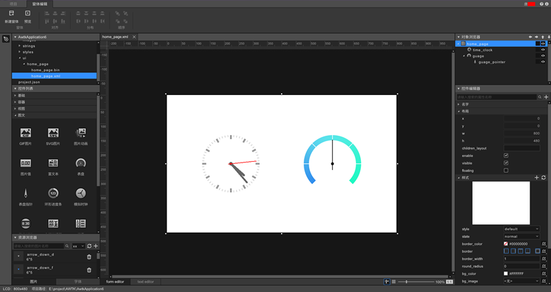
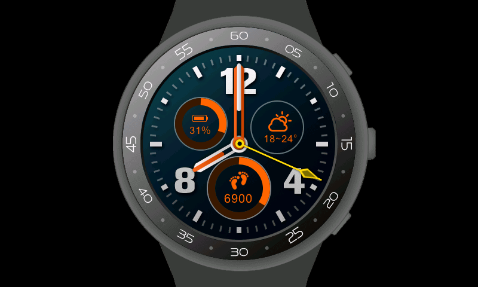

# AWTK = Toolkit AnyWhere

> [中文用户请看这里](README_zh.md)

## I. Introduction

[AWTK](README.md) , the abbreviation of Toolkit AnyWhere, is an open source GUI engine developed by [ZLG](http://www.zlg.cn/). It is a cross-platform GUI engine for embedded systems, WEB, mini programs, mobile phones and PC. It is a powerful, efficient, reliable and easy-to-use GUI engine for users to design beautiful GUI applications.

> Welcome developers to join us in our development:[Joint Ecology Building Plan](docs/awtk_ecology.md)

#### [AWTK](README.md) has two implications as follows: 

* Toolkit AnyWhere.
* As the built-in GUI of AWorksOS, which is the ZLG IoT operating system.

#### [AWTK](README.md) source code repositories:

* Main source code repository: [https://github.com/zlgopen/awtk](https://github.com/zlgopen/awtk)
* Mirrored source code repository：[https://gitee.com/zlgopen/awtk](https://gitee.com/zlgopen/awtk)
* Stable version pack: https://pan.baidu.com/s/1_oRgj67M-I4kivk-YzwFWA    Access code:1cmi

#### AWTK Designer - the UI design tool:

* It is no longer necessary to write XML by yourself.
* Design the UI by drag and drop. What you see is what you get.
* Support quick preview and pack resources with one-click.
* Registration and download: https://awtk.zlg.cn



#### Screenshots:




## II. Ultimate Objectives

* To support development of embedded applications.✔
* To support development of Linux applications.✔
* To support development of MacOS applications.✔
* To support development of Windows applications.✔
* To support development of Web applications.✔
* To support development of Android applications.✔
* To support development of iOS applications.✔
* To support development of WeChat mini programs.
* To support development of AliPay mini programs.
* To support development of Baidu mini programs.
* To support development of 2D mini games.

## III. Main Features

### 1. Cross-platform

[AWTK](README.md) is a cross-platform GUI engine , which has two meanings as follows:

* AWTK's code is cross-platform. At present, it is compatible with platforms such as ZLG AWorksOS, Windows, Linux, MacOS, embedded Linux, Android, iOS, Web and embedded raw systems. It can be easily ported to variety of different RTOS. In the future, AWTK can be also run as mini programs. 

* In addition, AWTK has a cross-platform library of basic tools, which includes lists, arrays, strings (UTF8 and widechar), event emitters, values, objects, file system, mutex, threads, formulas and string analysis, in order that the applications you develop with AWTK can really run across platforms.

### 2. Efficient

[AWTK](README.md)  ensure efficiency through the following operations: 

* Update changed parts using dirty rectangles algorithms.
* Support 3 FrameBuffer to make the UI run at the highest frame rate (optional).
* UI description files and theme files are stored in efficient binary formats, in order that they can be analyzed more fast.
* Support different GPU acceleration interfaces, including OpenGL, DirectX, Vulkan and Metal and so on.
* Support 2D acceleration interfaces of embedded platforms, such as NXP's PXP interfaces and STM32's DMA2D interfaces, user can easy to adapt to other acceleration interfaces.

### 3. Stable

[AWTK](README.md) makes codes as stable and reliable as possible in following ways: 

* Perform static checks using cppcheck and facebook infer.
* Dynamically check memory with valgrind.
* With approximately 20,000 lines of codes for unit testing.
* With support from the powerful GUI team of ZLG.
* Has been validated in multiple practical projects.
* Has been validated by multiple platforms and compilers.
* With excellent architecture design.
* Code Review.
* Manual test.

### 4. Powerful 

* Abundant widgets (being add more widgets).
* Support multiple image formats (png/jpg/gif/svg).
* Support multiple font formats (bitmap and vector fonts).
* Support window animation function.
* Support widget animation function.
* Support HD screen.
* Support UI layout description file.
* Support UI theme file.
* Support switch themes in runtime.
* Support custom rule for widget layout.
* Support custom rule for highlighting dialogs.
* With many auxiliary tools.
* Support different CPU from low-end (such as Cortex M3) to high-end.
* Support no-filesystem platform and custom filesystem.
* Support raw systems platform and RTOS.

### 5. Easy-to-use

* With many demonstration codes.
* With complete API document and user guide document.
* With technical support from the powerful team of ZLG.
* With the UI designer, which also developed with AWTK (https://awtk.zlg.cn). 
* Use declarative UI description language. user can enable widget animation, window animation, and image display (png/jpg/svg/gif) with one line code.

### 6. Customizable 

* Support extend custom widgets.
* Support extend custom animations.
* Support implement custom main loop.
* Support extend custom soft keyboard.
* Support extend custom image loader.
* Support extend custom font loader.
* Support extend custom input method engine.
* Support extend custom layout algorithms for widgets.
* Support extend custom rule for highlighting dialogs.
* Support implement custom LCD interface.
* Support extend custom vector engines (e.g.skia/cairo).
* All extended and built-in widgets are treated the same.

### 7. Multiple Development Languages

[AWTK](README.md) is been developed in the C Program Language. Scripts in different languages can be generated by the IDL. The binding code generated not only simply mapping the C API to the target script language, but  also with the native code styles of the target script language. At present, following languages are supported (More languages will be added): 

* C
* C++
* lua
* java
* python
* Javascript on jerryscript
* Javascript on nodejs
* Javascript on quickjs

### 8. Internationalization 

* Support Unicode. 
* Support input methods.
* Support translate strings. 
* Support translate images.
* Support text bidirectional algorithms.

### 9. The MVVM framework for embedded software thoroughly separate user interfaces from business logic 

* High performances. 
* Low memory usage.
* More thorough isolation.
* Portable to other GUI.
* Less codes (~5,000 lines).
* No need for learning API of AWTK.
* Support multiple programming languages (support C/JS at present).

> For details, please see https://github.com/zlgopen/awtk-mvvm

### 10. Open source codes are freely available for commercial purposes (LGPL)

## IV.  Simulation Run

### Code Downloading 

* Download with git 

> [Git under Windows](https://git-scm.com/download/win)

**Code Downloading**

```
git clone https://github.com/zlgopen/awtk.git
```

> Under Windows, codes can be downloaded by git with GUI tool.

**Code Updating (in the awtk directory)**

```
git pull
```

>  The advantage of using Git is that it is very convenient to update the code later.

* Directly download the zip file.

>  Download the [ zip file](https://github.com/zlgopen/awtk/archive/master.zip). Once unzipped, the file shall be renamed **awtk**.

### Mac

If scons and sdl2 aren't installed, please run the following command in the terminal (assuming that brew has been installed):
```
brew install scons sdl2
```

Compile and run (Enter the directory where awtk is and run the following command in the terminal): 

```
scons
./bin/demoui
```

### Ubuntu （version >=16)

 If scons and the dependent software pack aren't installed, please run the following command in the terminal:

```
sudo apt-get install scons libsndio-dev libgtk-3-dev libglu1-mesa libglu1-mesa-dev libgl1-mesa-glx libgl1-mesa-dev libasound2-dev git vim clang-format
```

Compile and run (Enter the awtk directory and run the following command in the terminal): 

```
scons
./bin/demoui
```

> If it can't be run in Ubuntu 14, please refer to [FAQ](docs/faq.md).

### Windows

> Please install python (64-bit python shall be installed for a 64-bit system), scons and Visual Studio C++ (version>=2017) first.

>  If pywin32 isn't installed, please use pip install:

```
pip install pywin32
```

Compile and run (Enter the awtk directory and run the following command in the terminal): 

```
scons
bin\demoui
```

> If PIL isn't installed, please use pip install:

```
pip install Pillow
```

## V. Online Demonstration

* [Online Demonstration of Basic Widgets](http://zlgawtk.bceapp.com/awtk/demos/demoui/index.html)

* [Graphical Demonstration](http://zlgawtk.bceapp.com/awtk/demos/Chart-Demo/index.html)

* [Music Player Demonstration](http://zlgawtk.bceapp.com/awtk/demos/MusicPlayer-Demo/index.html)

* [Smart Watch Demonstration](http://zlgawtk.bceapp.com/awtk/demos/SmartWatch-Demo/index.html)

## VI. Platform Porting

* [For details, refer to the Joint Ecology Building Plan for AWTK](docs/awtk_ecology.md)

## VII. Language Binding

* [AWTK Binding Code Generator](https://github.com/zlgopen/awtk-binding)

* [LUA Binding](https://github.com/zlgopen/awtk-lua)

* [C++ Binding](https://github.com/zlgopen/awtk-cpp)

* [JAVA Binding](https://github.com/zlgopen/awtk-java)

* [Python Binding](https://github.com/zlgopen/awtk-python)

* [MiniJVM Binding](https://github.com/zlgopen/awtk-minijvm)

* [JS-Binding QuickJS](https://github.com/zlgopen/awtk-quickjs)

* [JS-Binding NodeJS](https://github.com/zlgopen/awtk-nodejs)

* [JS-Binding JerryScript](https://github.com/zlgopen/awtk-jerryscript)

## VIII. Related Projects

* [Template Project](https://github.com/zlgopen/awtk-hello)

* [Demonstration Codes with C Program](https://github.com/zlgopen/awtk-c-demos)

* [Wonderful Examples](https://github.com/zlgopen/awtk-examples)

* [AWTK-MVVM](https://github.com/zlgopen/awtk-mvvm)

* [MVC/MVVM Example Demonstration](https://github.com/zlgopen/awtk-patterns)

* [Examples for Custom Widgets: Widget Generator](https://github.com/zlgopen/awtk-widget-generator)

* [Examples for Custom Widgets: QR code](https://github.com/zlgopen/awtk-widget-qr)

* [Examples for Custom Widgets: TinyGL](https://github.com/zlgopen/awtk-widget-glview)

* [Examples for Custom Widgets: Number-label](https://github.com/zlgopen/awtk-widget-number-label)

* [Examples for Custom Widgets: Code Editor](https://github.com/zlgopen/awtk-widget-code-edit)

* [Examples for Custom Widgets: Date Picker](https://github.com/zlgopen/awtk-widget-date-picker)

* [Examples for Custom Widgets: Table View](https://github.com/zlgopen/awtk-widget-table-view)

* [Examples for Custom Font Loader](https://github.com/zlgopen/awtk-custom-font-loader)

The third party provides: 

* [react-awtk](https://github.com/wenyufei2018/react-awtk)

* [Examples for Custom Widgets: QR code](https://github.com/CUITzhaoqi/awtk-qr)

* [Examples for Custom Widgets: Circle Sliders](https://github.com/longyuwlz/awtk_slider_circle)


## IX. Documentation

* [Development Docs](docs/README.md)

* [Change Logs](docs/changes.md)

* [TODO](TODO.md)

* [Beginners' Guide and Handbook](https://github.com/zlgopen/awtk-docs)

## X. Joint Ecology Building Plan

* [Joint Ecology Building Plan](docs/awtk_ecology.md)
* In-depth Partners

[](https://www.nxp.com)　[](http://www.anyka.com)　[](http://www.ingenic.com.cn)　[](http://www.mindmotion.com.cn)
