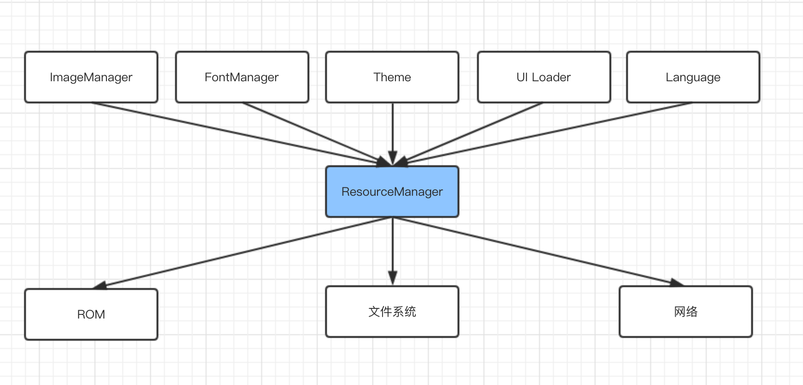

#AWTK 中的资源管理

## 基本架构

这里的资源管理器并非 Windows 下的文件浏览器，而是负责对各种资源，比如字体、窗体样式、图片、界面数据、字符串和其它数据的进行集中管理的组件。引入资源管理器的目的有以下几个：

* 让上层不需要了解存储的方式。在没有文件系统时或者内存紧缺时，把资源转成常量数组直接编译到代码中。在有文件系统而且内存充足时，资源放在文件系统中。在有网络时，资源也可以存放在服务器上（暂未实现）。资源管理器为上层提供统一的接口，让上层而不用关心底层的存储方式。

* 让上层不需要了解资源的具体格式。比如一个名为 earth 的图片，没有文件系统或内存紧缺，图片直接用位图数据格式存在 ROM 中，而有文件系统时，则用 PNG 格式存放在文件系统中。资源管理器让上层不需要关心图片的格式，访问时指定图片的名称即可（不用指定扩展名）。

* 让上层不需要了解屏幕的密度。不同的屏幕密度下需要加载不同的图片，比如 MacPro 的 Retina 屏就需要用双倍解析度的图片，否则就出现界面模糊。资源管理器需要为此提供支持，让上层不需关心屏幕的密度。

* 对资源进行内存缓存。不同类型的资源使用方式是不一样的，比如字体和窗体样式加载之后会一直使用，UI 文件在生成界面之后就暂时不需要了，PNG 文件解码之后就只需要保留解码的位图数据即可。资源管理器配合图片管理器等其它组件实现资源的自动缓存。

负责资源管理器和资源管理相关的组件如下图所示：



> 网络加载暂未实现。

## 资源的生成

AWTK 中的资源需要进行格式转换才能使用：

* 在没有文件系统时或者内存紧缺时，需要把资源转成常量数组直接编译到代码中。
* XML 格式的 UI 文件需要转换成二进制的格式。
* XML 格式的窗体样式文件需要转换成二进制的格式。
* TTF 可以根据需要转换成位图字体。
* PNG 可以根据需要转换成位图图片。

相关工具：

* bin/fontgen 位图字体生成工具
* bin/imagegen 位图图片生成工具
* bin/resgen 二进制文件生成资源常量数组
* bin/themegen XML 窗体样式转换成二进制的窗体样式
* bin/xml\_to\_ui XML 的界面描述格式转换二进制的界面描述格式
* ./scripts/update\_res.py 批量转换整个项目的资源

## 一、初始化

将资源生成常量数组直接编译到代码中时，其初始化过程为：

* 1. 包含相应的数据文件。

```
#include "assets/inc/fonts/ap.data"
#include "assets/inc/fonts/default.data"
#include "assets/inc/fonts/default_ttf.data"
#include "assets/inc/images/bricks.data"
#include "assets/inc/images/checked.data"
...
```

* 2. 将资源增加到资源管理器中。

```
  assets_manager_add(rm, font_ap);
  assets_manager_add(rm, font_default);
  assets_manager_add(rm, font_default_ttf);
  assets_manager_add(rm, image_bricks);
  assets_manager_add(rm, image_checked);
  ...
```

将资源放在文件系统中时，一般不需要特殊处理，不过可以用 assets\_manager\_load 预加载资源。如：

```
  assets_manager_load(rm, ASSET_TYPE_THEME, "default");
  assets_manager_load(rm, ASSET_TYPE_FONT, "default_ttf");
```

> 参考：demos/assets.c

## 二、使用方法

* 加载图片图片

使用 image\_manager\_load，指定图片的名称即可。

```
  bitmap_t img;
  image_manager_load(image_manager(), "earth", &img);
```

> 或者通过更上层 widget 的函数去加载图片：

```
 bitmap_t bitmap;
 widget_load_image(widget, "myimage", &bitmap);
```

* 使用 UI 数据

使用 window\_open，指定资源的名称即可。如：

```
widget_t* win = window_open(name);
```

* 使用字体

一般在窗体样式文件中指定字体即可。

* 使用窗体样式

一般在界面描述文件中指定 style 即可。

## 三、资源的名称

资源名称一般就是资源的文件名，不带文件扩展名。比如图片名为 test.png，那资源名称就是 test，如果因为某种原因，把 test.png 换成了 test.jpg，对代码并无影响。

> 对于 DATA 类型的资源，由于其扩展名不固定，所以需要带扩展名才能访问。
>
> 比如资源文件名为"app.json"，不能用"app"访问，而是用"app.json"才能访问。

对于图片和 UI 资源名称，AWTK 还支持一种高级用法。想想下面几种情况：

* 需要支持不同的分辨率。而在不同分辨率里，要使用不同的背景图片。
* 需要支持竖屏和横屏。而有的界面自动排版不能满足需求，需要为竖屏和横屏个写一个 XML 文件。
* 需要支持不同的语言。而在不同的语言里，有的图片是语言相关的。

为了应对这些情况，AWTK 提供了名称表达式：

* 名称中可以带变量和表达式。变量用${xxx}表示，xxx 将被替换成实际的值。
* 可以指定多个名称，依次匹配，直到找到的为止。多个名称之间用逗号分隔。

示例 1：

```
  <style name="sky">
    <normal bg_image="bg_${device_orientation}_1"/>
  </style>
```

在竖屏下，相当于：

```
  <style name="sky">
    <normal bg_image="bg_portrait_1"/>
  </style>
```

在横屏下，相当于：

```
  <style name="sky">
    <normal bg_image="bg_landscape_1"/>
  </style>
```

示例 2:

```
<image image="flag_${country},flag_none" x="c" y="m:-80" w="80" h="80"/>
```

在 locale 为 zh\_CN 时，相当于：

```
<image image="flag_CN,flag_none" x="c" y="m:-80" w="80" h="80"/>
```

依次查找 flag\_CN 和 flag\_none 两个图片。

在 locale 为 en\_US 时，相当于：

```
<image image="flag_US,flag_none" x="c" y="m:-80" w="80" h="80"/>
```

依次查找 flag\_US 和 flag\_none 两个图片。

> 变量名可以使用 [system\_info 中的成员变量](https://github.com/zlgopen/awtk/blob/master/docs/manual/system_info_t.md)

## 四、扩展用法

有时候在嵌入式平台开发项目中会出现一种情况，项目的资源分为两部分，一部分是基本上不会修改的资源（例如字库资源等），一部分会根据开发过程中会进行修改或者更换资源（例如图片资源等）。

这个时候需要把不会修改的资源烧写指定的地方（flash 或者 其他的存储设备中），然后再通过特定的方法加载到 awtk 中。

#### 示例：

```
#include "base/assets_manager.h"

/* 字体文件资源烧写到 0x60520000 的地址中 */
#define FONT_FULL_ADD 0x60520000
/* 字体文件资源大小长度 */
#define FONT_FULL_LEN 0x00220000

ret_t assets_init(void) {

    assets_manager_t* am = assets_manager();
    
     /* 
     * 把字体文件资源 data 数据直接加载到 awtk 中
     * 并且该字体文件资源的名字为 "default_full"
     * 程序内部可以通过 "default_full" 名字来使用该字体资源
     */
	assets_manager_add_data(am, "default_full", ASSET_TYPE_FONT, ASSET_TYPE_FONT_TTF, (const uint8_t*)FONT_FULL_ADD, FONT_FULL_LEN);
	
｝
```

> 备注：assets_manager_add_data 函数传入的资源 data 数组，会拷贝一份在 awtk 内部，所以如果资源 data 数组是通过 malloc 等方法创建出来的话，就需要自行释放资源 data 数组。
