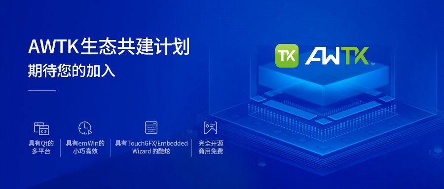

如果您针对某个芯片或平台移植过 AWTK，或者为 AWTK 扩展过炫酷的控件，并希望共享这个适配代码，可以联系我们开源到 GitHub 上，我们愿意在 AWTK 技术上对您提供进一步的支持服务，大家可以一起把这个适配做稳做好，构建 AWTK 良好的生态。

[进一步了解我们的 AWTK 生态共建计划](awtk_ecology_intro.md)

## 索引

- [操作系统适配](#操作系统适配)
- [MCU芯片适配](#MCU芯片适配)
- [扩展控件](#扩展控件)
- [编程语言绑定](#编程语言绑定)
- [编译构建工具](#编译构建工具)
- [商业应用案例](#商业应用案例)

## 操作系统适配

- #### 桌面操作系统

| 操作系统 | 下载地址                        | 作者                     |
| -------- | ------------------------------- | ------------------------ |
| Windows  | https://github.com/zlgopen/awtk | [ZLG](http://www.zlg.cn) |
| Linux    | https://github.com/zlgopen/awtk | [ZLG](http://www.zlg.cn) |
| macOS    | https://github.com/zlgopen/awtk | [ZLG](http://www.zlg.cn) |

- #### 嵌入式操作系统

| 操作系统     | 下载地址                                | 作者                     |
| ------------ | --------------------------------------- | ------------------------ |
| AWorksOS     | [MCU芯片适配](#MCU芯片适配)             |                          |
| 嵌入式 Linux | [MCU芯片适配](#MCU芯片适配)             |                          |
| RT-Thread    | [MCU芯片适配](#MCU芯片适配)             |                          |
| TencentOS    | [MCU芯片适配](#MCU芯片适配)             |                          |
| FreeRTOS     | [MCU芯片适配](#MCU芯片适配)             |                          |
| SylixOS      | https://github.com/zlgopen/awtk-sylixos | [ZLG](http://www.zlg.cn) |
| ms-rtos      | https://github.com/ms-rtos/awtk         | [翼辉](http://www.acoinfo.com/)|

- #### 软件框架和软件平台

| 操作系统  | 下载地址                                           | 作者                                          |
| --------- | -------------------------------------------------- | --------------------------------------------- |
| 海思Linux | https://github.com/zlgopen/awtk-linux-fb/issues/28 | [kent52712](https://github.com/kent52712)     |
| VSF平台   | https://github.com/vsfteam/vsf                     | [vsfteam](https://github.com/vsfteam)【原厂】 |
| Wayland   | https://github.com/zjm1060/awtk-wayland            | [zjm1060](https://github.com/zjm1060)         |
| Web       | https://github.com/zlgopen/awtk-web                | [ZLG](http://www.zlg.cn)                      |
| Android   | https://github.com/zlgopen/awtk-android            | [ZLG](http://www.zlg.cn)                      |
| iOS       | https://github.com/zlgopen/awtk-ios                | [ZLG](http://www.zlg.cn)                      |

## MCU芯片适配

以下按芯片厂商名字字母排序

- #### Anyka

| 芯片    | 操作系统            | 下载地址   | 作者                               |
| ------- | ------------------- | ---------- | ---------------------------------- |
| AK376xD | RT-Thread | 请联系作者 | [Anyka](http://www.anyka.com)【原厂】 |
| AK376xD | Linux | 请联系作者 | [Anyka](http://www.anyka.com)【原厂】 |

- #### Espressif

| 芯片  | 操作系统 | 下载地址                                | 作者                                      |
| ----- | -------- | --------------------------------------- | ----------------------------------------- |
| ESP32 | FreeRTOS | https://github.com/jason-mao/esp32-awtk | [jason-mao](https://github.com/jason-mao) |

- #### GigaDevice

| 芯片     | 操作系统 | 下载地址   | 作者                     |
| -------- | -------- | ---------- | ------------------------ |
| GD32450Z | 无       | 请联系作者 | [ZLG](http://www.zlg.cn) |

- #### Ingenic

| 芯片  | 操作系统 | 下载地址                                     | 作者                                         |
| ----- | -------- | -------------------------------------------- | -------------------------------------------- |
| M200  | Linux    | https://github.com/zlgopen/awtk-port-ingenic | [Ingenic](http://www.ingenic.com.cn)【原厂】 |
| X1000 | Linux    | https://github.com/zlgopen/awtk-port-ingenic | [Ingenic](http://www.ingenic.com.cn)【原厂】 |
| X1830 | Linux    | https://github.com/zlgopen/awtk-port-ingenic | [Ingenic](http://www.ingenic.com.cn)【原厂】 |

- #### ISSI
- #### MindMotion

| 芯片         | 操作系统 | 下载地址   | 作者                                               |
| ------------ | -------- | ---------- | -------------------------------------------------- |
| MM32F103RET6 | 无       | 请联系作者 | [MindMotion](http://www.mindmotion.com.cn)【原厂】 |

- #### Nordic

| 芯片     | 操作系统 | 下载地址   | 作者                                              |
| -------- | -------- | ---------- | ------------------------------------------------- |
| NRF52840 | FreeRTOS | 请联系作者 | [jimmywong2003](https://github.com/jimmywong2003) |

- #### NXP

| 芯片            | 操作系统 | 下载地址                                           | 作者                                  |
| --------------- | -------- | -------------------------------------------------- | ------------------------------------- |
| RT1052          | AWorksOS | https://github.com/zlgopen/awtk-aworks-rt1052      | [ZLG](http://www.zlg.cn)              |
| RT1052          | 无       | https://github.com/zlgopen/awtk-easyarm-rt1052-raw | [ZLG](http://www.zlg.cn)              |
| RT1052          | FreeRTOS | https://github.com/chinachuli/awtk-imxrt1052-raw   | [褚立](https://github.com/chinachuli) |
| RT1020          | AWorksOS | 请联系作者                                         | [ZLG](http://www.zlg.cn)              |
| i.MX6 Cortex-A7 | AWorksOS | 请联系作者                                         | [ZLG](http://www.zlg.cn)              |
| i.MX6 Cortex-A7 | Linux    | https://github.com/zlgopen/awtk-linux-fb           | [ZLG](http://www.zlg.cn)              |
| i.MX6 Cortex-A9 | Linux    | https://github.com/zlgopen/awtk-linux-fb           | [ZLG](http://www.zlg.cn)              |
| i.MX283         | Linux    | https://github.com/zlgopen/awtk-linux-fb           | [ZLG](http://www.zlg.cn)              |
| LPC54608        | 无       | 请联系作者                                         | [ZLG](http://www.zlg.cn)              |
| LPC54018        | 无       | 请联系作者                                         | [ZLG](http://www.zlg.cn)              |
| LPC1768         | 无       | https://github.com/zlgopen/awtk-lpc1768-raw       | [ZLG](http://www.zlg.cn)              |

- #### ST

| 芯片      | 操作系统  | 下载地址                                              | 作者                               |
| --------- | --------- | ----------------------------------------------------- | ---------------------------------- |
| STM32F103 | 无        | https://github.com/zlgopen/awtk-stm32f103ze-raw       | [ZLG](http://www.zlg.cn)           |
| STM32F103 | RT-Thread | https://github.com/zlgopen/awtk-stm32f103ze-rtthread  | [ZLG](http://www.zlg.cn)           |
| STM32F103 | TencentOS | https://github.com/zlgopen/awtk-stm32f103ze-tencentos | [ZLG](http://www.zlg.cn)           |
| STM32H743 | TencentOS | https://github.com/zlgopen/awtk-stm32h743iitx-tencentos | [ZLG](http://www.zlg.cn)           |
| STM32F429 | 无        | https://github.com/zlgopen/awtk-stm32f429igtx-raw     | [ZLG](http://www.zlg.cn)           |
| STM32F767 | 无        | https://github.com/zlgopen/awtk-stm32f767igtx-raw     | [ZLG](http://www.zlg.cn)           |
| STM32F769 | FreeRTOS  | https://github.com/wpmyj/awtk-stm32f769-freertos      | [王培明](https://github.com/wpmyj) |

> 以上信息如果有误，或需要补充的，请联系 chentan@zlg.cn 修正
>

## 扩展控件

- #### 基本控件

| 控件名称 | 下载地址                                        | 作者                                               |
| -------- | ----------------------------------------------- | -------------------------------------------------- |
| 二维码   | https://github.com/CUITzhaoqi/awtk-qr           | [CUITzhaoqi](http://github.com/CUITzhaoqi/awtk-qr) |
| 圆形滑块 | https://github.com/longyuwlz/awtk_slider_circle | [longyuwlz](http://github.com/longyuwlz)           |

- #### 图表控件

| 控件名称 | 下载地址                                 | 作者                     |
| -------- | ---------------------------------------- | ------------------------ |
| 饼图     | https://github.com/zlgopen/awtk-examples | [ZLG](http://www.zlg.cn) |
| 柱状图   | https://github.com/zlgopen/awtk-examples | [ZLG](http://www.zlg.cn) |
| 曲线图   | https://github.com/zlgopen/awtk-examples | [ZLG](http://www.zlg.cn) |

## 编程语言绑定

- #### C

| 解析引擎 | 下载地址                        | 作者                     |
| -------- | ------------------------------- | ------------------------ |
| C99      | https://github.com/zlgopen/awtk | [ZLG](http://www.zlg.cn) |

- #### JavaScript

| 解析引擎    | 下载地址                                    | 作者                     |
| ----------- | ------------------------------------------- | ------------------------ |
| JerryScript | https://github.com/zlgopen/awtk-jerryscript | [ZLG](http://www.zlg.cn) |
| QuickJS     | https://github.com/zlgopen/awtk-quickjs     | [ZLG](http://www.zlg.cn) |
| Node.js     | 请联系作者                                  | [ZLG](http://www.zlg.cn) |

- #### Lua

| 解析引擎 | 下载地址                            | 作者                     |
| -------- | ----------------------------------- | ------------------------ |
| Lua      | https://github.com/zlgopen/awtk-lua | [ZLG](http://www.zlg.cn) |

- #### C++

| 解析引擎 | 下载地址                            | 作者                     |
| -------- | ----------------------------------- | ------------------------ |
| C++98    | https://github.com/zlgopen/awtk-cpp | [ZLG](http://www.zlg.cn) |

- #### Java

| 解析引擎 | 下载地址                             | 作者                     |
| -------- | ------------------------------------ | ------------------------ |
| JDK      | https://github.com/zlgopen/awtk-java | [ZLG](http://www.zlg.cn) |

## 编译构建工具

| 构建工具 | 编译平台 | 下载地址                                    | 作者                                    |
| -------- | -------- | ------------------------------------------- | --------------------------------------- |
| SCons    | PC ALL   | https://github.com/zlgopen/awtk             | [ZLG](http://www.zlg.cn)                |
| SCons    | ARMCC    | https://github.com/zlgopen/awtk-scons-armcc | [ZLG](http://www.zlg.cn)                |
| SCons    | MinGW    | https://github.com/zlgopen/awtk-scons-mingw | [ZLG](http://www.zlg.cn)                |
| CMake    | MSVC     | https://github.com/zlgopen/awtk-msvc        | [ZLG](http://www.zlg.cn)                |
| CMake    | macOS    | https://github.com/oskycar/awtktest_cmake   | [allenyang](https://github.com/oskycar) |

## 商业应用案例

- #### 智能家居
- #### 智能穿戴
- #### 汽车电子
- #### 医疗电子
- #### 工业控制
