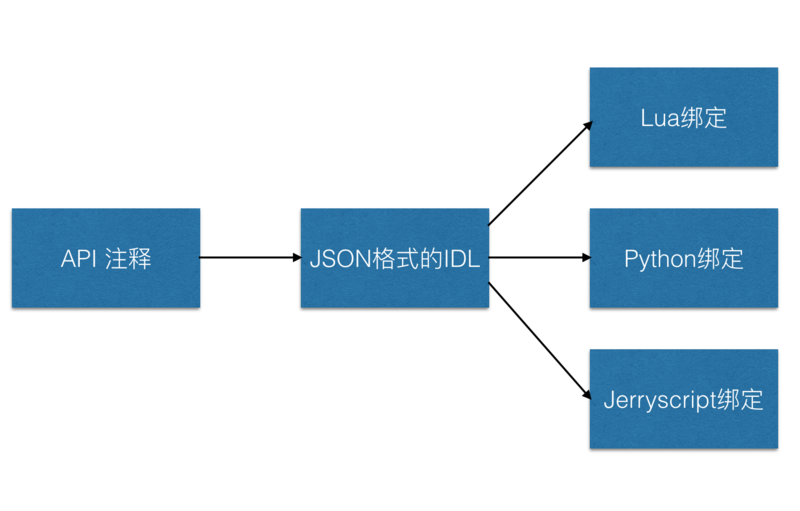

# AWTK脚本绑定的实现原理 - lua绑定

脚本化是[AWTK](https://github.com/xianjimli/awtk)的一个基本功能。[AWTK](https://github.com/xianjimli/awtk)计划支持嵌入式系统中常用的脚本，如lua、python和jerryscript。脚本绑定说简单也简单，说复杂也复杂，采用FFI(calling external C functions)和SWIG绑定一些简单的函数是很方便的，但绑定一个复杂的GUI系统还是很有挑战的。之所以不采用通用的工具，而是实现自己的代码产生器，主要有以下考虑：

* 我使用FFI和SWIG的经验很有限，觉得有些功能不太好实现，至少目前我还不知道实现这些功能的方法和思路。

* 担心FFI和SWIG的运行环境的可移植性。在Windows、Linux和Macos上肯定是没有问题的，但是在嵌入式系统，特别是RTOS和裸系统中，支持像动态库等功能可能有些困难的。

* 对jerryscript没有支持。jerryscript是三星开源的javascript实现，在嵌入式系统中用得比较多，通用的绑定机制对jerryscript没有支持。

* 代码风格。不同语言有不同的代码风格，特别是命名风格，直接把C言语的风格映射过去，对于开发者不太友好。FFI和SWIG都需要做额外的工作才能实现这个功能。

* AWTK采用面向对象设计，并用C实现面向对象编程的。而通用的绑定机制对此并不友好，实现起来非常困难。
 
* 自定义的代码产生器并不复杂，而且具有更大的灵活性。 

基于以上这些原因，我决定自己实现[AWTK](https://github.com/xianjimli/awtk)的脚本绑定机制。它的实现原理如下：用特定格式的API注释来描述要脚本化的API，用一个名为gen_idl的工具把注释提取出来生成JSON的接口描述文件，然后用不同的代码产生器生成对应语言的绑定：

 

## 注释格式

我采用了类似于[jsduck](https://github.com/senchalabs/jsduck)的API注释格式，但是jsduck并不支持C语言的数据类型，所以没有必要去兼容jsduck。

### 一、类的注释

示例：

```
/**
 * @class progress_bar_t 
 * @parent widget_t
 * @scriptable
 * 进度条控件。
 */
```

里面说明了类的名称、基类的名称和该类型是否可以脚本化。

### 二、类成员变量注释

示例：

```
  /** 
   * @property {uint8_t} value 
   * @readonly
   * 进度条的值[0-100]。
   */
```

里面说明了成员变量的类型、名称和是否只读等信息。

### 三、函数的注释

示例：

```
/**
 * @method progress_bar_set_value
 * 设置进度条的进度。
 * @param {widget_t*} widget 控件对象。
 * @param {uint8_t}  value 进度
 *
 * @return {ret_t} 返回RET_OK表示成功，否则表示失败。
 */
```

里面说明了函数的名称、参数和返回值。缺省为前一个类的成员函数，也可以用@global把它标识为一个全局函数。构造函数和析构可能会有不同的处理，所以用@constructor和deconstructor分别标识出来。有的函数自动产生绑定代码比较困难，此时可以用@custom标识为手写绑定代码。

### 四、枚举的注释

示例：

```
/**
 * @enum align_v_t
 * @scriptable
 * 垂直对齐的常量定义。
 */
typedef enum _align_v_t {
  /**
   * @const ALIGN_V_NONE
   * 无效对齐方式。
   */
  ALIGN_V_NONE= 0,
  /**
   * @const ALIGN_V_MIDDLE
   * 居中对齐。
   */
  ALIGN_V_MIDDLE,
  /**
   * @const ALIGN_V_TOP
   * 顶部对齐。
   */
  ALIGN_V_TOP,
  /** 
   * @const ALIGN_V_BOTTOM
   * 底部对齐。
   */
  ALIGN_V_BOTTOM
}align_v_t;
```

里面定义了枚举的名称和各个枚举值。


## 代码产生器

代码产生器本身很简单，有兴趣的朋友可以帮忙Review一下。

* JSON格式的代码产生器：tools/idl_gen/gen_idl.js

* Lua的绑定代码产生器：tools/idl_gen/gen_lua.js

## lua绑定

对lua绑定花了一些时间，由于对lua不熟悉，还特意买了两本书，阅读lua的源码也有很大帮助。这里做个笔记，方便有需要的朋友参考：

### 一、全局函数的绑定

这个很多资料里都有介绍。

示例：

* 1.实现wrap函数

```
static int wrap_tk_quit(lua_State* L) {
  ret_t ret = 0;
  ret = (ret_t)tk_quit();

  lua_pushnumber(L,(lua_Number)(ret));

  return 1;
}
```

* 2.注册

```
  lua_pushcfunction(L, wrap_tk_quit);
  lua_setglobal(L, "tk_quit");
```

### 二、构造函数的绑定

* 1.实现wrap函数。构造函数的wrap函数和普通函数的wrap差不多，只是最后要调用awtk\_newuserdata创建一个userdata对象，并关联metatable。我开始用的lua\_pushlightuserdata函数，后来发现lua里全部的ligthuserdata用的是一个metatable，修改一个对象的metatable，其它类型的对象的metatable也被修改了(我感觉这种做法并不合理)。

```
static int wrap_button_create(lua_State* L) {
  widget_t* ret = NULL;
  widget_t* parent = (widget_t*)tk_checkudata(L, 1, "widget_t");
  xy_t x = (xy_t)luaL_checkinteger(L, 2);
  xy_t y = (xy_t)luaL_checkinteger(L, 3);
  wh_t w = (wh_t)luaL_checkinteger(L, 4);
  wh_t h = (wh_t)luaL_checkinteger(L, 5);
  ret = (widget_t*)button_create(parent, x, y, w, h);

  return tk_newuserdata(L, ret, "/button_t/widget_t", "awtk.button_t");
}
```

* 2.注册

```
static void button_t_init(lua_State* L) {
  static const struct luaL_Reg static_funcs[] = {
    {"create", wrap_button_create},
    {NULL, NULL}
  };
...
  luaL_openlib(L, "Button", static_funcs, 0);
}
```

### 三、成员函数和获取成员变量的绑定

* 1.实现wrap函数。成员函数的wrap函数和普通函数的wrap差不多。

```
static int wrap_check_button_set_value(lua_State* L) { 
  ret_t ret = 0; 
  widget_t* widget = (widget_t*)tk_checkudata(L, 1, "widget_t");
  uint32_t value = (uint32_t)luaL_checkinteger(L, 2);
  ret = (ret_t)check_button_set_value(widget, value);

  lua_pushnumber(L,(lua_Number)(ret));

  return 1;
}
```

* 2.注册。为了让成员函数能够一级一级的调到父类中去，我使用了lua的__index函数。

先把类的成员函数放到一张表中，方便后面查找。

```
static const struct luaL_Reg check_button_t_member_funcs[] = {
  {"set_text", wrap_check_button_set_text},
  {"set_value", wrap_check_button_set_value},
  {NULL, NULL}
};
```

通过find_member到上表中查找成员函数，如果找到就直接返回该函数。如果没找到，再看是不是成员变量，是则返回成员变量的值。最后再到父类中去查找，重复这个过程。

```
static int wrap_check_button_t_get_prop(lua_State* L) {
  check_button_t* obj = (check_button_t*)tk_checkudata(L, 1, "check_button_t");
  const char* name = (const char*)luaL_checkstring(L, 2);
  const luaL_Reg* ret = find_member(check_button_t_member_funcs, name);

  (void)obj;
  (void)name;
  if(ret) {
    lua_pushcfunction(L, ret->func);
    return 1;
  }
  if(strcmp(name, "value") == 0) {
    lua_pushboolean(L,(lua_Integer)(obj->value));

  return 1;
  }
  else {
    return wrap_widget_t_get_prop(L);
  }
}

```

注册metatable。

```
  static const struct luaL_Reg index_funcs[] = {
    {"__index", wrap_check_button_t_get_prop},
    {"__newindex", wrap_check_button_t_set_prop},
    {NULL, NULL}
  };
  
  luaL_newmetatable(L, "awtk.check_button_t");
  lua_pushstring(L, "__index");
  lua_pushvalue(L, -2);
  lua_settable(L, -3);
```

### 四、设置成员变量的绑定

这个我是使用__newindex函数来实现的。如果修改readonly的成员会打印警告，否则就直接修改。对于不存在的成员变量，到父类中去查找，重复这个过程。

```
static int wrap_check_button_t_set_prop(lua_State* L) {
  check_button_t* obj = (check_button_t*)tk_checkudata(L, 1, "check_button_t");
  const char* name = (const char*)luaL_checkstring(L, 2);
(void)obj;
(void)name;
  if(strcmp(name, "value") == 0) {
      printf("value is readonly\n");
      return 0;
  }
  else {
    return wrap_widget_t_set_prop(L);
  }
}
```


### 五、枚举的绑定

枚举则是直接创建了一张表，把枚举的值放到表中即可。

```
static void value_type_t_init(lua_State* L) {
  lua_newtable(L);
  lua_setglobal(L, "ValueType");
  lua_getglobal(L, "ValueType");

  lua_pushstring(L, "INVALID");
  lua_pushinteger(L, VALUE_TYPE_INVALID);
  lua_settable(L, -3);
```

### 六、回调函数的处理

回调函数的处理麻烦一点，而且书里没有讲过，所以花了一些功夫。后来发现有回调函数的函数，很难自动产生代码，所幸这样的函数没几个，干脆手写了这部代码。

```
static ret_t call_on_event(void* ctx, event_t* e) {
  lua_State* L = (lua_State*)s_current_L;
  int func_id = (char*)ctx - (char*)NULL;

  lua_settop(L, 0); 
  lua_rawgeti(L, LUA_REGISTRYINDEX, func_id);
  tk_newuserdata(L, e, "event_t", NULL);

  lua_pcall(L,1,1,0);

  return RET_OK;
}

static int wrap_widget_on(lua_State* L) {
  ret_t ret = 0;
  widget_t* widget = (widget_t*)tk_checkudata(L, 1, "widget_t");
  event_type_t type = (event_type_t)luaL_checkinteger(L, 2); 

  if(lua_isfunction(L, 3)) {
    int func_id = 0;
    lua_pushvalue(L, 3); 
    func_id = luaL_ref(L, LUA_REGISTRYINDEX);
    ret = (ret_t)widget_on(widget, type, call_on_event, (char*)NULL + func_id);
    lua_pushnumber(L,(lua_Number)ret);

    return 1;
  } else {
    return 0;
  }
}

static int wrap_widget_off(lua_State* L) {
  ret_t ret = 0;
  widget_t* widget = (widget_t*)tk_checkudata(L, 1, "widget_t");
  uint32_t id = (uint32_t)luaL_checkinteger(L, 2); 
  emitter_item_t* item = emitter_find(widget->emitter, id);

  if(item) {
    uint32_t func_id = (char*)(item->ctx) - (char*)NULL;
    luaL_unref(L, LUA_REGISTRYINDEX, func_id);
    ret = (ret_t)widget_off(widget, id);
  }

  lua_pushnumber(L,(lua_Number)(ret));

  return 1;
}
```

## lua示例

本例中创建了两个按钮和一个进度条，可以通过按钮来控制进度条的值。

```
function application_init()
  local win = Window.create(nil, 0, 0, 0, 0)
  local inc = Button.create(win, 10, 5, 80, 30) 
  inc:set_text(to_wstr('Inc'));
 
  local dec = Button.create(win, 100, 5, 80, 30);
  dec:set_text(to_wstr('Dec'));
  
  local progress_bar = ProgressBar.create(win, 10, 80, 168, 30);
  progress_bar:set_value(40);
  
  inc:on(EventType.EVT_CLICK, function(evt) 
    local e = PointerEvent.cast(evt);
    progress_bar:set_value(progress_bar.value + 10);
    print('on inc click:(' .. tostring(e.x) .. ' ' .. tostring(e.y) .. ')')
  end);
  
  dec:on(EventType.EVT_CLICK, function(evt) 
    local e = PointerEvent.cast(evt);
    progress_bar:set_value(progress_bar.value - 10);
    print('on dec click:(' .. tostring(e.x) .. ' ' .. tostring(e.y) .. ')')
  end);
end

application_init()
```

## 参考资料

* http://book.luaer.cn
* https://www.lua.org/manual/5.2/
* http://www.cnblogs.com/luweimy/p/3972353.html
