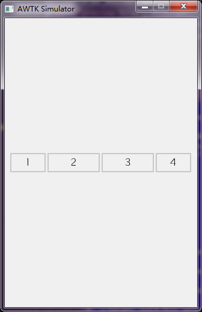
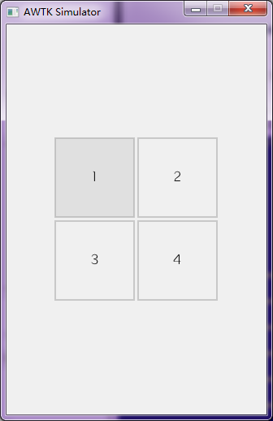
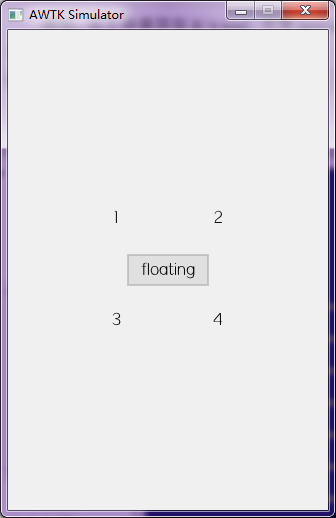
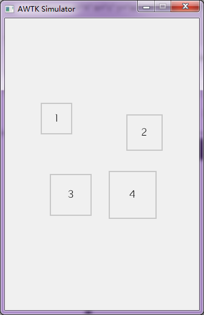

# 缺省子控件的布局器

## 一、语法

子控件布局器统一使用 children_layout 属性指定，其语法为：

```
缺省子控件布局器 => default '(' PARAM_LIST ')'
PARAM_LIST => PARAM | PARAM ',' PARAM_LIST
```

示例：

```
<view x="0" y="0" w="100%" h="100%" children_layout="default(c=2,r=8,m=5,s=5)">
```

## 二、参数

缺省子控件的布局器提供了下列参数：

| 参数          | 简写   |  说明 |
|----------------|:------:|:--------------|
| rows           | r      | 行数 |
| cols           | c      | 列数 |
| width          | w      | 子控件的宽度，可以用来计算列数，与 cols 互斥   |
| height         | h      | 子控件的高度，可以用来计算行数，与 rows 互斥   |
|  x\_margin     | xm     | 水平方向的边距  |
| y\_margin      | ym     | 垂直方向的边距   |
| spacing        | s      | 子控件之间的间距   |
| keep_invisible | ki     | 是否给不可见的控件留位置（缺省否）|
| keep_disable   | kd     | 是否给不用的控件留位置（缺省是）|
| aligh_h        | a      | 用于 hbox 的情况 (col=0,row=1), 子控件整体水平对齐的方式。

在代码中，可以通过 widget\_set\_children\_layout 函数启用子控件布局器：

```
/**
 * @method widget_set_children_layout
 * 设置子控件的布局参数。
 * @annotation ["scriptable"]
 * @param {widget_t*} widget 控件对象。
 * @param {const char*} params 布局参数。
 *
 * @return {ret_t} 返回 RET_OK 表示成功，否则表示失败。
 */
ret_t widget_set_children_layout(widget_t* widget, const char* params);
```

示例：

```
widget_set_children_layout(w, "default(r=2,c=2)");
```

在 XML 中，可以通过 children\_layout 属性设置：
```
  <column x="20" y="160" w="50%" h="60" children_layout="default(r=2,c=1,ym=2,s=10)" >
    <check_button name="c1" text="Book"/>
    <check_button name="c2" text="Food"/>
  </column>
```

## 三、使用方法

下面我们看看，如何调整 rows/cols 两个参数，来实现不同的布局方式。

### 0. 缺省

在没有设置子控件布局参数时，采用缺省的布局方式，父控件啥事也不做，完全由子控件自己的布局参数决定。

### 1. hbox 水平布局

当 rows=1,cols=0 时，所有子控件在水平方向排成一行，可以实现水平布局功能。子控件的参数：

* x 从左到右排列，由布局参数计算而出。
* y 为 y\_margin
* w 由子控件自己决定。
* h 为父控件的高度-2*y\_margin

> 子控件需要自己决定宽度。
> aligh_h 参数可以控制整体对齐方式。

示例：

```
<window>
  <view x="c" y="m" w="300" h="30" children_layout="default(r=1,c=0,s=5)">
      <button text="1" w="20%"/>
      <button text="2" w="30%"/>
      <button text="3" w="30%"/>
      <button text="4" w="20%"/>
  </view>
</window>
```

例如，将文件保存当前目录的 t.xml 文件，可用 preview_ui（在 awtk\bin 目录下）预览效果如下图，命令如下：

```
 bin\preview_ui.exe t.xml
```



### 2. vbox 垂直布局

当 cols=1,rows=0 时，所有子控件在垂直方向排成一列，可以实现垂直布局功能。子控件的参数：

* x 为 x\_margin
* y 从上到下排列，由布局参数计算而出。
* w 为父控件的宽度-2*x\_margin
* h 由子控件自己决定。

> 子控件需要自己决定高度。

示例：

```
<window>
  <view x="c" y="m" w="80" h="200" children_layout="default(r=0,c=1,s=5)">
      <button text="1" h="20%"/>
      <button text="2" h="30%"/>
      <button text="3" h="30%"/>
      <button text="4" h="20%"/>
  </view>
</window>
```

例如，将文件保存当前目录的 t.xml 文件，可用 preview_ui（在 awtk\bin 目录下）预览效果如下图，命令如下：

```
bin\preview_ui.exe t.xml
```


### 3. listbox 列表布局

当 cols=1,rows=N 时，所有子控件在垂直方向排成一列，可以实现列表布局功能。子控件的参数：

* x 为 x\_margin
* y 从上到下排列，由布局参数计算而出。
* w 为父控件的宽度-2*x\_margin
* h 为父控件的高度（减去边距和间距）分成成 N 等分。

> 子控件无需指定 x/y/w/h 等参数

示例：

```
<window>
  <view x="c" y="m" w="200" h="200" children_layout="default(r=4,c=1,s=5)">
      <button text="1" />
      <button text="2" />
      <button text="3" />
      <button text="4" />
  </view>
</window>
```

例如，将文件保存当前目录的 t.xml 文件，可用 preview_ui（在 awtk\bin 目录下）预览效果如下图，命令如下：

```
 bin\preview_ui.exe t.xml
```


### 4. grid 网格布局

当 cols=M,rows=N 时，所有子控件放在 MxN 的网格中，可以实现网格布局功能。

> 子控件无需指定 x/y/w/h 等参数

示例：

```
<window>
  <view x="c" y="m" w="200" h="200" children_layout="default(r=2,c=2,s=5)">
      <button text="1" />
      <button text="2" />
      <button text="3" />
      <button text="4" />
  </view>
</window>
```

例如，将文件保存当前目录的 t.xml 文件，可用 preview_ui（在 awtk\bin 目录下）预览效果如下图，命令如下：

```
 bin\preview_ui.exe t.xml
```



### 5. floating 浮动布局

如果子控件的 floating 属性设置为 true，其不受 children\_layout 的限制：

示例：

```
<window>
  <view x="c" y="m" w="200" h="200" children_layout="default(r=2,c=2,s=5)">
      <label text="1" />
      <label text="2" />
      <label text="3" />
      <label text="4" />

      <button text="floating" floating="true" x="c" y="m" w="80" h="30"/>
  </view>
</window>
```

例如，将文件保存当前目录的 t.xml 文件，可用 preview_ui（在 awtk\bin 目录下）预览效果如下图，命令如下：

```
 bin\preview_ui.exe t.xml
```



## 四、高级用法

### 1. 子控件布局器和子控件自身的布局参数结合。

为了更大的灵活性，缺省子控件布局器可以和子控件自身的参数结合起来。

示例：

```
<window>
  <view x="c" y="m" w="200" h="200" children_layout="default(r=2,c=2,s=5)">
      <button text="1" x="0" y="0" w="50%" h="50%"/>
      <button text="2" x="r" y="m" w="60%" h="60%"/>
      <button text="3" x="c" y="m" w="70%" h="70%"/>
      <button text="4" x="c" y="m" w="80%" h="80%"/>
  </view>
</window>
```

例如，将文件保存当前目录的 t.xml 文件，可用 preview_ui（在 awtk\bin 目录下）预览效果如下图，命令如下：

```
 bin\preview_ui.exe t.xml
```


### 2. 子控件自身的布局参数 x/y/w/h 均为像素方式时，需要用 self\_layout 参数指定。

示例：

```
<window>
  <view x="c" y="m" w="200" h="200" children_layout="default(r=2,c=2,s=5)">
      <button text="1" self_layout="default(x=0,y=0,w=50,h=50)" />
      <button text="2" x="r" y="m" w="60%" h="60%"/>
      <button text="3" x="c" y="m" w="70%" h="70%"/>
      <button text="4" x="c" y="m" w="80%" h="80%"/>
  </view>
</window>
```

例如，将文件保存当前目录的 t.xml 文件，可用 preview_ui（在 awtk\bin 目录下）预览效果如下图，命令如下：

```
 bin\preview_ui.exe t.xml
```



## 五、示例

demos/assets/raw/ui/中有演示各种布局参数的示例。

> 以上在运行预览命令时，假定 awtk 的根目录为当前目录。
> 
> 在不同平台下，命令运行方式有细微差别，请自行调整。
> 
