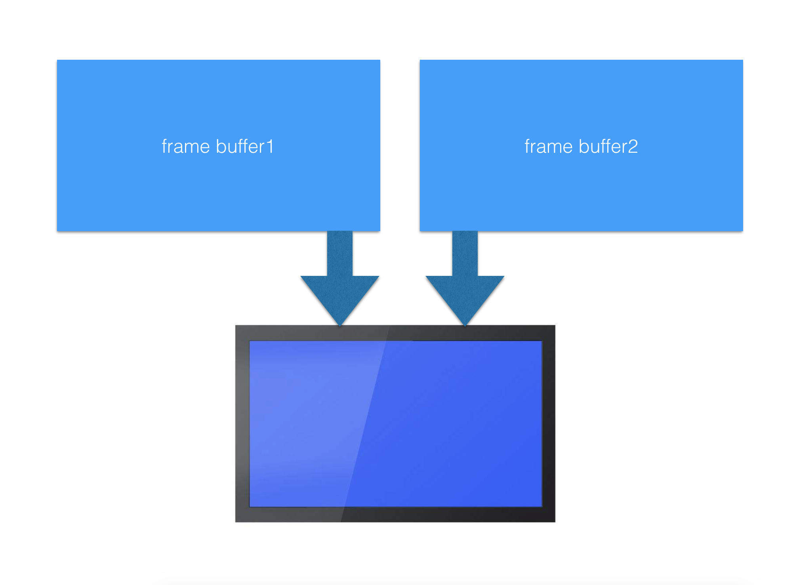
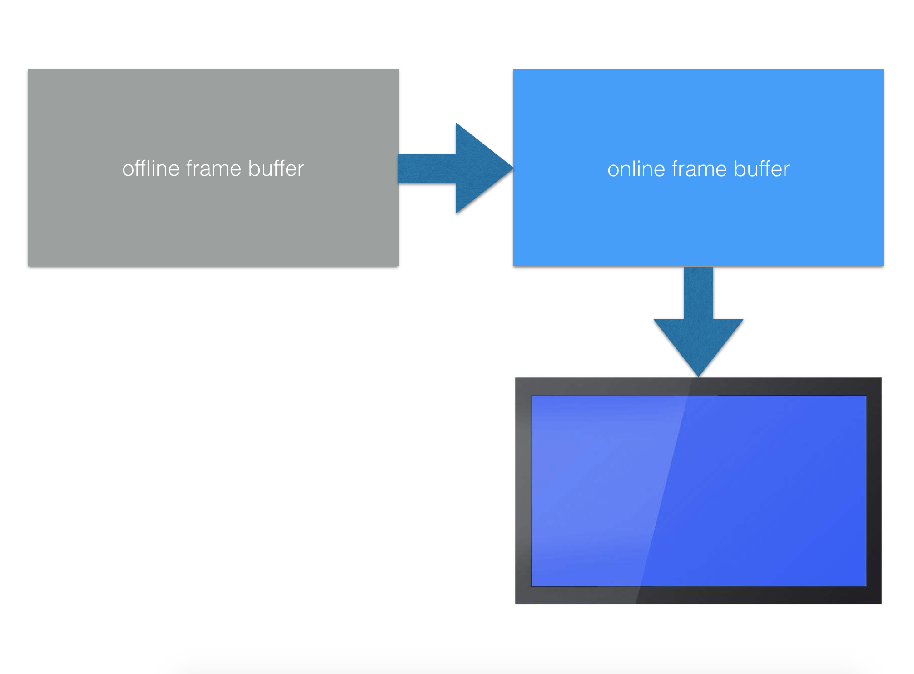
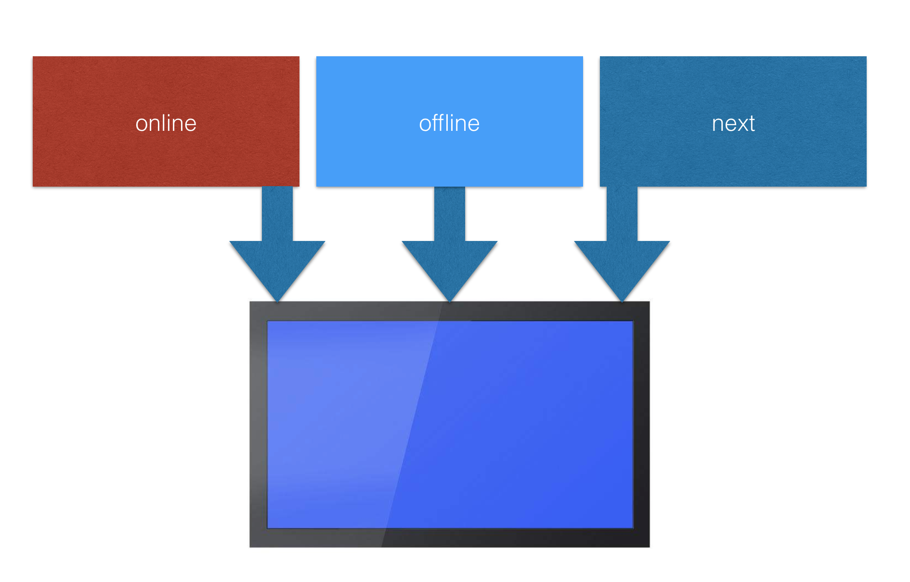

## FrameBuffer 的几种使用方式

### 一、单 framebuffer。

系统中只有一个 framebuffer，LCD 使用该 framebuffer 进行显示，GUI 使用该 framebuffer 进行绘制。

#### 优点：
* 只有一个 framebuffer，内存需求减半。
* 无需额外内存拷贝，而且只需画变化的部分，所以性能很高耗电低。

#### 缺点

* GUI 绘制的同时 LCD 在显示，这很容易出现屏幕闪烁。为了避免闪烁，可以在 GUI 绘制前禁用 LCD 同步数据（需等待 LCD 刷完后再禁用），等绘制完成时再启用 LCD 同步数据。我在 stm32f429igtx 上测试，发现确实不闪烁了，但是在窗口动画时，颜色有些不正常。不知是不是 LCD 频繁启用/禁用，LCD 时钟来不及稳定导致的。

> 如果硬件能够解决动画颜色不正常的问题或者不需要动画，这种方式是最好的选择。

### 二、双 framebuffer，一个 online 一个 offline，轮流切换显示。

* 1.GUI 在 offline 的 framebuffer 上绘制。
* 2.LCD 显示 online 的 framebuffer。
* 3.GUI 绘制完成后，交换两个 framebuffer，online 变 offline，offline 变 online。

#### 优点：

* 无需内存拷贝，切换 LCD 的 framebuffer 地址即可。

#### 缺点

* GUI 每次都需要进行完整的绘制，不能只绘制变化的部分。

### 三、双 framebuffer，一个固定 online 供 LCD 显示，一个固定 offline 供 GUI 绘制。

#### 优点：

* 只需绘制变化的部分，绘制完成后，把变化的部分从 offline 的 framebuffer 拷贝到 online 的 framebuffer 即可。

#### 缺点：

* 窗口动画时，可能整个屏幕都在变化，所以拷贝的量比较大。优化方法：对于平移的动画，可以让 GUI 直接往 online 的 framebuffer 上绘制，减少一次内存拷贝，而且不会出现闪烁。

### 四、三个 framebuffer，一个 online 供 LCD 显示，一个 offline 供 GUI 绘制，一个为下一个要显示的 framebuffer。

第二种方式的双缓冲切换方法有一个重要的性能问题：因为并不是在任意时刻都可以切换切换缓冲区，而是只有在当前帧显示完成后才能切换，否则就会出现刚显示一部分就切换到下一帧的情况，这会导致闪烁。所以每次切换都需要等待显示完成，按每秒刷新 60 帧算，这需要等待 16ms 左右，如果绘制本身需要 16ms，那帧率就只有 30FPS 了。如果使三个 framebuffer，就不用等待切换完成了，帧率一下可以到达 60FPS 了。

* 1.GUI 选取不是 online 和 next 的 framebuffer 作为 offline 的 framebuffer，在 offline 的 framebuffer 上绘制。
* 2.GUI 绘制完成后，把 offline 设置为 next 作为即将显示的 framebuffer。
* 3.LCD 在显示完成中断里，将 next 设置为 online 的 framebuffer，并将 next 设置为空闲。

#### 优点：

* 显示速度大幅提升。

#### 缺点：

* 多一些内存开销。

> 以上方式各有优缺点，请根据具体情况进行选择，建议使用最后两种方式。
