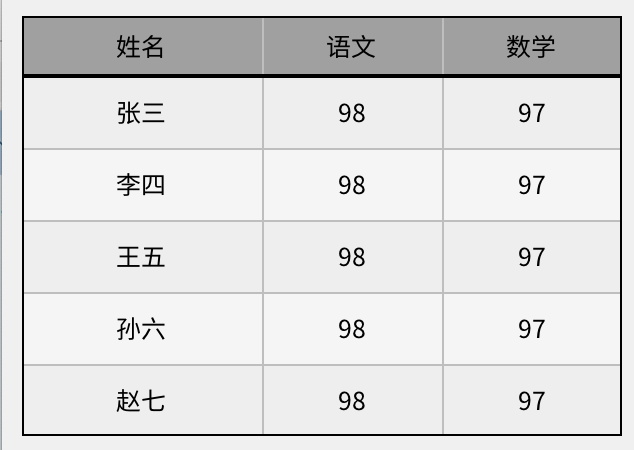

# Grid 控件用法

在很长一段时间内，grid 都只是起到语义上的作用，在功能上和 view 没有不同。最近我们对它做了以下改成，在不少地方可以提高开发效率。

* 可以指定不同列的宽度。这个在默认子控件布局中是没法实现的。
* 可以绘制网格线。按传统方法去做，虽然不是不可能，也是非常麻烦的。
* 奇偶行可以指定不同的背景颜色。按传统方法去做，也是非常麻烦的。

有了上述这些特性，我们就可以非常方便的实现表格效果。



> 由于 grid 本身不具有滚动效果，不适合显示大量数据。

## 1. 用法

### 1.1 指定行数

通过属性 rows 指定行数。

### 1.2 指定各列的参数

通过属性 columns_definition 指定各列的参数

```c
  /** 
   * @property {char*} columns_definition
   * @annotation ["set_prop","get_prop","readable","persitent","design","scriptable"]
   * 各列的参数。
   * 各列的参数之间用英文的分号 (;) 分隔，每列参数的格式为：
   *
   * col(w=?,left_margin=?,right_margin=?,top_maorgin=?,bottom_margin=?)
   *
   * * w 为列的宽度（必须存在）。取值在 (0-1] 区间时，视为 grid 控件宽度的比例，否则为像素宽度。
   * * left_margin（可选，可缩写为 l) 该列左边的边距。
   * * right_margin（可选，可缩写为 r) 该列右边的边距。
   * * top_margin（可选，可缩写为 t) 该列顶部的边距。
   * * bottom_margin（可选，可缩写为 b) 该列底部的边距。
   * * margin（可选，可缩写为 m) 同时指定上面 4 个边距。
   * * fill_available(可选，可缩写为f) 填充剩余宽度(只有一列可以指定)。
   * 
   */
  char* columns_definition;
```

### 1.3 显示网格

* 属性 show_grid 设置为 true。
* 在 style 中指定 grid_color 的颜色
* 在 style 中指定 border_color 的颜色

### 1.4 奇偶行不同背景颜色

* 在 style 中通过 even\_bg\_color 指定偶数行的背景颜色
* 在 style 中通过 odd\_bg\_color 指定奇数行的背景颜色

### 1.5 完整示例

```xml
<window>
  <grid x="10" y="10" w="-20" h="30" columns_definition="col(w=0.4,m=5);col(w=0.3,m=5);col(w=0.3,m=5);" rows="1"
    style.normal.grid_color="gray" style.normal.border_color="black" show_grid="true"
    style.normal.bg_color="#a0a0a0">
    <label text="姓名" />
    <label text="语文" />
    <label text="数学" />
  </grid>

  <grid x="10" y="40" w="-20" h="180" columns_definition="col(w=0.4,m=5);col(w=0.3,m=5);col(w=0.3,m=5);" rows="5"
    style.normal.grid_color="gray" style.normal.border_color="black"
    style.normal.odd_bg_color="#f5f5f5" style.normal.even_bg_color="#eeeeee" show_grid="true">
    <label text="张三" />
    <label text="98" />
    <label text="97" />

    <label text="李四" />
    <label text="98" />
    <label text="97" />

    <label text="王五" />
    <label text="98" />
    <label text="97" />

    <label text="孙六" />
    <label text="98" />
    <label text="97" />

    <label text="赵七" />
    <label text="98" />
    <label text="97" />
  </grid>
</window>
```
