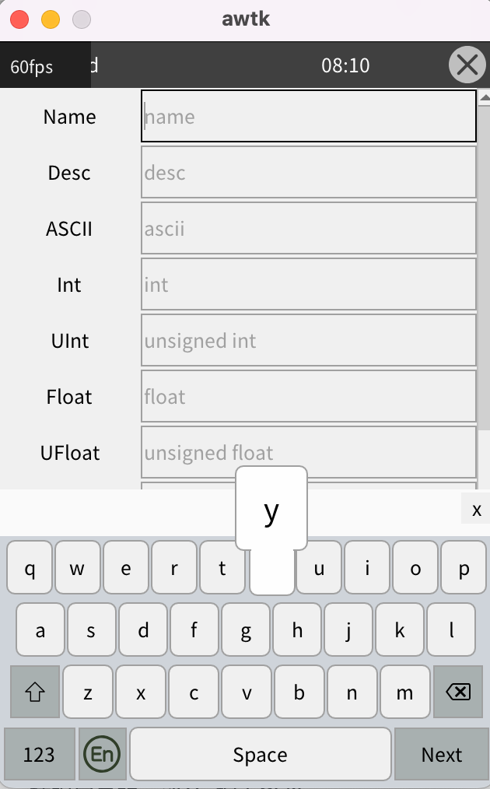

# 软键盘支持按键预览

## 一、介绍

在嵌入式系统中，通常屏幕很小。如果使用电容触摸屏，手指按下时会挡住其下的按钮，让人不确定是否按在了正确的位置，特别是在软键盘这种按钮按钮很密集的界面，更容易让人产生焦虑。

AWTK 支持了按钮预览的功能，可以大幅缓解这种焦虑。当按下按钮时，在上方显示一个放大的按钮，这种方法在 Android/iOS 中早已广泛使用，效果如下所示：




## 二、使用方法

### 1. 基本方法

指定按钮的 enable_preview 属性为 true 即可，如：

```xml
<button name="Q" enable_preview="true" text="Q"/>
```

### 2. 在软键盘的候选字中使用

候选字按钮是动态创建的，没有办法在 XML 中为按钮指定，为此我们为 candidates 也增加了 enable_preview 属性：

```xml
<candidates x="0" y="0" w="100%" h="30" enable_preview="true"/>
```

