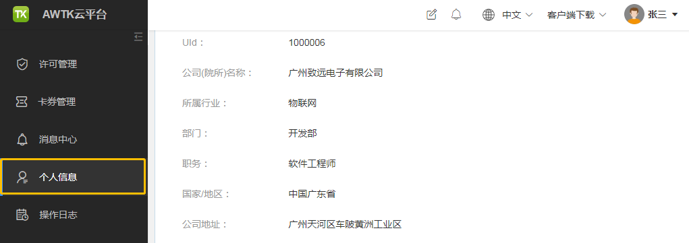
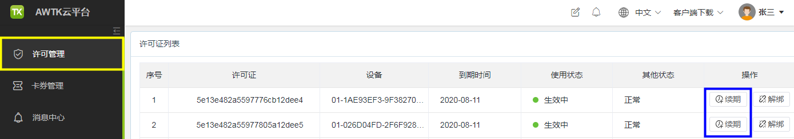

# 如何续期使用 AWTK Designer

因 AWTK Designer 许可证有使用期限，如果许可证到期了，将无法继续使用 AWTK Designer。如需继续使用 AWTK Designer，可按下面步骤，完成许可证续期：

##### 1、登录 AWTK 云平台：  https://awtk.zlg.cn 。

##### 2、完善个人信息。

在 AWTK 云平台的 “个人信息” 页面绑定好邮箱，并完整填写真实有效的公司信息，通过管理员审核后将有机会定期获赠 Designer 续期卡券，获得卡券后可以对 Designer 进行许可证续期。

##### 3、点击 “许可管理” 页面中的 “续期” 按钮，完成续期。

> 欲了解更多信息，请参阅：AWTK Designer 安装目录、Docs 文件夹下的文档：

> - 《AWTK Designer 快速安装指南。pdf》
> - 《AWTK Designer 快速使用指南。pdf》
> - 《AWTK Designer 用户手册。pdf》
