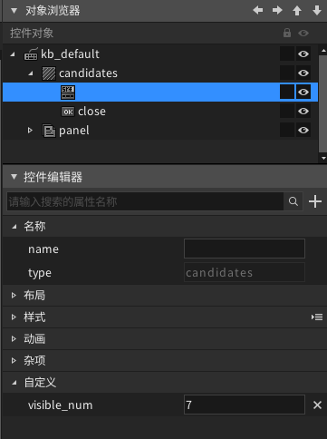
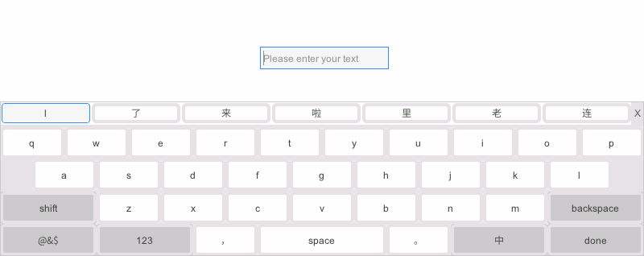

# 如何设置软键盘候选词可见个数

软键盘默认情况下一行的候选词会比较多，如果用户想调整候选词的可见个数，AWTK也支持了此功能，本篇文章将介绍如何使用该功能。

## 1. 新建软键盘

如果工程中还没有软键盘，可以参考文档[《如何添加中文输入法》](https://z.zlg.cn/articleinfo?id=853284)新建软键盘以及添加中文输入法。

## 2. 设置候选词控件的可见个数属性

调整候选词可见个数的属性名称是“visible_num”，可以直接在AWTK Designer给candidates控件添加自定义属性的形式修改：



或者可以直接修改keyboard的xml文件，添加visible_num属性：

```xml
<candidates x="0" y="0" w="100%" h="30" enable_preview="true" visible_num="7"/>
```

修改后在AWTK Designer重新打包资源文件并编译工程，运行程序预览效果：

