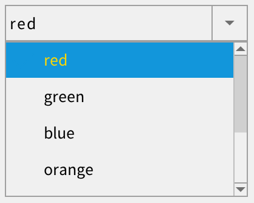

# 如何设置下拉选择框 (combo box) 弹出窗口/列表项的样式？

点击下拉选择框的按钮弹出下拉选择框，它是一个独立的 popup 窗口，所以设置样式与普通控件有所不同，之前很多朋友遇到过麻烦。本文详细介绍一下其样式的设置方法。



## 1. 样式

* 弹出窗口本身的样式。style 的名称为"combobox_popup"，如：

```xml
<popup>
  <style name="combobox_popup">
    <normal bg_color="#808080"/>
  </style>
</popup>
```

* 列表项的样式。style 的名称为"default"，如：

```xml
<combo_box_item>
  <style name="default" icon_at="left" text_color="black" bg_color="#f0f0f0">
    <normal  icon="empty" text_color="green"/>
    <focused icon="empty" bg_color="#1296db" text_color="gold" />
    <pressed icon="empty" bg_color="#1296db" text_color="white" />
    <over    icon="empty" bg_color="#1296db" text_color="white" />
    <normal_of_checked  icon="check"/>
    <focused_of_checked  icon="check" bg_color="#1296db" text_color="gold"/>
    <pressed_of_checked icon="check" bg_color="#1296db" text_color="white" />
    <over_of_checked    icon="check" bg_color="#1296db" text_color="white" />
  </style>
</combo_box_item>
```

* 扩展下拉选择框中的列表视图和滚动条，使用默认的样式。

## 2. 样式文件的查找顺序

### 2.1 普通下拉选择框

1. styles/combobox_popup

2. styles/default

### 2.2 扩展下拉选择框

1. styles/combobox_ex_popup

2. styles/default

## 3. 高级用法

在上面的用法中，所有的下拉选择框，使用相同的样式。在特殊情况下，可能需要为不同的下拉选择框指定不同的样式。此时可以使用下拉选择框的 theme\_of\_popup 属性，为其指定特别样式文件。如：

```xml
<combo_box_ex x="10" y="100" w="200" h="30" options="1;2;3;4;5;6;7;8;9;0;11;22;33;44;55" theme_of_popup="number"/>
```

也可以调用 API 去设置。如：

```c
combo_box_set_theme_of_popup(combo_box, "number")
```

在上面的例子中，就会到 styles/number 这个文件中去读取样式数据。

> 也可以使用当前窗口的样式，将 theme\_of\_popup 设置为当前窗口的样式（或者名称）。
