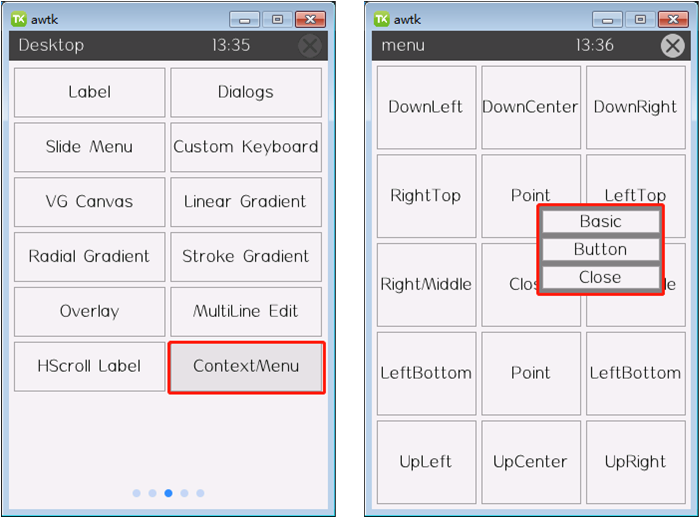

# 如何显示上下文菜单（俗称右键菜单）

如果需要实现鼠标右键弹出菜单，可以使用 popup 窗口设计菜单 UI 界面，并且通过 AWTK 提供 EVT_CONTEXT_MENU 事件实现该功能，具体步骤如下：

（1）使用 popup 窗口完成界面设计，作为弹出的菜单。在 popup 窗口的UI文件中，设置 self_layout 属性为"menu"类型，然后设置 close_when_click_outside 属性为"true"，表示点击到菜单外时关闭菜单，代码如下：

```xml
<!-- awtk/design/default/ui/menu_point.xml -->
<popup style="dark" self_layout="menu(w=128,h=90)" close_when_click_outside="true">
  ...
</popup>
```

（2）完成菜单的界面设计后，在源代码中注册对应控件的 EVT_CONTEXT_MENU 事件，例如此处为"open:menu_point"按钮注册该事件，在事件的回调函数中打开步骤（1）中设计好的菜单 UI 文件，代码如下：

```c
/* awtk/demos/demo_ui_app.c */
static ret_t on_context_menu(void* ctx, event_t* e) {
  open_window("menu_point", NULL);

  return RET_OK;
}

static ret_t install_one(void* ctx, const void* iter) {
  widget_t* widget = WIDGET(iter);
  widget_t* win = widget_get_window(widget);

  if (widget->name != NULL) {
    const char* name = widget->name;
    if (strstr(name, "open:") != NULL) {
      widget_on(widget, EVT_CLICK, on_open_window, (void*)(name + 5));
      widget_on(widget, EVT_LONG_PRESS, on_open_window, (void*)(name + 5));
      if (tk_str_eq(name, "open:menu_point")) {
        widget_on(widget, EVT_CONTEXT_MENU, on_context_menu, win);
      }
...
  return RET_OK;
}
```

（3）运行 awtk/bin/demoui，打开"ContextMenu"页面，鼠标右键点击"Point"按钮，效果如下图所示。


