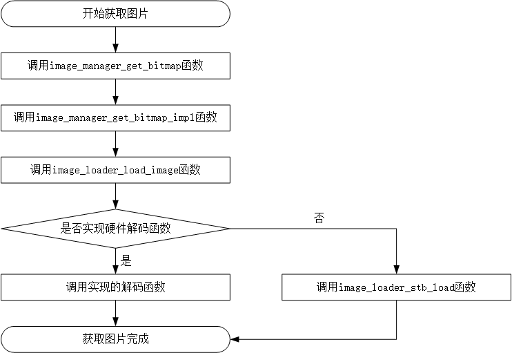

# 如何使用硬件图像解码

AWTK 默认采用 stb 库进行软件图像解码，全靠 CPU 计算。硬件解码是指将图像解码的工作分配给专门的硬件来处理，减轻 CPU 的计算量，从而提高图像绘制的性能。

## 1 AWTK 解码图片的流程

不同平台的解码流程可能会有区别，在 AWTK 中，用户需要自己实现硬件解码的接口，然后调用 image_loader_register 函数注册该接口，后续 AWTK 程序在进行解码时会自动调用该接口解码图片。

```c
/**
 * @method image_loader_register
 * 注册图片加载器。
 *
 * @annotation ["static"]
 * @param {image_loader_t*} loader loader对象。
 *
 * @return {ret_t} 返回RET_OK表示成功，否则表示失败。
 */
ret_t image_loader_register(image_loader_t* loader);
```

此处以获取 jpg 图片为例展示 AWTK 是如何获取图片的：



> 注：
> 1. 上图中的 image_manager_get_bitimp 函数是 AWTK 提供的获取图片功能，接口详见：awtk/src/base/image_manager.c。
> 2. 上图中的 image_loader_load_image 函数是 AWTK 提供的加载图片接口，接口详见：awtk/src/base/image_loader.h。

## 2 STM32 平台案例

本节以 AWTK 针对 STM32F767igtx 为例，大致讲解如何将硬件解码接口集成到 AWTK 中，移植层源码可前往 [GitHub](https://guihub.com/zlgopen/awtk-stm32f767igtx-raw) 下载。

步骤一：用户需根据实际使用的硬件平台实现 jpg 图像硬件解码的接口，然后定义一个 image_loader_t 的对象，重载对象中的 load 函数，代码如下：

```c
/* awtk-stm32f767igtx-raw/awtk-port/stm32_jpg_image_loader.c */
/* jpg硬件解码函数 */
static ret_t image_loader_stm32_jpg_load(image_loader_t *l,
                                         const asset_info_t *asset,
                                         bitmap_t *image) {
/* 实现jpg硬件解码，具体实现视硬件决定 */
}

static const image_loader_t stm32_jpg_image_loader = {
    .load = image_loader_stm32_jpg_load};

image_loader_t *image_loader_stm32_jpg() {
  return (image_loader_t *)&stm32_jpg_image_loader;
}
```

步骤二：在 LCD 初始化时顺便注册上一步骤中创建的 image_loader_t 对象，代码如下：

```c
/* awtk-stm32f767igtx-raw/awtk-port/main_loop_stm32_raw.c */
/* 在LCD初始化时调用注册函数 */
lcd_t* platform_create_lcd(wh_t w, wh_t h) {
  image_loader_register(image_loader_stm32_jpg());
  return stm32f767_create_lcd(w, h);
}
```

