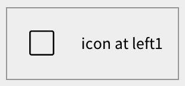
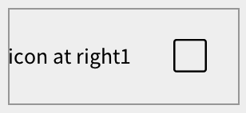
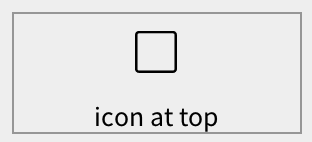
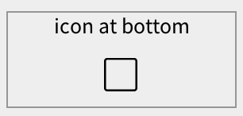
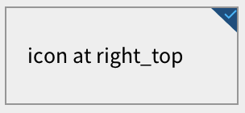
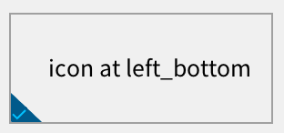
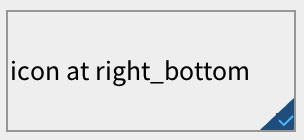
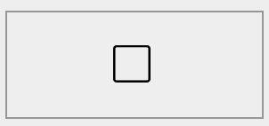

# 用 icon_at 属性设置图标位置

## 1. style

在 style 文件中通过 icon_at 属性设置图标位置。

```xml
  <style name="right_bottom" icon_at="right_bottom">
    <normal  icon="unchecked_right_bottom" />
    <pressed icon="unchecked_right_bottom" />
    <over    icon="unchecked_right_bottom" text_color="green"/>
    <focused icon="unchecked_right_bottom" text_color="green"/>
    <normal_of_checked icon="checked_right_bottom" text_color="blue"/>
    <pressed_of_checked icon="checked_right_bottom" text_color="blue"/>
    <over_of_checked icon="checked_right_bottom" text_color="green"/>
    <focused_of_checked icon="checked_right_bottom" text_color="green"/>
    <normal_of_indeterminate icon="indeterminate" text_color="blue"/>
    <pressed_of_indeterminate icon="indeterminate" text_color="blue"/>
    <over_of_indeterminate icon="indeterminate" text_color="green"/>
    <focused_of_indeterminate icon="indeterminate" text_color="green"/>
  </style>
```

## 2. 示例（多选按钮）

### 2.1. left 图标在左边中间

* 代码

```xml
 <check_button text="icon at left1" focusable="true" style="left"/>
``` 

* 效果



### 2.2. right 图标在右边中间

* 代码

```xml
<check_button text="icon at right1" focusable="true" style="right" />
```

* 效果



### 2.3. top 图标在上边中间

* 代码

```xml
<check_button text="icon at top" focusable="true" style="top" />
```

* 效果



### 2.4. bottom 图标在下边中间

* 代码

```xml
<check_button text="icon at bottom" focusable="true" style="bottom" />
```

* 效果



### 2.5. left_top 图标在左上角

* 代码
    
```xml
<check_button text="icon at left_top" focusable="true" style="left_top" />
```

* 效果


### 2.6. right_top 图标在右上角

* 代码

```xml
<check_button text="icon at right_top" focusable="true" style="right_top" />
```

* 效果




### 2.7. left_bottom 图标在左下角

* 代码

```xml
      <check_button text="icon at left_bottom" focusable="true" style="left_bottom" />
```

* 效果



### 2.8. right_bottom 图标在右下角

* 代码

```xml
<check_button text="icon at right_bottom"
       focusable="true" style="right_bottom" />
```

* 效果



### 2.9. center 图标在中间

> 注意：center 属性不要 text 属性，否则退化为 left 属性。

* 代码

```xml
 <check_button focusable="true" style="center" />
```      

* 效果




 


