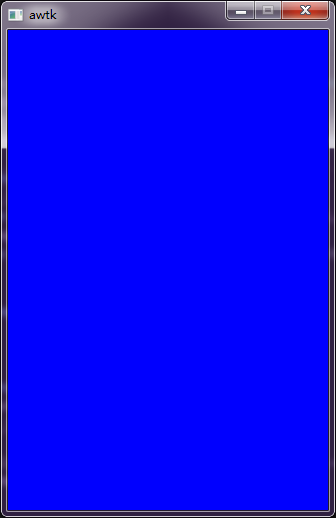
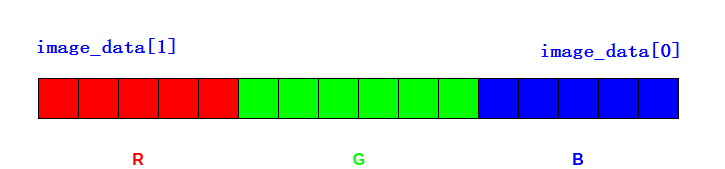

# 如何使用 mutable\_image 控件

如果需要将视频数据或者摄像头采集到的画面显示到屏幕上，可以使用 mutable_image 控件来实现该功能。该控件主要提供了 mutable_image_set_prepare_image 函数注册一个回调函数，该回调函数在每次绘制之前被调用，用于准备下一帧要显示的图片。

## 1 相关函数

在使用 mutable_image 控件的时候，通常涉及到下面几个函数。

（1）mutable_image_set_prepare_image 函数

- 函数原型：

```c
/**
 * @method mutable_image_set_prepare_image
 * 设置prepare_image回调函数。
 *
 * prepare_image回调函数在每次绘制之前被调用，用于准备下一帧要显示的图片。
 * 比如获取摄像头的预览图片，将其设置到image参数中。
 *
 * 注意：在回调函数中，只能修改图片的内容，不用修改图片的大小和格式，如果不匹配请先转换。
 *
 * @param {widget_t*} widget mutable_image对象。
 * @param {mutable_image_prepare_image_t} prepare_image 准备图片的回调函数。
 * @param {void*} prepare_image_ctx prepare_image回调函数的上下文。
 *
 * @return {ret_t} 返回RET_OK表示成功，否则表示失败。
 */
ret_t mutable_image_set_prepare_image(widget_t* widget,
            mutable_image_prepare_image_t prepare_image, void* prepare_image_ctx);
```

mutable_image_prepare_image_t 的定义如下：

```c
typedef ret_t (*mutable_image_prepare_image_t)(void* ctx, bitmap_t* image);
```

（2）bitmap_create_ex 函数

- 函数原型：

```c
/**
 * @method bitmap_create_ex
 * 创建图片对象。
 * @annotation ["constructor", "scriptable", "gc"]
 * @param {uint32_t} w 宽度。
 * @param {uint32_t} h 高度。
 * @param {uint32_t} line_length 每一行实际占用的内存，一般情况下为w\*bpp，可填写默认值0。
 * @param {bitmap_format_t} format 格式。
 *
 * @return {bitmap_t*} 返回bitmap对象。
 */
bitmap_t* bitmap_create_ex(uint32_t w, uint32_t h, uint32_t line_length, 
                           bitmap_format_t format);
```

format 参数位图格式常量详见下表：

| 名称                | 说明                                                   |
| ------------------- | ------------------------------------------------------ |
| BITMAP_FMT_NONE     | 无效格式                                               |
| BITMAP_FMT_RGBA8888 | 一个像素占用4个字节，RGBA占一个字节，按内存地址递增    |
| BITMAP_FMT_ABGR8888 | 一个像素占用4个字节，ABGR占一个字节，按内存地址递增    |
| BITMAP_FMT_BGRA8888 | 一个像素占用4个字节，BGRA占一个字节，按内存地址递增    |
| BITMAP_FMT_ARGB8888 | 一个像素占用4个字节，ARGB占一个字节，按内存地址递增    |
| BITMAP_FMT_RGB565   | 一个像素占用2个字节，RGB分别占用5,6,5位,按内存地址递增 |
| BITMAP_FMT_BGR565   | 一个像素占用2个字节，BGR分别占用5,6,5位,按内存地址递增 |
| BITMAP_FMT_RGB888   | 一个像素占用3个字节，RGB占一个字节，按内存地址递增     |
| BITMAP_FMT_BGR888   | 一个像素占用3个字节，RGB占一个字节，按内存地址递增     |
| BITMAP_FMT_GRAY     | 一个像素占用1个字节                                    |
| BITMAP_FMT_MONO     | 一个像素占用1比特                                      |

（3）image_fill 函数

- 函数原型：

```c
/**
 * @method image_fill
 * 用颜色绘制指定的区域。
 * @param {bitmap_t*} dst 目标图片对象。
 * @param {const rect_t*} dst_r 要填充的目标区域。
 * @param {color_t} c 颜色。
 *
 * @return {ret_t} 返回RET_OK表示成功，否则表示失败，返回失败则上层用软件实现。
 */
ret_t image_fill(bitmap_t* dst, rect_t* dst_r, color_t c);
```

（4）image_copy 函数

- 函数原型：

```c
/**
 * @method image_copy
 * 把图片指定的区域拷贝到framebuffer中。
 * @param {bitmap_t*} dst 目标图片对象。
 * @param {bitmap_t*} src 源图片对象。
 * @param {const rect_t*} src_r 要拷贝的区域。
 * @param {xy_t} dx 目标位置的x坐标。
 * @param {xy_t} dy 目标位置的y坐标。
 *
 * @return {ret_t} 返回RET_OK表示成功，否则表示失败，返回失败则上层用软件实现。
 */
ret_t image_copy(bitmap_t* dst, bitmap_t* src, rect_t* src_r, xy_t dx, xy_t dy);
```

## 2 基本用法

可以通过下面两种方式使用 mutable_image 控件，两者完成的功能都是一样的，设置屏幕的颜色为蓝色，效果如下图所示：



### 2.1 示例一

直接操作位图数据 image_data，然后往 image_data 设置相应的颜色值，image_data 的大小 = 位图的高度 \* bitmap_get_line_length（每一行实际占用的内存，一般情况下为 w * bpp，其中 w 表示位图的高度，bpp 表示一个像素占用字节数）。image_data 的位图数据格式要与当前 LCD 保持一致,可以调用 lcd_get_desired_bitmap_format 函数获取当前LCD位图数据格式，例如：

```c
bitmap_format_t format = lcd_get_desired_bitmap_format(c->lcd);
```

其中，bitmap_format_t 的定义可参考上面中的 format 参数说明或者参考 `awtk/src/base/types_def.h`文件。

- 如果 format = BITMAP_FMT_BGR565，表示一个像素占用 2 个字节，BGR 分别占用 5,6,5 位,按内存地址递                                                                                                                                                                                                                               增，设置 image_data 的颜色值为蓝色数据格式如下：

```c
image_data[0] = 0x1f;   //第一个像素
image_data[1] = 0x00;   //第一个像素
image_data[2] = 0x1f;   //第二个像素
image_data[3] = 0x00;   //第二个像素
...
```

- 如果 format = BITMAP_FMT_BGRA8888，表示一个像素占用 4 个字节，BGRA 占一个字节，按内存地址递增，设置 image_data 的颜色值为蓝色数据格式如下：

```c
image_data[0] = 0x1f;   //第一个像素
image_data[1] = 0x00;   //第一个像素
image_data[2] = 0x00;   //第一个像素
image_data[3] = 0xff;    //第一个像素
```

AWTK 中默认使用的 LCD 的格式为 BGR565，对应的数据格式请看下图



实现代码如下：

```c
ret_t mutable_image_prepare_image(void* ctx, bitmap_t* image) {
  uint32_t i = 0;
  uint32_t bpp = 0;
  uint32_t size = 0;
  uint8_t* image_data = NULL;
  bpp = bitmap_get_bpp(image);
  size = image->h * bitmap_get_line_length(image);
  image_data = bitmap_lock_buffer_for_write(image);

  /*
   * LCD 的格式为 BGR565 ,那么 bpp 应该为 2
   * image_data是 mutable_image 控件的 bitmap 的位图数据，数据格式与LCD保持一致
   * image_data大小 =  image->h * bitmap_get_line_length（每一行实际占用的内存，一般情况下为w*bpp）
   * 这里给 image_data 设置为蓝色，当然也可以设置摄像头数据或者视频数据
   */
  for (; i < size; i += bpp, image_data += bpp) {
    image_data[0] = 0x1f;
    image_data[1] = 0x00;
  }

  return RET_OK;
}

ret_t application_init() {
  tk_ext_widgets_init();

  widget_t* win = window_create(NULL, 0, 0, 0, 0);

  /* 创建 mutable_image 控件 */
  widget_t* mutable = mutable_image_create(win, 0, 0, win->w, win->h);

  /* 注册 mutable_image 控件的绘制图像回调函数 */
  mutable_image_set_prepare_image(mutable, mutable_image_prepare_image, NULL);

  return RET_OK;
}
```

### 2.2 示例二

调用 bitmap_create_ex 创建图片对象，图片对象创建好后，调用 image_fill 函数往图片对象填充颜色值。最后调用 image_copy 函数负责将要显示的图片复制到目标图片中（该图片对象由 mutable_image 控件自动生成和销毁），代码如下：

```c
static ret_t mutable_image_prepare_image(void* ctx, bitmap_t* image) {
  bitmap_t* src = (bitmap_t*)ctx;
  rect_t r = rect_init(0, 0, image->w, image->h);

  color_t color;
  color.rgba.r = 0;
  color.rgba.g = 0;
  color.rgba.b = 0xff;
  color.rgba.a = 0xff;

  image_fill(src, &r, color);
  image_copy(image, src, &r, 0, 0);

  return RET_OK;
}

ret_t application_init() {
  widget_t* mutable_image = NULL;
  bitmap_t* src = NULL;
  widget_t* win = window_create(NULL, 0, 0, 0, 0);
  canvas_t* c = widget_get_canvas(win);

  /* XXX: 解码图片的格式和 lcd 的格式保持一致，才能获得最高的性能 */
  bitmap_format_t format = lcd_get_desired_bitmap_format(c->lcd);
  src = bitmap_create_ex(win->w, win->h, 0, format);

  mutable_image = mutable_image_create(win, 0, 0, win->w, win->h);
  mutable_image_set_prepare_image(mutable_image, mutable_image_prepare_image, src);

  return RET_OK;
}
```

> 完整示例请参考 [mutable_image.c](https://github.com/zlgopen/awtk-c-demos/blob/master/demos/mutable_image.c)。

## 3 硬件图层融合用法

在某些平台下，支持 LCD 有多个硬件 FrameBuffer，这些硬件 FrameBuffer 可以在硬件绘制时合成到 LCD 上显示，可将这些 FrameBuffer 理解为多个图层，图层融合后绘制到 LCD 上，这样的速度比软件合成要快很多，因此 mutable_image 控件也支持硬件图层融合用法。

> 注：硬件图层融合用法只适用于支持 LCD 有多个硬件 FrameBuffer 的平台。

使用硬件图层融合用法需满足以下要求：

- AWTK 的 LCD 类型必须是 32 位色的 RGBA 或 BGRA；
- 定义宏 WITH_LCD_CLEAR_ALPHA，让 AWTK 支持刷新透明区域，并支持背景色为透明的混合算法。

需要注意的是：

1. 定义宏 WITH_LCD_CLEAR_ALPHA 会降低 AWTK 的性能；
2. AWTK 支持刷新透明区域，即支持 window 背景色为透明或半透明的效果，其原理是在绘图之前在矩形区域刷一层全透明的颜色；
3. AWTK 支持背景色为透明的混合算法，该算法会比背景色为不透明的混合算法更加消耗性能（背景色为透明，需要比背景色不透明的每个像素点增加好几个乘除法的运算，但是如果背景色本身为不透明就会退化为原来的背景色不透明的混合算法）。

### 3.1 示例

硬件图层融合用法相较于基本用法不同的地方有三点：

- 硬件图层融合用法需要 LCD 类型为 32 位色的 RGBA 或 BGRA；
- 需要有 LCD 的硬件 FrameBuffer 的地址，该地址通常由硬件平台指定；
- 需要调用 mutable_image_set_framebuffe r函数设置硬件 FrameBuffer。

调用 mutable_image_set_framebuffer 函数设置硬件 FrameBuffer后，mutable_image 控件不会在 AWTK 的 GUI 上显示，但由于 mutable_image 控件的刷新函数受到 AWTK 消息循环机制的影响，所以 mutable_image 控件的帧率和 AWTK 的帧率一样，但优点是用户只需要把图像数据刷新到 mutable_image 控件上即可，接下来的过程由 AWTK 处理，代码如下：

```c
/* 假设 DEVICE_FB 宏的地址为 lcd 的硬件 framebuffer 地址 */
#define DEVICE_FB (uint8_t*)0XC0000000

ret_t mutable_image_prepare_image(void* ctx, bitmap_t* image) {
  uint32_t i = 0;
  uint32_t bpp = 0;
  uint32_t size = 0;
  uint8_t* image_data = NULL;
  bpp = bitmap_get_bpp(image);
  size = image->h * bitmap_get_line_length(image);
  image_data = bitmap_lock_buffer_for_write(image);

  /* 
   * 把带有透明度的蓝色填充到 LCD 的硬件 FrameBuffer 中
   * image_data 是 mutable_image 控件的 bitmap 的位图数据
   * 这里的 image 的位图格式和长宽是在 mutable_image_set_framebuffer 函数中设置的
   * 这里给 image_data 设置为蓝色，当然也可以设置摄像头数据或者视频数据
   * 这里的 image_data 的地址就是上面 LCD 的硬件 FrameBuffer 地址
   */
  for(;i < size; i += bpp, image_data += bpp) {
      image_data[0] = 0xff;
      image_data[1] = 0x00;
      image_data[2] = 0x00;
      image_data[3] = 0xa0;
  }
  return RET_OK;
}

ret_t application_init() {
  tk_ext_widgets_init();
  widget_t* win = window_create(NULL, 0, 0, 0, 0);
  widget_t* mutable = mutable_image_create(win, 0, 0, win->w, win->h);
  mutable_image_set_prepare_image(mutable, mutable_image_prepare_image, NULL);
  
  /* mutable_image 控件设置位图格式为 BGRA8888 的 LCD 的硬件 FrameBuffer */
  mutable_image_set_framebuffer(mutable, win->w, win->h, BITMAP_FMT_BGRA8888, DEVICE_FB);
  
  return RET_OK;
}
```

### 3.2 直接刷新硬件 FrameBuffer

若嵌入式平台支持多线程，可以使用一条线程绘制视频数据到其中一个硬件图层上，然后使用另外一条线程绘制 AWTK 的 GUI。该方法的优点是视频的刷新率不会受到 AWTK 的帧率影响，就算 AWTK 的 GUI 出现卡顿现象，也不会导致视频卡顿。

由于 mutable_image 控件只支持 RGBA8888、BGRA8888、RGB888、BGR888、RGB565、BGR565 格式的图像，因此当视频数据为 YUV 格式的图像时，就需要开发者在程序中将 YUV 图像转换为 mutable_image 控件支持的图像格式，再绘制到控件上。若硬件图层支持各种格式的透传，例如支持 YUV 图像，那么就可以节省格式转换所消耗的时间与资源。
