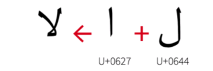
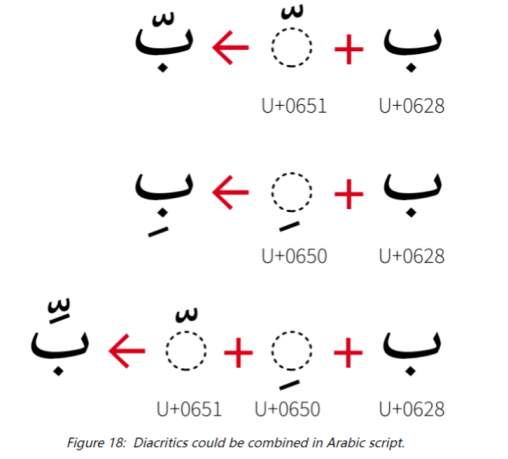

# 如何使用 FriBidi/SheenBidi + HarfBuzz 文本整形功能

AWTK 新增支持使用 HarfBuzz + FriBidi/SheenBidi 库，对阿拉伯语、印度语、希伯来语和泰语等语言进行文本整形并显示。

## 什么是文本整形？

### 文本整形简介

文本整形是将 Unicode 文本转换为经过适当排列的字形序列的过程，这些字形可被渲染到屏幕上，或生成最终输出形式以嵌入文档中。文本整形主要应用于阿拉伯语、印度语等复杂书写规则中，是一个多步骤的处理过程，主要涉及：

1. 根据书写规则调整字形，例如阿拉伯语的连字（ligatures）、印度文的元音位置重排、泰文的重叠符号等；
2. 启用字体内置的排版功能，如字距调整（kern）、小型大写字母（smcp）等；
3. 文本方向处理，例如阿拉伯语一般为从右到左排序，英文则是从左到右；
4. 字形选择与定位，根据上下文选择正确的字形，并精确计算每个字形在水平或垂直方向的位置。

整形过程依赖以下因素：输入字符串、当前使用的字体、字符串所属的文字系统（书写体系）以及字符串对应的语言。

### 文本整形示例

文本整形前后，显示的字模数量、字模位置或字模形状都可能发生改变。例如下图的阿拉伯字符串，原本由两个字符（Unicode 编码为 U+0627 和 U+0644）经整形后变为一个全新的字模。此时字符串在内存中仍由右侧两个字符表示，只是在绘制时显示为左侧的字模。



下图则是字模位置发生改变的几个文本整形示例，可以看到右侧为原生字符，经文本整形后（左侧），部分字模的位置发生了变化。




## 什么是 HarfBuzz？

### HarfBuzz 库简介

HarfBuzz 是一个开源的文本整形引擎，可将 Unicode 文本转为精确的字形序列和排版布局。它支持复杂的书写规则（如阿拉伯语、印度语、藏文等），并支持解析 OpenType 字体特性（连字、替换字形、字距调整等）。

### HarfBuzz 工作原理

1. 输入：HarfBuzz 接收一个 Unicode 文本字符串、一个 OpenType 或 TrueType 字体文件（AWTK 内部一般使用 .ttf 后缀的 TrueType 字体文件）以及排版参数（文本方向、语言）；
2. 处理：HarfBuzz 识别并分析文本的语言和书写规则，根据规则替换或调整字模形状、排布方向等，并精确计算每个字模的位置；
3. 输出：每个字模的 ID 序列（glyph id）、每个字模的坐标和偏移量、文本分段信息（可用于 edit 控件的光标移动和选择）。

在获得 HarfBuzz 输出的数据后，结合 AWTK 内部的字体渲染引擎 stb_truetype 或 FreeType，经过替换对应 ID 的字模、应用字模坐标和偏移量等操作后，即可显示文本整形后的效果。

## 什么是 FriBidi / SheenBidi ？

### FriBidi / SheenBidi 库简介

FriBidi 和 SheenBidi 均是用于处理双向文本的开源库，但二者的开源协议并不相同。它们主要用于实现 Unicode 双向算法，解决包含从左到右（LTR 文本，如中文、英文）和从右到左（RTL 文本，如阿拉伯语、希伯来语）字符的混合文本的正确显示顺序问题。在本方案中，主要用于对文本排序后提供给 HarfBuzz 进行后续的整形处理。

两个库在功能上差异不大，SheenBidi 相对于 FriBidi 在处理复杂文本上效率更高一些；而 FriBidi 内置了对部分阿拉伯文本的处理，在不使用 HarfBuzz 时，单独使用 FriBidi 库也能对阿拉伯文本进行一些简单的处理。

## AWTK + FriBidi / SheenBidi + HarfBuzz 的方案介绍

动态整形方案使用 C/C++ 版本的 HarfBuzz 库，AWTK 内部已对其进行了适配，在编译 AWTK 时会一同加入编译。在绘制字符串过程中，AWTK 内部会调用 FriBidi/SheenBidi + HarfBuzz 库获取文本整形数据，最后调用字体渲染库 stb_truetype 或 FreeType 进行显示。

该方案的优点如下：

1. 支持文本变动的场景，在文本变动后也可显示文本整形效果；
2. 无需额外生成文本整形数据文件，因此在大量字符串场景下也不会加载整形数据占用额外内存。

缺点有如下几点：

1. 动态整形方案的 C/C++ 版本 HarfBuzz 编译出来的库文件较大，对低资源平台不友好；
2. 由于 HarfBuzz 本身代码逻辑较为复杂，在获取字模前都会调用 HarfBuzz 库函数，即使在少量文本的场景下效率也会受到影响。

注意：使用动态字符串方案时需要编译 HarfBuzz，而 HarfBuzz 的编译对编译器有一定要求。使用 MSVC 编译时，最低版本为 14.0.25420.1；使用 gcc 编译时，最低需要 4.8 版本。

## AWTK + FriBidi / SheenBidi + HarfBuzz 从零开始配置与使用

若想在 AWTK 中使用 FriBidi/SheenBidi + HarfBuzz，需要先进行一些配置。下面将分别介绍如何指定 bidi 双向排序库，以及动态字符串整形方案的配置与使用。

### 指定双向排序库

在 awtk_config.py 中新增了 BIDI_BACKEND 设置，`sheenbidi`、`fribidi` 分别代表 SheenBidi 库和 FriBidi 库（若不指定，默认使用 SheenBidi 库）。

```python
# awtk_config.py

BIDI_BACKEND = 'sheenbidi'
#BIDI_BACKEND = 'fribidi'
```

一般**不建议直接修改 awtk_config.py** 的配置。若需要编译某个 BIDI_BACKEND 模式，可在输入 scons 命令时加入选项。下面举例说明如何选择并编译以上几种模式。

若需要使用 SheenBidi 库，可用以下命令进行编译：

```sh
scons BIDI_BACKEND=sheenbidi
```

若要使用 FriBidi 库，可用以下命令进行编译：

```sh
scons BIDI_BACKEND=fribidi
```

### 动态字符串方案的配置与使用

#### 配置

在 awtk_config.py 中新增了 TEXT_SHAPING 设置，`no_text_shaping`、`harfbuzz` 分别代表不使用 HarfBuzz 整形和使用 HarfBuzz 动态整形两种模式（默认不使用整形）。

```python
# awtk_config.py

TEXT_SHAPING = 'no_text_shaping'
#TEXT_SHAPING = 'harfbuzz'
```

一般**不建议直接修改 awtk_config.py** 的配置。若需要编译某个 TEXT_SHAPING 模式，可在输入 scons 命令时加入选项。下面举例说明如何选择并编译动态字符串整形方案。

``` sh
scons TEXT_SHAPING=harfbuzz
```

#### 使用

在完成配置并编译后，可运行 AWTK 自带的示例（路径：awtk/bin/demo_harfbuzz）查看动态整形效果。

## 如何在 Linux 平台使用

Linux 平台与 Windows 平台类似，也添加了 BIDI_BACKEND 与 TEXT_SHAPING 的编译选项，只需在编译时添加对应选项即可。

### 使用动态字符串整形方案编译

在终端中进入 awtk-linux-fb 文件夹，输入以下命令进行编译：

```shell
scons TEXT_SHAPING=harfbuzz
```

## 如何在 RTOS 平台使用

在 RTOS 平台编译时，需要手动加入宏和第三方文件。

### 使用动态字符串整形方案编译

将以下目录下的所有文件加入编译：

```
3rd/harfbuzz
src/font_loader/harfbuzz
```

在项目的 `awtk_config.h` 中加入以下宏定义：

```c
// 以下两个字体渲染引擎选择其中一个
#define WITH_STB_FONT 1
#define WITH_FT_FONT 1

// 定义启用 harfbuzz 动态整形
#define WITH_HARFBUZZ_TEXT_SHAPING 1
```

完成以上两步后再进行编译，即可使用动态字符串整形方案。

