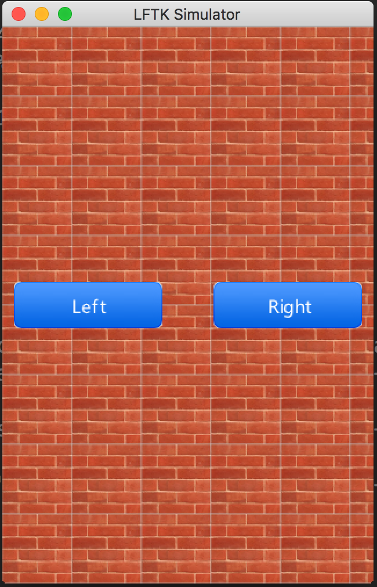

# AWTK中的图片显示方式

## 一、显示方式

AWTK提供了多种图片显示方式：

* 居中显示。将图片按原大小显示在目标矩形的中央。
* 缩放显示。将图片缩放至目标矩形的大小(不保证宽高成比例)。
* 自动缩放显示。将图片缩放至目标矩形的宽度或高度(选取最小的比例)，并居中显示。
* 宽度缩放显示。将图片缩放至目标矩形的宽度，高度按此比例进行缩放，超出不部分不显示。
* 高度缩放显示。将图片缩放至目标矩形的高度，宽度按此比例进行缩放，超出不部分不显示。
* 平铺显示。
* 水平方向平铺显示，垂直方向缩放。
* 垂直方向平铺显示，水平方向缩放。
* 9宫格显示。将图片分成等大小的9块，4个角按原大小显示在目标矩形的4个角，左右上下和中间5块分别缩放显示在对应的目标区域。
* 水平方向3宫格显示，垂直方向居中。将图片在水平方向上分成等大小的3块，左右两块按原大小显示在目标矩形的左右，中间一块缩放显示在目标区域中间剩余部分。
* 垂直方向3宫格显示，水平方向居中。将图片在垂直方向上分成等大小的3块，上下两块按原大小显示在目标矩形的上下，中间一块缩放显示在目标区域中间剩余部分。
* 水平方向3宫格显示，垂直方向缩放。将图片在水平方向上分成等大小的3块，左右两块按原大小显示在目标矩形的左右，中间一块缩放显示在目标区域中间剩余部分。
* 垂直方向3宫格显示，水平方向缩放。将图片在垂直方向上分成等大小的3块，上下两块按原大小显示在目标矩形的上下，中间一块缩放显示在目标区域中间剩余部分。

## 二、在程序中使用(仅限于image控件)

```
image_set_draw_type(img, IMAGE_DRAW_CENTER);
```

## 三、在XML界面描述文件中使用(仅限于image控件)

```
<window name="main" x="0" y="0" w="320" h="480">
  <image style="1:border" x="0" y="0" w="50%" h="50%" image="earth" draw_type="center"/>
  <image style="1:border" x="0" y="50%" w="100%" h="50%" image="earth" draw_type="repeat"/>
</window>
```

## 四、在主题中使用(适用于所有控件的背景)

```
<window style-type="1:bricks" bg-image="bricks"  bg-image-draw-type="repeat"/>
<button style-type="1:blue_img" state="normal"   bg-image="btn_blue_n" bg-image-draw-type="3patch_x" text-color="white"/>
<button style-type="1:blue_img" state="pressed"  bg-image="btn_blue_p" bg-image-draw-type="3patch_x" text-color="white"/>
<button style-type="1:blue_img" state="over"     bg-image="btn_blue_o" bg-image-draw-type="3patch_x" text-color="white"/>
```

## 五、查看实际效果

demos/xml/draw_type目录下有一些XML界面描述文件，这些文件演示了各种显示方式的效果。可以用preview\_ui来预览，如：

```
./bin/preview_ui demos/xml/draw_type/bg.xml
```
效果图：


