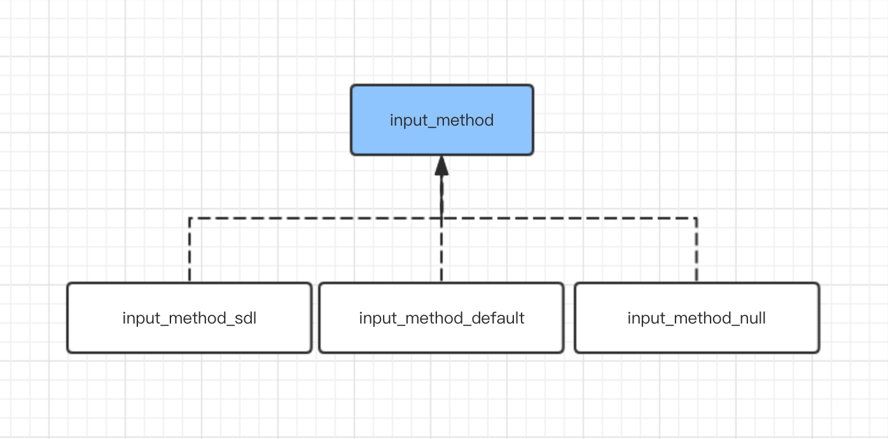
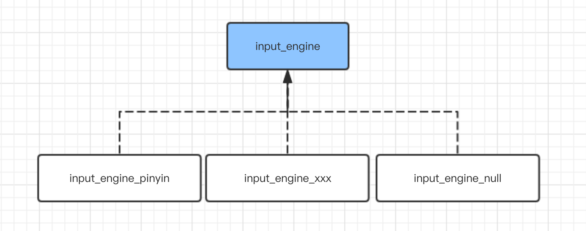

# 输入法

输入法是 GUI 重要的组件之一，虽然实现起来并不是太复杂，但其涉及的组件比较多，理解起来还是比较困难的，这里介绍一下 AWTK 中输入法的内部架构。


## 一、软键盘

在嵌入式系统中，通常没有物理键盘，所以需要在屏幕上实现软键盘。AWTK 中的软键盘是一个普通的窗口，其中的按钮和候选字控件，都是用 AWTK 的 UI 描述文件定义的，可以方便实现各种不同的软键盘。软键盘的描述文件放在 res/raw/ui 目录下，文件名以 kb_打头。

与普通窗口相比，软键盘有以下不同：

* 被点击时不会影响原有编辑器的焦点。
* 缺省不接受按键事件(除非指定grab_keys属性为true)和输入文本事件。

为了实现方便，AWTK 中引入了一个 keyboard 的窗口类，在设计时考虑了下面几个问题：

* 1. 软键盘上有多个页面。有的输入中文，有的输入大写字母，有的输入小写字母，有的输入数字，有的输入符号。

**方案：** 在软键盘中可以放多个页面，点击切按钮时进行切换。按钮的名字以"page:"开头，即意味着按下该按钮时切换到指定的页面。比如，下面的按钮被点击时就会切换到数字符号键盘：

```
 <button name="page:symnum" style="1:highlight" w="15%" text="123"/>
```

* 2. 不同的编辑器需要不同的软键盘。比如输入数值的编辑器得到焦点时，就应该只显示输入数值的软键盘。

**方案：** 为不同输入类型的编辑器提供不同软键盘，这些软键盘有各自的 UI 描述文件。输入类型和 UI 描述文件名之间的对应关系如下：

| 输入类型   |      键盘描述文件      |  说明 |
|----------|:-------------:|------:|
| INPUT_PHONE | kb_phone | 电话号码|
| INPUT_INT | kb_int | 整数 |
| INPUT_FLOAT | kb_float | 浮点数|
| INPUT_UINT | kb_uint | 非负整数 |
| INPUT_UFLOAT | kb_ufloat | 非负浮点数|
| INPUT_HEX | kb_hex | 16 进制 |
| INPUT_EMAIL | kb_ascii |邮件地址|
| INPUT_PASSWORD | kb_ascii |密码|
| 其它 | kb_default ||
     
> 参考：input\_methods/input\_method\_default.c

* 3. 软键盘上的按钮存在多种功能。有点用于切换软键盘上页面，有的用于输入文本，有的提交按键给输入法引擎进一步处理，有的用于删除最后输入的字符。

**方案：** 通过按钮的名字决定其功能：

| 按钮名称  |      功能说明 |
|----------|:-------------:|
| space | 输入空格|
| backspace | 删除最后输入的字符|
| key: 开头 | 按键。需要交给输入法引擎进一步处理|
| page: 开头 |切换页面|
| 其它 |直接提交该文本到编辑器|


* 4. 有时需要显示候选字有时不需要。

**方案：** 提供一个候选字控件，可以根据需要加入到软键盘描述文件中。 

> 参考：res/raw/ui/kb_default.xml

> 详情请参考 [keyboard 的文档](https://github.com/zlgopen/awtk/blob/master/docs/manual/keyboard_t.md)。

## 二、输入法接口及实现

AWTK 作为一个通用的 GUI，需要考虑以下几种情况：

* 1. 不需要输入法。
* 2. 低端嵌入式设备没有资源启用输入法。
* 3. 手机/PC 有原生的输入法，不需要 AWTK 提供一套输入法。
* 4. 在中高端嵌入式设备中，有资源启用输入法而且需要输入法。

针对上面几种情况，AWTK 提供了三种不同的实现，可以根据需要加入对应的实现：



* null 实现只是提供了空的实现，不启用输入法和软键盘。
* sdl 实现包装了原生输入法 (SDL 的实现有些问题，还需要进一步完善）。
* default 提供了自己的实现，负责软键盘的打开关闭和输入法引擎的创建。

## 三、输入法引擎及实现

输入法引擎主要负责将用户的按键转换成一组候选字（这些候选字将在软键盘上的候选字控件上显示出来）。输入法引擎有很多，不同的语言也有不同的输入法引擎。请参考 [输入法引擎](https://github.com/zlgopen/awtk/blob/master/src/input_engines/README.md)



## 四、编辑器

编辑器只需要在得到焦点或失去焦点时，请求输入法打开或关闭输入法即可。

## 五、键盘控制打开、关闭和 toggle 输入法

在没有触屏的系统中，可能需要用按键来打开、关闭和 toggle 输入法，否则软键盘一旦弹出来，就没有办法关闭了。

我们可以重新定义以下的宏，来实现这个功能。

```c
#ifndef TK_KEY_CLOSE_INPUT_METHOD
#define TK_KEY_CLOSE_INPUT_METHOD TK_KEY_F7
#endif /*TK_KEY_CLOSE_INPUT_METHOD*/

#ifndef TK_KEY_OPEN_INPUT_METHOD
#define TK_KEY_OPEN_INPUT_METHOD TK_KEY_F8
#endif /*TK_KEY_OPEN_INPUT_METHOD*/

#ifndef TK_KEY_TOGGLE_INPUT_METHOD
#define TK_KEY_TOGGLE_INPUT_METHOD TK_KEY_F9
#endif /*TK_KEY_TOGGLE_INPUT_METHOD*/
```

