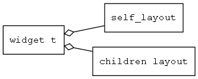

# 控件布局器(layouter)

## 一、为什么需要控件布局器(layouter)

如果界面上元素是预先知道的，而且窗口的大小也是固定的，通过可视化的工具，以所见即所得的方式，去创建界面是最轻松的方式。但是在下列情况下，使用布局参数是更好的选择。

* 需要适应不同大小的屏幕。
* 窗口的大小可以动态调整的。
* 界面上的元素是动态的，需要用程序创建界面。

[AWTK](https://github.com/zlgopen/awtk)提供了简单而又强大的布局参数。

## 二、概述

AWTK的布局器(layouter)分为两类，一类用于对控件自身进行布局，另外一类用于对子控件进行布局。

* self\_layout 对控件自身进行布局
* children\_layout 用于对子控件进行布局

AWTK提供了灵活的扩展机制，可以方便的扩展新的布局方式，所以self\_layouter和children\_layouter都是接口。

## 三、控件自身的布局

* 1.[缺省控件布局器介绍](self_layouter_default.md)
* 2.[菜单布局器介绍](self_layouter_menu.md)

> 以后会陆续实现css flex等布局方式。

## 三、子控件的布局

* 1.[缺省子控件布局器介绍](children_layouter_default.md)
* 2.[ListView子控件布局器介绍](children_layouter_list_view.md)

> 以后会陆续实现css flex等布局方式。
