# 参考手册

## 一、GUI 相关组件

### 控件

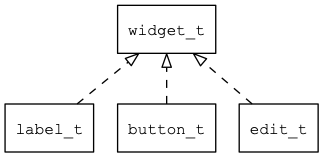

#### widget

* [widget](manual/widget_t.md) 所有控件、窗口和窗口管理器的基类。

#### 窗口管理器
* [window\_manager](manual/window_manager_t.md) 窗口管理器。

#### 窗口
* [window\_base](manual/window_base_t.md) 窗口基类。
* [dialog](manual/dialog_t.md) 对话框。
* [popup](manual/popup_t.md) 弹出窗口。
* [window](manual/window_t.md) 普通窗口。
* [system\_bar](manual/system_bar_t.md) 系统状态窗口。
* [calibration\_win](manual/calibration_win_t.md) 电阻屏校准窗口。
* [overlay](manual/overlay_t.md) 悬浮窗口。

#### 基本控件
* [button](manual/button_t.md) 按钮控件。
* [label](manual/label_t.md) 文本控件。
* [edit](manual/edit_t.md) 单行编辑器控件。
* [image](manual/image_t.md) 图片控件。
* [dragger](manual/dragger_t.md) dragger 控件。
* [draggable](manual/draggable_t.md) draggable 控件。
* [image\_base](manual/image_base_t.md) 图片控件基类。
* [check\_button](manual/check_button_t.md) 多选按钮。
* [radio\_button](manual/check_button_t.md) 单选按钮。
* [spin\_box](manual/spin_box_t.md) 数值编辑器控件。
* [combo\_box](manual/combo_box_t.md) 下拉列表控件。
* [combo\_box\_ex](manual/combo_box_ex_t.md) 可滚动的下拉列表控件。
* [combo\_box\_item](manual/combo_box_item_t.md) 下拉列表项控件。
* [color\_tile](manual/color_tile_t.md) 色块控件。
* [dialog\_title](manual/dialog_title_t.md) 对话框标题控件。
* [dialog\_client](manual/dialog_client_t.md) 对话框客户区控件。
* [slider](manual/slider_t.md) 滑块控件。
* [progress\_bar](manual/progress_bar_t.md) 进度条控件。
* [tab\_control](manual/tab_control_t.md) 标签控件。
* [tab\_button](manual/tab_button_t.md) 标签按钮控件。
* [tab\_button\_group](manual/tab_button_group_t.md) 标签按钮分组控件。

#### 通用容器控件
* [row](manual/row_t.md) 行控件。
* [column](manual/column_t.md) 列控件。
* [grid](manual/grid_t.md) 网格控件。
* [view](manual/view_t.md) 通用容器控件。
* [grid\_item](manual/grid_item_t.md) 网格项控件。
* [group\_box](manual/group_box_t.md) 通用分组控件。
* [app\_bar](manual/app_bar_t.md) app\_bar 控件。
* [button\_group](manual/button_group_t.md) 按钮分组控件。

#### 扩展控件
* [candidates](manual/candidates_t.md) 软键盘候选字控件。
* [canvas\_widget](manual/canvas_widget_t.md) 画布控件。
* [color\_picker](manual/color_picker_t.md) 颜色选择器控件。
* [gif\_image](manual/gif_image_t.md) gif\_image 控件。
* [guage](manual/guage_t.md) 仪表控件。
* [guage\_pointer](manual/guage_pointer_t.md) 仪表指针控件。
* [image\_animation](manual/image_animation_t.md) 图片动画控件。
* [image\_value](manual/image_value_t.md) 图片值控件。
* [keyboard](manual/keyboard_t.md)  软键盘控件。
* [progress\_circle](manual/progress_circle_t.md) 进度圆环控件。
* [rich\_text](manual/rich_text_t.md) 图文混排控件。
* [rich\_text\_view](manual/rich_text_view_t.md) 用于协调 rich text 和 scrollbar 控件。
* [slide\_menu](manual/slide_menu_t.md) 左右滑动菜单控件。
* [slide\_view](manual/slide_view_t.md) 滑动视图控件。
* [slide\_view\_indicator](manual/slide_indicator_t.md) 滑动视图的指示器控件。
* [svg\_image](manual/svg_image_t.md) SVG 图片控件。
* [switch](manual/switch_t.md) 开关控件。
* [text\_selector](manual/text_selector_t.md) 文本选择器控件。
* [time\_clock](manual/time_clock_t.md) 模拟时钟控件。
* [digit\_clock](manual/digit_clock_t.md) 数字时钟控件。
* [list\_view](manual/list_view_t.md) 列表视图控件。
* [list\_view\_h](manual/list_view_h_t.md) 水平列表视图控件。
* [list\_item](manual/list_item_t.md) 列表项控件。
* [scroll\_bar](manual/scroll_bar_t.md) 滚动条控件。
* [scroll\_view](manual/scroll_view_t.md) 滚动视图控件。
* [mledit](manual/mledit_t.md) 多行编辑器控件。
* [line\_number](manual/line_number_t.md) 多行编辑器的行号控件。
* [mutable\_image](manual/mutable_image_t.md) mutable 图片控件（用于辅助实现 camera/video)。
* [file\_browser\_view](manual/file_browser_view_t.md) 文件浏览控件。

### 常用常量

* [控件状态定义](manual/widget_state_t.md)

* [控件属性定义](manual/widget_prop_t.md)

### 画布

#### 普通画布
* [canvas](manual/canvas_t.md)

* [canvas offline](manual/canvas_offline_t.md)

#### 矢量图画布

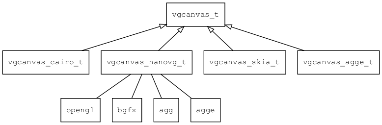

* [vgcanvas](manual/vgcanvas_t.md)

### 资源相关组件

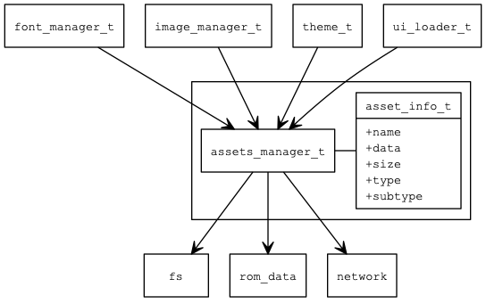

* [asset\_info](manual/asset_info_t.md) 资源信息。
* [assets\_manager](manual/assets_manager_t.md) 资源管理器。

#### 1. 字体

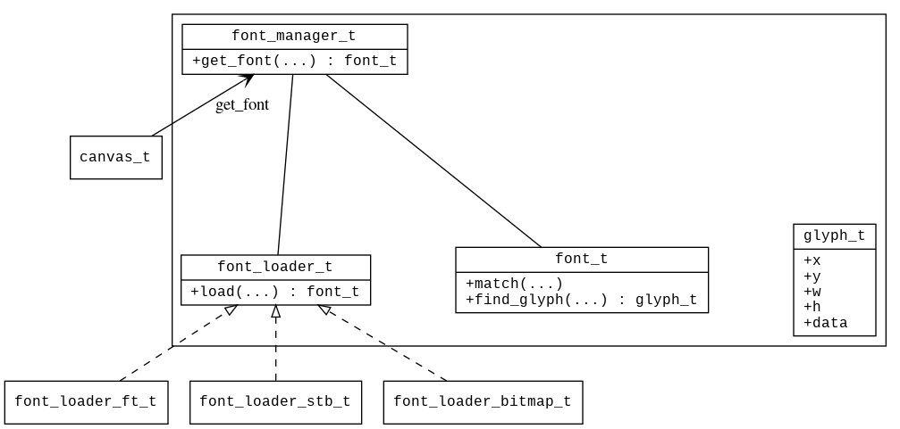

* [glyph](manual/glyph_t.md) 字模。
* [font](manual/font_t.md) 字体。
* [font\_loader](manual/font_loader_t.md) 字体加载器。
* [font\_loader\_ft](manual/font_loader_ft_t.md) 基于 freetype 实现的字体加载器。
* [font\_loader\_stb](manual/font_loader_stb_t.md) 基于 stb 实现的字体加载器。
* [font\_loader\_bitmap](manual/font_loader_bitmap_t.md) 基于位图实现的字体加载器。
* [font\_manager](manual/font_manager_t.md) 字体管理器。

#### 2. 图片

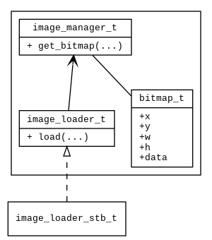

* [bitmap](manual/bitmap_t.md) 位图。
* [image\_loader](manual/image_loader_t.md) 图片加载器。
* [image\_loader\_stb](manual/image_loader_stb_t.md) stb 图片加载器。
* [image\_manager](manual/image_manager_t.md) 图片管理器。

#### 3. 字符串资源

* [locale\_info](manual/locale_info_t.md) 本地化信息。

#### 4. 主题

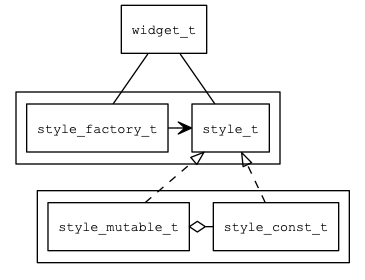

* [style](manual/style_t.md) style 接口。
* [theme](manual/theme_t.md) 常量主题数据。
* [style\_factory](manual/style_factory_t.md) style 工厂。
* [style\_const](manual/style_const_t.md) 只读的 style。
* [style\_mutable](manual/style_mutable_t.md) 可修改的 style。

#### 5.UI 描述数据

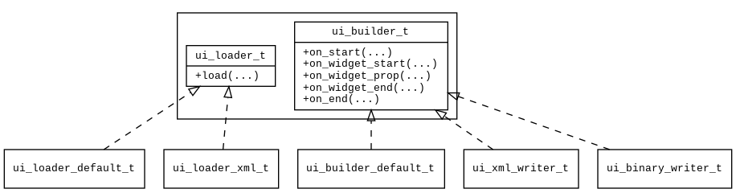

* [ui\_loader](manual/ui_loader_t.md) loader 接口。
* [ui\_builder](manual/ui_builder_t.md) builder 接口。

* [ui\_builder\_default](manual/ui_builder_default_t.md) 缺省 builder 实现，负责构建 widget 树。
* [ui\_xml\_writer](manual/ui_xml_writer_t.md) 生成 XML 格式的 UI 描述数据。 
* [ui\_binary\_writer](manual/ui_binary_writer_t.md) 生成二进制格式的 UI 描述数据。  

* [ui\_loader\_default](manual/ui_loader_default_t.md) 二进制格式的 UI 资源加载器。 
* [ui\_loader\_xml](manual/ui_loader_xml_t.md) XML 格式的 UI 资源加载器。

### 输入法

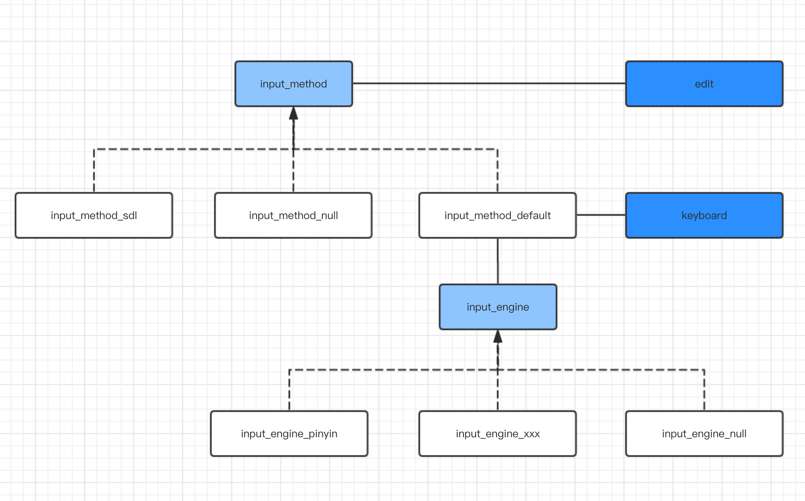

* [input\_type](manual/input_type_t.md) 输入类型（用于控制软键盘和输入格式）
* [input\_method](manual/input_method_t.md) 输入法接口。
* [input\_method\_default](manual/input_method_default_t.md) 输入法缺省实现。
* [input\_method\_sdl](manual/input_method_sdl_t.md) 输入法 SDL 实现。
* [input\_method\_null](manual/input_method_null_t.md) 输入法空实现。

* [input\_engine](manual/input_engine_t.md) 输入法引擎接口。
* [input\_engine\_null](manual/input_engine_null_t.md) 空输入法引擎实现。
* [input\_engine\_pinyin](manual/input_engine_pinyin_t.md) 拼音输入法引擎实现。

### 定时器/IDLE

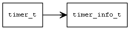

* [timer](manual/timer_t.md) 定时器。

* [timer\_info](manual/timer_info_t.md) 单个 timer 的信息。

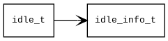

* [idle](manual/idle_t.md) 用于异步执行一些函数。 

* [idle\_info](manual/idle_info_t.md) 单个 idle 的信息。 

### 布局器
  
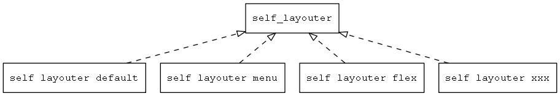

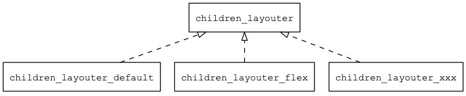

* [self\_layouter](manual/self_layouter_t.md) 控件自身排版布局器的接口

* [children\_layouter](manual/children_layouter_t.md) 子控件排版布局器的接口

* [self\_layouter\_factory](manual/self_layouter_factory_t.md) 控件自身排版布局器的工厂。

* [children\_layouter\_factory](manual/children_layouter_factory_t.md) 子控件排版布局器的的工厂。

* [self\_layouter\_default](manual/self_layouter_default_t.md) 缺省的控件自身布局算法实现。

* [self\_layouter\_menu](manual/self_layouter_menu_t.md) 菜单控件自身布局算法实现。

* [children\_layouter\_default](manual/children_layouter_default_t.md) 缺省的子控件布局算法实现。

* [children\_layouter\_list\_view](manual/children_layouter_list_view_t.md) 列表视图的子控件布局算法实现。

### lcd

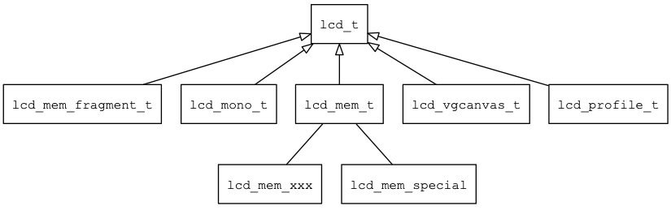
 
* [lcd](manual/lcd_t.md) LCD 接口

* [lcd\_type](manual/lcd_type_t.md) LCD 类型定义

* [lcd\_draw\_mode](manual/lcd_draw_mode_t.md) LCD 绘制模式

* [lcd\_mem\_fragment](manual/lcd_mem_fragment_t.md) 片段 LCD

* [lcd\_orientation](manual/lcd_orientation_t.md) LCD 旋转常量

* [lcd\_mem\_bgr565](manual/lcd_mem_bgr565_t.md) bgr565 格式的 LCD

* [lcd\_mem\_bgr888](manual/lcd_mem_bgr888_t.md) bgr888 格式的 LCD

* [lcd\_mem\_bgra8888](manual/lcd_mem_bgra8888_t.md) bgra8888 格式的 LCD

* [lcd\_mem\_rgb565](manual/lcd_mem_rgb565_t.md) rgb565 格式的 LCD

* [lcd\_mem\_rgb888](manual/lcd_mem_rgb888_t.md) rgb888 格式的 LCD

* [lcd\_mem\_rgba8888](manual/lcd_mem_rgba8888_t.md) bgra8888 格式的 LCD

* [lcd\_mem\_special](manual/lcd_mem_special_t.md) 特殊格式的 LCD

* [lcd\_mono](manual/lcd_mono_t.md) 单色 LCD

* [lcd\_profile](manual/lcd_profile_t.md) 用于 profile 性能的 LCD

### 杂项

* [system\_info](manual/system_info_t.md) 系统信息。

## 二、基本函数库

### 容器与基本数据结构

* [darray](manual/darray_t.md) 动态数组。
* [slist](manual/slist_t.md) 单向链表。
* [wbuffer](manual/wbuffer_t.md) Write Buffer。
* [rbuffer](manual/rbuffer_t.md) Read Buffer。
* [ring\_buffer](manual/ring_buffer_t.md) 循环缓存区。
* [str](manual/str_t.md) 可变长度的 UTF8 字符串。
* [wstr](manual/wstr_t.md) 可变长度的宽字符字符串。
* [object](manual/object_t.md) 对象接口。
* [object\_default](manual/object_default_t.md) 对象接口的缺省实现。
* [object\_array](manual/object_array_t.md) 简单的动态数组，内部存放 value 对象。

* [point](manual/point_t.md) 点。
* [rect](manual/rect_t.md) 矩形。
* [color](manual/color_t.md) 颜色对象。
* [pointf](manual/pointf_t.md) 点（浮点数格式）。
* [int\_str](manual/int_str_t.md) 数字-字符串类型
* [str\_str](manual/str_str_t.md) 字符串-字符串类型
* [named\_value](manual/named_value_t.md) 命名的值。
* [value](manual/value_t.md) 一个通用数据类型，用来存放整数、浮点数、字符串和其它对象。
* [emitter](manual/emitter_t.md) 事件分发器，用于实现观察者模式。
* [rgba](manual/rgba_t.md) RGBA 颜色值。
* [asset\_info](manual/asset_info_t.md) 资源类型定义。

### 流

* [istream](manual/tk_istream_t.md) 输入流的接口。
* [ostream](manual/tk_ostream_t.md) 输出流的接口。
* [iostream](manual/tk_iostream_t.md) 输入/出流的接口。

* [iostream\_mem](manual/tk_iostream_mem_t.md) 内存输入输出流。
* [istream\_mem](manual/tk_istream_mem_t.md) 内存输入流。
* [ostream\_mem](manual/tk_ostream_mem_t.md) 内存输出流。

* [istream\_file](manual/tk_istream_file_t.md) 文件输入流。
* [ostream\_file](manual/tk_ostream_file_t.md) 文件输出流。

* [iostream\_tcp](manual/tk_iostream_tcp_t.md) TCP 输入输出流。
* [istream\_tcp](manual/tk_istream_tcp_t.md) TCP 输入流。
* [ostream\_tcp](manual/tk_ostream_tcp_t.md) TCP 输出流。

* [iostream\_udp](manual/tk_iostream_udp_t.md) UDP 输入输出流。
* [istream\_udp](manual/tk_istream_udp_t.md) UDP 输入流。
* [ostream\_udp](manual/tk_ostream_udp_t.md) UDP 输出流。

* [iostream\_serial](manual/tk_iostream_serial_t.md) 串口输入输出流。
* [istream\_serial](manual/tk_istream_serial_t.md) 串口输入流。
* [ostream\_serial](manual/tk_ostream_serial_t.md) 串口输出流。

* [istream\_buffered](manual/tk_istream_buffered_t.md) 缓冲输入流。
* [ostream\_buffered](manual/tk_ostream_buffered_t.md) 缓冲输出流。

* [iostream\_noisy](manual/tk_iostream_noisy_t.md) 故障注入流。
* [ostream\_noisy](manual/tk_ostream_noisy_t.md) 故障注入输出流。

* [iostream\_shdlc](manual/tk_iostream_shdlc_t.md) SHDLC 输入输出流。
* [istream\_shdlc](manual/tk_istream_shdlc_t.md) SHDLC 输入流。
* [ostream\_shdlc](manual/tk_ostream_shdlc_t.md) SHDLC 输出流。

* [ostream\_retry](manual/tk_ostream_retry_t.md) 重传输出流。

### 并发

* [mutex](manual/tk_mutex_t.md) 互斥锁。
* [thread](manual/tk_thread_t.md) 线程。
* [semaphor](manual/tk_semaphore_t.md) 信号量。
* [cond\_var](manual/tk_cond_var_t.md) 简化版条件变量。

### 事件与事件源

* [event](manual/emitter_t.md) 事件基类。
* [timer\_info](manual/timer_info_t.md) 单个定时器的信息。
* [timer\_manager](manual/timer_manager_t.md) 定时器管理器
* [idle\_info](manual/idle_info_t.md) 单个 idle 的信息。
* [idle\_manager](manual/idle_manager_t.md) idle_manager_t 管理器
* [event\_source](manual/event_source_t.md) 事件源接口。
* [event\_source\_fd](manual/event_source_fd_t.md) 基于文件描述符的事件源实现。
* [event\_source\_idle](manual/event_source_idle_t.md) 基于 IDLE 的事件源实现。
* [event\_source\_timer](manual/event_source_timer_t.md) 基于 Time 的事件源实现。
* [event\_source\_manager](manual/event_source_manager_t.md) 事件源管理器的接口。
* [event\_source\_manager\_default](manual/event_source_manager_default_t.md) 创建事件源管理器。

### 压缩解压

* [compressor](manual/compressor_t.md) 压缩解压接口。
* [compressor\_miniz](manual/compressor_miniz_t.md) 基于 miniz 实现的压缩解压接口。

### 平台相关

* [fs](manual/fs_t.md) 文件系统
* [fs\_dir](manual/fs_dir_t.md) 目录
* [fs\_file](manual/fs_file_t.md) 文件
* [fs\_item](manual/fs_item_t.md) 目录或目录。
* [path](manual/path_t.md) 路径相关的工具函数。
* [memory](manual/tk_mem_t.md) 内存管理相关函数和宏。
* [date\_time](manual/date_time_t.md) 时间日期函数。
* [time\_now](manual/time_now_t.md) 获取当前时间的函数。
* [platform](manual/platform_t.md) 平台接口，包括：获取时间、休眠等函数
* [socket\_pair](manual/socketpair_t.md) 生成两个可以互相通信的 socket 句柄。

### 数据格式
 
* [ubjson\_parser](manual/ubjson_parser_t.md)
* [ubjson\_writer](manual/ubjson_writer_t.md)
* [xml\_parser](manual/XmlParser.md)

### 工具类

* [easing](manual/easing_type_t.md) 缓动作常量定义。
* [utils](manual/utils_t.md) 工具类
* [utf8](manual/utf8_t.md) wchar_t 和 char 类型转换接口
* [matrix](manual/matrix_t.md) 2D 阵变换。
* [func\_desc](manual/func_desc_t.md) 函数描述。
* [value\_desc](manual/value_desc_t.md) 属性描述。
* [func\_call\_parser](manual/func_call_parser_t.md) 从字符串中解析出函数调用需要的参数。
* [tokenizer](manual/tokenizer_t.md) 从字符串中解析出一个一个的 token。
* [color\_parse](manual/color_parser_t.md) 颜色解析对象。
