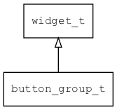

## button\_group\_t
### 概述


Button Group控件。一个简单的容器控件，用于容纳一组按钮控件。

它本身不提供布局功能，仅提供具有语义的标签，让xml更具有可读性。
子控件的布局可用layout\_children属性指定。
请参考[布局参数](https://github.com/zlgopen/awtk/blob/master/docs/layout.md)。

button\_group\_t是[widget\_t](widget_t.md)的子类控件，widget\_t的函数均适用于button\_group\_t控件。

在xml中使用"button\_group"标签创建button\_group。如：

```xml
<button_group x="0" y="m" w="100%" h="40" children_layout="default(c=4,r=1,s=5,m=5)">
<button name="open:basic" text="Basic"/>
<button name="open:button" text="Buttons"/>
<button name="open:edit" text="Edits"/>
<button name="open:keyboard" text="KeyBoard"/>
</button_group>
```

可用通过style来设置控件的显示风格，如背景颜色等。如：

```xml
<style name="default" border_color="#a0a0a0">
<normal     bg_color="#f0f0f0" />
</style>
```
----------------------------------
### 函数
<p id="button_group_t_methods">

| 函数名称 | 说明 | 
| -------- | ------------ | 
| <a href="#button_group_t_button_group_cast">button\_group\_cast</a> | 转换为button_group对象(供脚本语言使用)。 |
| <a href="#button_group_t_button_group_create">button\_group\_create</a> | 创建button_group对象 |
#### button\_group\_cast 函数
-----------------------

* 函数功能：

> <p id="button_group_t_button_group_cast">转换为button_group对象(供脚本语言使用)。

* 函数原型：

```
widget_t* button_group_cast (widget_t* widget);
```

* 参数说明：

| 参数 | 类型 | 说明 |
| -------- | ----- | --------- |
| 返回值 | widget\_t* | button\_group对象。 |
| widget | widget\_t* | button\_group对象。 |
#### button\_group\_create 函数
-----------------------

* 函数功能：

> <p id="button_group_t_button_group_create">创建button_group对象

* 函数原型：

```
widget_t* button_group_create (widget_t* parent, xy_t x, xy_t y, wh_t w, wh_t h);
```

* 参数说明：

| 参数 | 类型 | 说明 |
| -------- | ----- | --------- |
| 返回值 | widget\_t* | 对象。 |
| parent | widget\_t* | 父控件 |
| x | xy\_t | x坐标 |
| y | xy\_t | y坐标 |
| w | wh\_t | 宽度 |
| h | wh\_t | 高度 |
