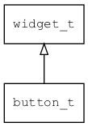

## button\_t
### 概述


按钮控件。

点击按钮之后会触发EVT\_CLICK事件，注册EVT\_CLICK事件以执行特定操作。

按钮控件也可以作为容器使用，使用图片和文本作为其子控件，可以实现很多有趣的效果。

button\_t是[widget\_t](widget_t.md)的子类控件，widget\_t的函数均适用于button\_t控件。

在xml中使用"button"标签创建按钮控件。如：

```xml
<button x="c" y="m" w="80" h="30" text="OK"/>
```

> 更多用法请参考：
[button.xml](https://github.com/zlgopen/awtk/blob/master/design/default/ui/button.xml)

在c代码中使用函数button\_create创建按钮控件。如：

```c
widget_t* button = button_create(win, 10, 10, 128, 30);
widget_set_text(button, L"OK");
widget_on(button, EVT_CLICK, on_click, NULL);
```

> 创建之后，需要用widget\_set\_text或widget\_set\_text\_utf8设置文本内容。

> 完整示例请参考：
[button demo](https://github.com/zlgopen/awtk-c-demos/blob/master/demos/button.c)

可用通过style来设置控件的显示风格，如字体的大小和颜色等等。如：

```xml
<style name="default" border_color="#a0a0a0"  text_color="black">
<normal     bg_color="#f0f0f0" />
<pressed    bg_color="#c0c0c0" x_offset="1" y_offset="1"/>
<over       bg_color="#e0e0e0" />
<disable    bg_color="gray" text_color="#d0d0d0" />
</style>
```

> 更多用法请参考：
[theme
default](https://github.com/zlgopen/awtk/blob/master/design/default/styles/default.xml#L31)
----------------------------------
### 函数
<p id="button_t_methods">

| 函数名称 | 说明 | 
| -------- | ------------ | 
| <a href="#button_t_button_cast">button\_cast</a> | 转换为button对象(供脚本语言使用)。 |
| <a href="#button_t_button_create">button\_create</a> | 创建button对象 |
| <a href="#button_t_button_set_enable_long_press">button\_set\_enable\_long\_press</a> | 设置是否启用长按事件。 |
| <a href="#button_t_button_set_repeat">button\_set\_repeat</a> | 设置触发EVT\_CLICK事件的时间间隔。为0则不重复触发EVT\_CLICK事件。 |
### 属性
<p id="button_t_properties">

| 属性名称 | 类型 | 说明 | 
| -------- | ----- | ------------ | 
| <a href="#button_t_enable_long_press">enable\_long\_press</a> | bool\_t | 是否启用长按事件，为true时才触发长按事件。 |
| <a href="#button_t_repeat">repeat</a> | int32\_t | 重复触发EVT\_CLICK事件的时间间隔。 |
### 事件
<p id="button_t_events">

| 事件名称 | 类型  | 说明 | 
| -------- | ----- | ------- | 
| EVT\_CLICK | pointer\_event\_t | 点击事件。 |
| EVT\_LONG\_PRESS | pointer\_event\_t | 长按事件。 |
#### button\_cast 函数
-----------------------

* 函数功能：

> <p id="button_t_button_cast">转换为button对象(供脚本语言使用)。

* 函数原型：

```
widget_t* button_cast (widget_t* widget);
```

* 参数说明：

| 参数 | 类型 | 说明 |
| -------- | ----- | --------- |
| 返回值 | widget\_t* | button对象。 |
| widget | widget\_t* | button对象。 |
#### button\_create 函数
-----------------------

* 函数功能：

> <p id="button_t_button_create">创建button对象

* 函数原型：

```
widget_t* button_create (widget_t* parent, xy_t x, xy_t y, wh_t w, wh_t h);
```

* 参数说明：

| 参数 | 类型 | 说明 |
| -------- | ----- | --------- |
| 返回值 | widget\_t* | 对象。 |
| parent | widget\_t* | 父控件 |
| x | xy\_t | x坐标 |
| y | xy\_t | y坐标 |
| w | wh\_t | 宽度 |
| h | wh\_t | 高度 |
#### button\_set\_enable\_long\_press 函数
-----------------------

* 函数功能：

> <p id="button_t_button_set_enable_long_press">设置是否启用长按事件。

* 函数原型：

```
ret_t button_set_enable_long_press (widget_t* widget, bool_t enable_long_press);
```

* 参数说明：

| 参数 | 类型 | 说明 |
| -------- | ----- | --------- |
| 返回值 | ret\_t | 返回RET\_OK表示成功，否则表示失败。 |
| widget | widget\_t* | 控件对象。 |
| enable\_long\_press | bool\_t | 是否启用长按事件。 |
#### button\_set\_repeat 函数
-----------------------

* 函数功能：

> <p id="button_t_button_set_repeat">设置触发EVT\_CLICK事件的时间间隔。为0则不重复触发EVT\_CLICK事件。

* 函数原型：

```
ret_t button_set_repeat (widget_t* widget, int32_t repeat);
```

* 参数说明：

| 参数 | 类型 | 说明 |
| -------- | ----- | --------- |
| 返回值 | ret\_t | 返回RET\_OK表示成功，否则表示失败。 |
| widget | widget\_t* | 控件对象。 |
| repeat | int32\_t | 触发EVT\_CLICK事件的时间间隔(毫秒)。 |
#### enable\_long\_press 属性
-----------------------
> <p id="button_t_enable_long_press">是否启用长按事件，为true时才触发长按事件。

触发长按事件后不再触发点击事件。
缺省不启用。

* 类型：bool\_t

| 特性 | 是否支持 |
| -------- | ----- |
| 可直接读取 | 是 |
| 可直接修改 | 否 |
| 可持久化   | 是 |
| 可脚本化   | 是 |
| 可在IDE中设置 | 是 |
| 可在XML中设置 | 是 |
| 可通过widget\_get\_prop读取 | 是 |
| 可通过widget\_set\_prop修改 | 是 |
#### repeat 属性
-----------------------
> <p id="button_t_repeat">重复触发EVT\_CLICK事件的时间间隔。

为0则不重复触发EVT\_CLICK事件。

* 类型：int32\_t

| 特性 | 是否支持 |
| -------- | ----- |
| 可直接读取 | 是 |
| 可直接修改 | 否 |
| 可持久化   | 是 |
| 可脚本化   | 是 |
| 可在IDE中设置 | 是 |
| 可在XML中设置 | 是 |
| 可通过widget\_get\_prop读取 | 是 |
| 可通过widget\_set\_prop修改 | 是 |
