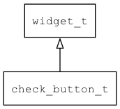

## check\_button\_t
### 概述


勾选按钮控件(单选/多选)。

check\_button\_t是[widget\_t](widget_t.md)的子类控件，widget\_t的函数均适用于check\_button\_t控件。

在xml中使用"check_button"标签创建多选按钮控件。如：

```xml
<check_button name="c1" text="Book"/>
```

在xml中使用"radio_button"标签创建单选按钮控件。如：

```xml
<radio_button name="r1" text="Book"/>
```

> 更多用法请参考：
[button.xml](https://github.com/zlgopen/awtk/blob/master/design/default/ui/basic.xml)

在c代码中使用函数check\_button\_create创建多选按钮控件。如：

```c
widget_t* button = check_button_create(win, x, y, w, h);
widget_set_text(button, L"OK");
widget_on(button, EVT_VALUE_CHANGED, on_changed, NULL);
```

在c代码中使用函数check\_button\_create\_radio创建单选按钮控件。如：

```c
widget_t* button = check_button_create_radio(win, x, y, w, h);
widget_set_text(button, L"OK");
widget_on(button, EVT_VALUE_CHANGED, on_changed, NULL);
```

> 完整示例请参考：
[button demo](https://github.com/zlgopen/awtk-c-demos/blob/master/demos/check_button.c)

可用通过style来设置控件的显示风格，如字体的大小和颜色等等。如：

```xml
<style name="default" icon_at="left">
<normal  icon="unchecked" />
<pressed icon="unchecked" />
<over    icon="unchecked" text_color="green"/>
<normal_of_checked icon="checked" text_color="blue"/>
<pressed_of_checked icon="checked" text_color="blue"/>
<over_of_checked icon="checked" text_color="green"/>
</style>
```

> 更多用法请参考：
[theme
default](https://github.com/zlgopen/awtk/blob/master/design/default/styles/default.xml#L227)
----------------------------------
### 函数
<p id="check_button_t_methods">

| 函数名称 | 说明 | 
| -------- | ------------ | 
| <a href="#check_button_t_check_button_cast">check\_button\_cast</a> | 转换check_button对象(供脚本语言使用)。 |
| <a href="#check_button_t_check_button_create">check\_button\_create</a> | 创建多选按钮对象 |
| <a href="#check_button_t_check_button_create_radio">check\_button\_create\_radio</a> | 创建单选按钮对象 |
| <a href="#check_button_t_check_button_get_checked_button">check\_button\_get\_checked\_button</a> | 用于radio button获取同组中勾选的radio button。 |
| <a href="#check_button_t_check_button_set_value">check\_button\_set\_value</a> | 设置控件的值。 |
### 属性
<p id="check_button_t_properties">

| 属性名称 | 类型 | 说明 | 
| -------- | ----- | ------------ | 
| <a href="#check_button_t_value">value</a> | bool\_t | 值(勾选为TRUE，非勾选为FALSE)。 |
### 事件
<p id="check_button_t_events">

| 事件名称 | 类型  | 说明 | 
| -------- | ----- | ------- | 
| EVT\_VALUE\_WILL\_CHANGE | event\_t | 值(勾选状态)即将改变事件。 |
| EVT\_VALUE\_CHANGED | event\_t | 值(勾选状态)改变事件。 |
#### check\_button\_cast 函数
-----------------------

* 函数功能：

> <p id="check_button_t_check_button_cast">转换check_button对象(供脚本语言使用)。

* 函数原型：

```
widget_t* check_button_cast (widget_t* widget);
```

* 参数说明：

| 参数 | 类型 | 说明 |
| -------- | ----- | --------- |
| 返回值 | widget\_t* | check\_button对象。 |
| widget | widget\_t* | check\_button对象。 |
#### check\_button\_create 函数
-----------------------

* 函数功能：

> <p id="check_button_t_check_button_create">创建多选按钮对象

* 函数原型：

```
widget_t* check_button_create (widget_t* parent, xy_t x, xy_t y, wh_t w, wh_t h);
```

* 参数说明：

| 参数 | 类型 | 说明 |
| -------- | ----- | --------- |
| 返回值 | widget\_t* | widget对象。 |
| parent | widget\_t* | 父控件 |
| x | xy\_t | x坐标 |
| y | xy\_t | y坐标 |
| w | wh\_t | 宽度 |
| h | wh\_t | 高度 |
#### check\_button\_create\_radio 函数
-----------------------

* 函数功能：

> <p id="check_button_t_check_button_create_radio">创建单选按钮对象

* 函数原型：

```
widget_t* check_button_create_radio (widget_t* parent, xy_t x, xy_t y, wh_t w, wh_t h);
```

* 参数说明：

| 参数 | 类型 | 说明 |
| -------- | ----- | --------- |
| 返回值 | widget\_t* | widget对象。 |
| parent | widget\_t* | 父控件 |
| x | xy\_t | x坐标 |
| y | xy\_t | y坐标 |
| w | wh\_t | 宽度 |
| h | wh\_t | 高度 |
#### check\_button\_get\_checked\_button 函数
-----------------------

* 函数功能：

> <p id="check_button_t_check_button_get_checked_button">用于radio button获取同组中勾选的radio button。

* 函数原型：

```
widget_t* check_button_get_checked_button (widget_t* widget);
```

* 参数说明：

| 参数 | 类型 | 说明 |
| -------- | ----- | --------- |
| 返回值 | widget\_t* | 同组中勾选的radio button对象。 |
| widget | widget\_t* | radio\_button对象。 |
#### check\_button\_set\_value 函数
-----------------------

* 函数功能：

> <p id="check_button_t_check_button_set_value">设置控件的值。

* 函数原型：

```
ret_t check_button_set_value (widget_t* widget, bool_t value);
```

* 参数说明：

| 参数 | 类型 | 说明 |
| -------- | ----- | --------- |
| 返回值 | ret\_t | 返回RET\_OK表示成功，否则表示失败。 |
| widget | widget\_t* | check\_button对象。 |
| value | bool\_t | 值(勾选为TRUE，非勾选为FALSE)。 |
#### value 属性
-----------------------
> <p id="check_button_t_value">值(勾选为TRUE，非勾选为FALSE)。

* 类型：bool\_t

| 特性 | 是否支持 |
| -------- | ----- |
| 可直接读取 | 是 |
| 可直接修改 | 否 |
| 可持久化   | 是 |
| 可脚本化   | 是 |
| 可在IDE中设置 | 是 |
| 可在XML中设置 | 是 |
| 可通过widget\_get\_prop读取 | 是 |
| 可通过widget\_set\_prop修改 | 是 |
