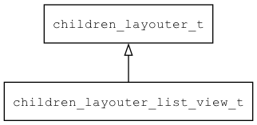

## children\_layouter\_list\_view\_t
### 概述


listview的子控件布局算法实现。

> 用法请参考：[listview子控件布局算法](
https://github.com/zlgopen/awtk/blob/master/docs/children_layouter_list_view.md)
----------------------------------
### 函数
<p id="children_layouter_list_view_t_methods">

| 函数名称 | 说明 | 
| -------- | ------------ | 
| <a href="#children_layouter_list_view_t_children_layouter_list_view_create">children\_layouter\_list\_view\_create</a> | 创建子控件布局对象。 |
#### children\_layouter\_list\_view\_create 函数
-----------------------

* 函数功能：

> <p id="children_layouter_list_view_t_children_layouter_list_view_create">创建子控件布局对象。

* 函数原型：

```
children_layouter_t* children_layouter_list_view_create ();
```

* 参数说明：

| 参数 | 类型 | 说明 |
| -------- | ----- | --------- |
| 返回值 | children\_layouter\_t* | 返回创建子控件布局对象。 |
