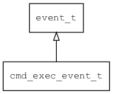

## cmd\_exec\_event\_t
### 概述


对象执行命令的事件。
----------------------------------
### 函数
<p id="cmd_exec_event_t_methods">

| 函数名称 | 说明 | 
| -------- | ------------ | 
| <a href="#cmd_exec_event_t_cmd_exec_event_cast">cmd\_exec\_event\_cast</a> | 把event对象转cmd_exec_event_t对象，主要给脚本语言使用。 |
| <a href="#cmd_exec_event_t_cmd_exec_event_init">cmd\_exec\_event\_init</a> | 初始命令执行事件。 |
### 属性
<p id="cmd_exec_event_t_properties">

| 属性名称 | 类型 | 说明 | 
| -------- | ----- | ------------ | 
| <a href="#cmd_exec_event_t_args">args</a> | const char* | 命令的参数。 |
| <a href="#cmd_exec_event_t_can_exec">can\_exec</a> | bool\_t | 执行结果(适用于CAN_EXEC)。 |
| <a href="#cmd_exec_event_t_name">name</a> | const char* | 命令的名称。 |
| <a href="#cmd_exec_event_t_result">result</a> | ret\_t | 执行结果(适用于EXECED)。 |
#### cmd\_exec\_event\_cast 函数
-----------------------

* 函数功能：

> <p id="cmd_exec_event_t_cmd_exec_event_cast">把event对象转cmd_exec_event_t对象，主要给脚本语言使用。

* 函数原型：

```
cmd_exec_event_t* cmd_exec_event_cast (event_t* event);
```

* 参数说明：

| 参数 | 类型 | 说明 |
| -------- | ----- | --------- |
| 返回值 | cmd\_exec\_event\_t* | 返回event对象。 |
| event | event\_t* | event对象。 |
#### cmd\_exec\_event\_init 函数
-----------------------

* 函数功能：

> <p id="cmd_exec_event_t_cmd_exec_event_init">初始命令执行事件。

* 函数原型：

```
event_t* cmd_exec_event_init (cmd_exec_event_t* event, uint32_t type, const char* name, const char* args);
```

* 参数说明：

| 参数 | 类型 | 说明 |
| -------- | ----- | --------- |
| 返回值 | event\_t* | 返回event对象。 |
| event | cmd\_exec\_event\_t* | event对象。 |
| type | uint32\_t | 事件类型。 |
| name | const char* | 命令名。 |
| args | const char* | 命令参数。 |
#### args 属性
-----------------------
> <p id="cmd_exec_event_t_args">命令的参数。

* 类型：const char*

| 特性 | 是否支持 |
| -------- | ----- |
| 可直接读取 | 是 |
| 可直接修改 | 否 |
| 可脚本化   | 是 |
#### can\_exec 属性
-----------------------
> <p id="cmd_exec_event_t_can_exec">执行结果(适用于CAN_EXEC)。

* 类型：bool\_t

| 特性 | 是否支持 |
| -------- | ----- |
| 可直接读取 | 是 |
| 可直接修改 | 否 |
| 可脚本化   | 是 |
#### name 属性
-----------------------
> <p id="cmd_exec_event_t_name">命令的名称。

* 类型：const char*

| 特性 | 是否支持 |
| -------- | ----- |
| 可直接读取 | 是 |
| 可直接修改 | 否 |
| 可脚本化   | 是 |
#### result 属性
-----------------------
> <p id="cmd_exec_event_t_result">执行结果(适用于EXECED)。

* 类型：ret\_t

| 特性 | 是否支持 |
| -------- | ----- |
| 可直接读取 | 是 |
| 可直接修改 | 否 |
| 可脚本化   | 是 |
