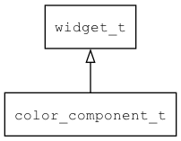

## color\_component\_t
### 概述


颜色选择器的颜色分量。
控件的名称有严格规定：
COLOR_PICKER_CHILD_SV: 水平为Value/Brightness(递增)，垂直为Saturation(递减)。
COLOR_PICKER_CHILD_H: 水平为同色，垂直为Hue(递减)。
----------------------------------
### 函数
<p id="color_component_t_methods">

| 函数名称 | 说明 | 
| -------- | ------------ | 
| <a href="#color_component_t_color_component_cast">color\_component\_cast</a> | 转换为color_component对象(供脚本语言使用)。 |
| <a href="#color_component_t_color_component_create">color\_component\_create</a> | 创建color_component对象 |
| <a href="#color_component_t_color_component_get_h">color\_component\_get\_h</a> | 获取h分量。 |
| <a href="#color_component_t_color_component_get_s">color\_component\_get\_s</a> | 获取s分量。 |
| <a href="#color_component_t_color_component_get_v">color\_component\_get\_v</a> | 获取v分量。 |
| <a href="#color_component_t_color_component_set_color">color\_component\_set\_color</a> | 设置颜色。 |
| <a href="#color_component_t_color_component_set_hsv">color\_component\_set\_hsv</a> | 设置颜色。 |
#### color\_component\_cast 函数
-----------------------

* 函数功能：

> <p id="color_component_t_color_component_cast">转换为color_component对象(供脚本语言使用)。

* 函数原型：

```
widget_t* color_component_cast (widget_t* widget);
```

* 参数说明：

| 参数 | 类型 | 说明 |
| -------- | ----- | --------- |
| 返回值 | widget\_t* | color\_component对象。 |
| widget | widget\_t* | color\_component对象。 |
#### color\_component\_create 函数
-----------------------

* 函数功能：

> <p id="color_component_t_color_component_create">创建color_component对象

* 函数原型：

```
widget_t* color_component_create (widget_t* parent, xy_t x, xy_t y, wh_t w, wh_t h);
```

* 参数说明：

| 参数 | 类型 | 说明 |
| -------- | ----- | --------- |
| 返回值 | widget\_t* | 对象。 |
| parent | widget\_t* | 父控件 |
| x | xy\_t | x坐标 |
| y | xy\_t | y坐标 |
| w | wh\_t | 宽度 |
| h | wh\_t | 高度 |
#### color\_component\_get\_h 函数
-----------------------

* 函数功能：

> <p id="color_component_t_color_component_get_h">获取h分量。

* 函数原型：

```
float color_component_get_h (widget_t* widget);
```

* 参数说明：

| 参数 | 类型 | 说明 |
| -------- | ----- | --------- |
| 返回值 | float | 返回h分量。 |
| widget | widget\_t* | color\_component对象。 |
#### color\_component\_get\_s 函数
-----------------------

* 函数功能：

> <p id="color_component_t_color_component_get_s">获取s分量。

* 函数原型：

```
float color_component_get_s (widget_t* widget);
```

* 参数说明：

| 参数 | 类型 | 说明 |
| -------- | ----- | --------- |
| 返回值 | float | 返回s分量。 |
| widget | widget\_t* | color\_component对象。 |
#### color\_component\_get\_v 函数
-----------------------

* 函数功能：

> <p id="color_component_t_color_component_get_v">获取v分量。

* 函数原型：

```
float color_component_get_v (widget_t* widget);
```

* 参数说明：

| 参数 | 类型 | 说明 |
| -------- | ----- | --------- |
| 返回值 | float | 返回v分量。 |
| widget | widget\_t* | color\_component对象。 |
#### color\_component\_set\_color 函数
-----------------------

* 函数功能：

> <p id="color_component_t_color_component_set_color">设置颜色。

* 函数原型：

```
ret_t color_component_set_color (widget_t* widget, color_t c);
```

* 参数说明：

| 参数 | 类型 | 说明 |
| -------- | ----- | --------- |
| 返回值 | ret\_t | 返回RET\_OK表示成功，否则表示失败。 |
| widget | widget\_t* | 控件对象。 |
| c | color\_t | 颜色。 |
#### color\_component\_set\_hsv 函数
-----------------------

* 函数功能：

> <p id="color_component_t_color_component_set_hsv">设置颜色。

* 函数原型：

```
ret_t color_component_set_hsv (widget_t* widget, float h, float s, float v);
```

* 参数说明：

| 参数 | 类型 | 说明 |
| -------- | ----- | --------- |
| 返回值 | ret\_t | 返回RET\_OK表示成功，否则表示失败。 |
| widget | widget\_t* | 控件对象。 |
| h | float | 色调。 |
| s | float | 饱和度。 |
| v | float | 明度。 |
