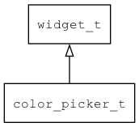

## color\_picker\_t
### 概述


颜色选择器。

color\_picker\_t是[widget\_t](widget_t.md)的子类控件，widget\_t的函数均适用于color\_picker\_t控件。

在xml中使用"color\_picker"标签创建颜色选择器控件。如：

```xml
<color_picker x="0" y="0" w="100%" h="100%" value="orange">
<color_component x="0" y="0" w="200" h="200" name="sv"/>
<color_component x="210" y="0" w="20" h="200" name="h"/>
<color_tile x="0" y="210" w="50%" h="20" name="new" bg_color="green"/>
<color_tile x="right" y="210" w="50%" h="20" name="old" bg_color="blue"/>
</color_picker>
```

> 更多用法请参考：
[color\_picker](https://github.com/zlgopen/awtk/blob/master/design/default/ui/color_picker.xml)

其中的子控件必须按下列规则命名：

* r 红色分量。可以是spin_box、edit和slider。
* g 绿色分量。可以是spin_box、edit和slider。
* b 蓝色分量。可以是spin_box、edit和slider。
* h Hue分量。可以是spin_box、edit、slider和color_component。
* s Saturation分量。可以是spin_box、edit和slider。
* v Value/Brightness分量。可以是spin_box、edit和slider。
* sv Saturation和Value/Brightness分量。可以是color_component。
* old 旧的值。可以是spin_box、edit和color_tile。
* new 新的值。可以是spin_box、edit和color_tile。
----------------------------------
### 函数
<p id="color_picker_t_methods">

| 函数名称 | 说明 | 
| -------- | ------------ | 
| <a href="#color_picker_t_color_picker_cast">color\_picker\_cast</a> | 转换为color_picker对象(供脚本语言使用)。 |
| <a href="#color_picker_t_color_picker_create">color\_picker\_create</a> | 创建color_picker对象 |
| <a href="#color_picker_t_color_picker_set_color">color\_picker\_set\_color</a> | 设置颜色。 |
### 属性
<p id="color_picker_t_properties">

| 属性名称 | 类型 | 说明 | 
| -------- | ----- | ------------ | 
| <a href="#color_picker_t_value">value</a> | const char* | 颜色。 |
### 事件
<p id="color_picker_t_events">

| 事件名称 | 类型  | 说明 | 
| -------- | ----- | ------- | 
| EVT\_VALUE\_WILL\_CHANGE | event\_t | 值(颜色)即将改变事件。 |
| EVT\_VALUE\_CHANGED | event\_t | 值(颜色)改变事件。 |
#### color\_picker\_cast 函数
-----------------------

* 函数功能：

> <p id="color_picker_t_color_picker_cast">转换为color_picker对象(供脚本语言使用)。

* 函数原型：

```
widget_t* color_picker_cast (widget_t* widget);
```

* 参数说明：

| 参数 | 类型 | 说明 |
| -------- | ----- | --------- |
| 返回值 | widget\_t* | color\_picker对象。 |
| widget | widget\_t* | color\_picker对象。 |
#### color\_picker\_create 函数
-----------------------

* 函数功能：

> <p id="color_picker_t_color_picker_create">创建color_picker对象

* 函数原型：

```
widget_t* color_picker_create (widget_t* parent, xy_t x, xy_t y, wh_t w, wh_t h);
```

* 参数说明：

| 参数 | 类型 | 说明 |
| -------- | ----- | --------- |
| 返回值 | widget\_t* | 对象。 |
| parent | widget\_t* | 父控件 |
| x | xy\_t | x坐标 |
| y | xy\_t | y坐标 |
| w | wh\_t | 宽度 |
| h | wh\_t | 高度 |
#### color\_picker\_set\_color 函数
-----------------------

* 函数功能：

> <p id="color_picker_t_color_picker_set_color">设置颜色。

* 函数原型：

```
ret_t color_picker_set_color (widget_t* widget, const char* color);
```

* 参数说明：

| 参数 | 类型 | 说明 |
| -------- | ----- | --------- |
| 返回值 | ret\_t | 返回RET\_OK表示成功，否则表示失败。 |
| widget | widget\_t* | 控件对象。 |
| color | const char* | 颜色。 |
#### value 属性
-----------------------
> <p id="color_picker_t_value">颜色。

* 类型：const char*

| 特性 | 是否支持 |
| -------- | ----- |
| 可直接读取 | 是 |
| 可直接修改 | 否 |
| 可持久化   | 是 |
| 可脚本化   | 是 |
| 可在IDE中设置 | 是 |
| 可在XML中设置 | 是 |
| 可通过widget\_get\_prop读取 | 是 |
| 可通过widget\_set\_prop修改 | 是 |
