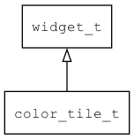

## color\_tile\_t
### 概述


色块控件。

用来显示一个颜色块，它通过属性而不是主题来设置颜色，方便在运行时动态改变颜色。

可以使用value属性访问背景颜色的颜色值。

color\_tile\_t是[widget\_t](widget_t.md)的子类控件，widget\_t的函数均适用于color\_tile\_t控件。

在xml中使用"color_tile"标签创建色块控件。如：

```xml
<color_tile x="c" y="m" w="80" h="30" bg_color="green" />
```

> 更多用法请参考：
[color_tile](https://github.com/zlgopen/awtk/blob/master/design/default/ui/color_picker_rgb.xml)

在c代码中使用函数color_tile\_create创建色块控件。如：

```c
widget_t* color_tile = color_tile_create(win, 10, 10, 128, 30);
color_tile_set_bg_color(color_tile, "red");
```
> 创建之后，用color\_tile\_set\_bg\_color设置背景颜色。
----------------------------------
### 函数
<p id="color_tile_t_methods">

| 函数名称 | 说明 | 
| -------- | ------------ | 
| <a href="#color_tile_t_color_tile_cast">color\_tile\_cast</a> | 转换为color_tile对象(供脚本语言使用)。 |
| <a href="#color_tile_t_color_tile_create">color\_tile\_create</a> | 创建color_tile对象 |
| <a href="#color_tile_t_color_tile_set_bg_color">color\_tile\_set\_bg\_color</a> | 设置背景颜色。 |
| <a href="#color_tile_t_color_tile_set_border_color">color\_tile\_set\_border\_color</a> | 设置边框颜色。 |
| <a href="#color_tile_t_color_tile_set_value">color\_tile\_set\_value</a> | 设置背景颜色。 |
### 属性
<p id="color_tile_t_properties">

| 属性名称 | 类型 | 说明 | 
| -------- | ----- | ------------ | 
| <a href="#color_tile_t_bg_color">bg\_color</a> | const char* | 背景颜色。 |
| <a href="#color_tile_t_border_color">border\_color</a> | const char* | 边框颜色。 |
#### color\_tile\_cast 函数
-----------------------

* 函数功能：

> <p id="color_tile_t_color_tile_cast">转换为color_tile对象(供脚本语言使用)。

* 函数原型：

```
widget_t* color_tile_cast (widget_t* widget);
```

* 参数说明：

| 参数 | 类型 | 说明 |
| -------- | ----- | --------- |
| 返回值 | widget\_t* | color\_tile对象。 |
| widget | widget\_t* | color\_tile对象。 |
#### color\_tile\_create 函数
-----------------------

* 函数功能：

> <p id="color_tile_t_color_tile_create">创建color_tile对象

* 函数原型：

```
widget_t* color_tile_create (widget_t* parent, xy_t x, xy_t y, wh_t w, wh_t h);
```

* 参数说明：

| 参数 | 类型 | 说明 |
| -------- | ----- | --------- |
| 返回值 | widget\_t* | 对象。 |
| parent | widget\_t* | 父控件 |
| x | xy\_t | x坐标 |
| y | xy\_t | y坐标 |
| w | wh\_t | 宽度 |
| h | wh\_t | 高度 |
#### color\_tile\_set\_bg\_color 函数
-----------------------

* 函数功能：

> <p id="color_tile_t_color_tile_set_bg_color">设置背景颜色。

* 函数原型：

```
ret_t color_tile_set_bg_color (widget_t* widget, const char* color);
```

* 参数说明：

| 参数 | 类型 | 说明 |
| -------- | ----- | --------- |
| 返回值 | ret\_t | 返回RET\_OK表示成功，否则表示失败。 |
| widget | widget\_t* | 控件对象。 |
| color | const char* | 背景颜色。 |
#### color\_tile\_set\_border\_color 函数
-----------------------

* 函数功能：

> <p id="color_tile_t_color_tile_set_border_color">设置边框颜色。

* 函数原型：

```
ret_t color_tile_set_border_color (widget_t* widget, const char* color);
```

* 参数说明：

| 参数 | 类型 | 说明 |
| -------- | ----- | --------- |
| 返回值 | ret\_t | 返回RET\_OK表示成功，否则表示失败。 |
| widget | widget\_t* | 控件对象。 |
| color | const char* | 边框颜色。 |
#### color\_tile\_set\_value 函数
-----------------------

* 函数功能：

> <p id="color_tile_t_color_tile_set_value">设置背景颜色。

* 函数原型：

```
ret_t color_tile_set_value (widget_t* widget, color_t color);
```

* 参数说明：

| 参数 | 类型 | 说明 |
| -------- | ----- | --------- |
| 返回值 | ret\_t | 返回RET\_OK表示成功，否则表示失败。 |
| widget | widget\_t* | 控件对象。 |
| color | color\_t | 背景颜色。 |
#### bg\_color 属性
-----------------------
> <p id="color_tile_t_bg_color">背景颜色。

* 类型：const char*

| 特性 | 是否支持 |
| -------- | ----- |
| 可直接读取 | 是 |
| 可直接修改 | 否 |
| 可持久化   | 是 |
| 可脚本化   | 是 |
| 可在IDE中设置 | 是 |
| 可在XML中设置 | 是 |
| 可通过widget\_get\_prop读取 | 是 |
| 可通过widget\_set\_prop修改 | 是 |
#### border\_color 属性
-----------------------
> <p id="color_tile_t_border_color">边框颜色。

* 类型：const char*

| 特性 | 是否支持 |
| -------- | ----- |
| 可直接读取 | 是 |
| 可直接修改 | 否 |
| 可持久化   | 是 |
| 可脚本化   | 是 |
| 可在IDE中设置 | 是 |
| 可在XML中设置 | 是 |
| 可通过widget\_get\_prop读取 | 是 |
| 可通过widget\_set\_prop修改 | 是 |
