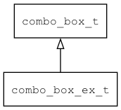

## combo\_box\_ex\_t
### 概述


可滚动的combo_box控件。
----------------------------------
### 函数
<p id="combo_box_ex_t_methods">

| 函数名称 | 说明 | 
| -------- | ------------ | 
| <a href="#combo_box_ex_t_combo_box_ex_create">combo\_box\_ex\_create</a> | 创建combo_box_ex对象 |
#### combo\_box\_ex\_create 函数
-----------------------

* 函数功能：

> <p id="combo_box_ex_t_combo_box_ex_create">创建combo_box_ex对象

* 函数原型：

```
widget_t* combo_box_ex_create (widget_t* parent, xy_t x, xy_t y, wh_t w, wh_t h);
```

* 参数说明：

| 参数 | 类型 | 说明 |
| -------- | ----- | --------- |
| 返回值 | widget\_t* | 对象。 |
| parent | widget\_t* | 父控件 |
| x | xy\_t | x坐标 |
| y | xy\_t | y坐标 |
| w | wh\_t | 宽度 |
| h | wh\_t | 高度 |
