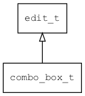

## combo\_box\_t
### 概述


下拉列表控件。

点击右边的按钮，可弹出一个下拉列表，从中选择一项作为当前的值。

combo\_box\_t是[edit\_t](edit_t.md)的子类控件，edit\_t的函数均适用于combo\_box\_t控件。

在xml中使用"combo_box"标签创建下拉列表控件。

列表选项可以直接写在"options"属性中。如：

```xml
<combo_box readonly="true" x="10" y="bottom:5" w="200" h="30" tr_text="ok"
options="1:ok;2:cancel;"/>
```

列表选项也可以放在独立的窗口中，用属性"open_window"指定窗口的名称。如：

```xml
<combo_box open_window="language" readonly="true" x="10" y="bottom:50" w="200" h="30"
tr_text="english"/>
```

language.xml:

```xml
<popup close_when_click_outside="true" h="80" >
<list_view x="0"  y="0" w="100%" h="100%" item_height="30">
<scroll_view name="view" x="0"  y="0" w="-12" h="100%">
<combo_box_item tr_text="english"/>
<combo_box_item tr_text="chinese" />
</scroll_view>
<scroll_bar_d name="bar" x="right" y="0" w="12" h="100%" value="0"/>
</list_view>
</popup>
```

> 更多用法请参考：[combo_box.xml](https://github.com/zlgopen/awtk/blob/master/design/default/ui/combo_box.xml)


如果在文本比较长时，希望在获得焦点时文本自动滚动，可以放入一个hscroll_label为子控件，并命名为"value"。如：

```xml
<combo_box left_margin="6" readonly="true" x="10" y="50" w="80" h="30" options="leftttttttttt;centerrrrrrrrrrrrrrrr;rightttttttttt;"
selected_index="1">
<hscroll_label x="0" y="0" w="-30" h="100%"
name="value"
lull="1000"
loop="true"
yoyo="true"
ellipses="true"
only_parent_focus="true"/>
<button style="combobox_down" x="right:5" y="middle" w="20" h="20"/>
</combo_box>
```

在c代码中使用函数combo\_box\_create创建下拉列表控件。如：

```c
widget_t* combo_box = combo_box_create(win, 10, 10, 128, 30);

combo_box_set_options(combo_box, "left;center;right;");
combo_box_set_selected_index(combo_box, 1);

```

创建之后：

* 用combo\_box\_set\_options设置可选项目。
* 用combo\_box\_set\_selected\_index设置缺省项。

> 完整示例请参考：[combo_box
demo](https://github.com/zlgopen/awtk-c-demos/blob/master/demos/combo_box.c)

可用通过style来设置控件的显示风格，如字体的大小和颜色等等。如：

```xml
<combo_box>
<style name="default" border_color="#a0a0a0"  text_color="black" text_align_h="left">
<normal     bg_color="#f0f0f0" />
<focused    bg_color="#f0f0f0" border_color="black"/>
<empty      bg_color="#f0f0f0" text_color="#a0a0a0" />
</style>
</combo_box>
```

* 1.combobox的下拉按钮的style名称为combobox_down，可以在主题文件中设置。

```xml
<button>
<style name="combobox_down" border_color="#a0a0a0">
<normal     bg_color="#f0f0f0" icon="arrow_down_n"/>
<pressed    bg_color="#c0c0c0" icon="arrow_down_p"/>
<over       bg_color="#e0e0e0" icon="arrow_down_o"/>
</style>
</button>
```

* 2.combobox的弹出popup窗口的style名称为combobox_popup，可以在主题文件中设置。

```xml
<popup>
<style name="combobox_popup" border_color="red">
<normal bg_color="#808080"/>
</style>
</popup>
```

> 更多用法请参考：[theme
default](https://github.com/zlgopen/awtk/blob/master/design/default/styles/default.xml#L422)
----------------------------------
### 函数
<p id="combo_box_t_methods">

| 函数名称 | 说明 | 
| -------- | ------------ | 
| <a href="#combo_box_t_combo_box_append_option">combo\_box\_append\_option</a> | 追加一个选项。 |
| <a href="#combo_box_t_combo_box_cast">combo\_box\_cast</a> | 转换combo_box对象(供脚本语言使用)。 |
| <a href="#combo_box_t_combo_box_count_options">combo\_box\_count\_options</a> | 获取选项个数。 |
| <a href="#combo_box_t_combo_box_create">combo\_box\_create</a> | 创建combo_box对象 |
| <a href="#combo_box_t_combo_box_get_option">combo\_box\_get\_option</a> | 获取第index个选项。 |
| <a href="#combo_box_t_combo_box_get_text">combo\_box\_get\_text</a> | 获取combo_box的文本。 |
| <a href="#combo_box_t_combo_box_get_value">combo\_box\_get\_value</a> | 获取combo_box的值。 |
| <a href="#combo_box_t_combo_box_reset_options">combo\_box\_reset\_options</a> | 重置所有选项。 |
| <a href="#combo_box_t_combo_box_set_custom_open_popup">combo\_box\_set\_custom\_open\_popup</a> | 设置自定义的打开弹出窗口的函数。 |
| <a href="#combo_box_t_combo_box_set_item_height">combo\_box\_set\_item\_height</a> | 设置item高度。 |
| <a href="#combo_box_t_combo_box_set_localize_options">combo\_box\_set\_localize\_options</a> | 设置是否本地化(翻译)选项。 |
| <a href="#combo_box_t_combo_box_set_open_window">combo\_box\_set\_open\_window</a> | 点击按钮时可以打开popup窗口，本函数可设置窗口的名称。 |
| <a href="#combo_box_t_combo_box_set_options">combo\_box\_set\_options</a> | 设置选项。 |
| <a href="#combo_box_t_combo_box_set_selected_index">combo\_box\_set\_selected\_index</a> | 设置第index个选项为当前选中的选项。 |
| <a href="#combo_box_t_combo_box_set_value">combo\_box\_set\_value</a> | 设置值。 |
### 属性
<p id="combo_box_t_properties">

| 属性名称 | 类型 | 说明 | 
| -------- | ----- | ------------ | 
| <a href="#combo_box_t_item_height">item\_height</a> | int32\_t | 下拉选项的高度。如果open_window为空，则使用缺省高度。 |
| <a href="#combo_box_t_localize_options">localize\_options</a> | bool\_t | 是否本地化(翻译)选项(缺省为TRUE)。 |
| <a href="#combo_box_t_open_window">open\_window</a> | char* | 为点击按钮时，要打开窗口的名称。 |
| <a href="#combo_box_t_options">options</a> | char* | 设置可选项(冒号分隔值和文本，分号分隔选项，如:1:red;2:green;3:blue)。 |
| <a href="#combo_box_t_selected_index">selected\_index</a> | int32\_t | 当前选中的选项。 |
| <a href="#combo_box_t_value">value</a> | int32\_t | 值。 |
### 事件
<p id="combo_box_t_events">

| 事件名称 | 类型  | 说明 | 
| -------- | ----- | ------- | 
| EVT\_VALUE\_WILL\_CHANGE | event\_t | 值即将改变事件。 |
| EVT\_VALUE\_CHANGED | event\_t | 值改变事件。 |
#### combo\_box\_append\_option 函数
-----------------------

* 函数功能：

> <p id="combo_box_t_combo_box_append_option">追加一个选项。

* 函数原型：

```
ret_t combo_box_append_option (widget_t* widget, int32_t value, const char* text);
```

* 参数说明：

| 参数 | 类型 | 说明 |
| -------- | ----- | --------- |
| 返回值 | ret\_t | 返回RET\_OK表示成功，否则表示失败。 |
| widget | widget\_t* | combo\_box对象。 |
| value | int32\_t | 值。 |
| text | const char* | 文本。 |
#### combo\_box\_cast 函数
-----------------------

* 函数功能：

> <p id="combo_box_t_combo_box_cast">转换combo_box对象(供脚本语言使用)。

* 函数原型：

```
widget_t* combo_box_cast (widget_t* widget);
```

* 参数说明：

| 参数 | 类型 | 说明 |
| -------- | ----- | --------- |
| 返回值 | widget\_t* | combo\_box对象。 |
| widget | widget\_t* | combo\_box对象。 |
#### combo\_box\_count\_options 函数
-----------------------

* 函数功能：

> <p id="combo_box_t_combo_box_count_options">获取选项个数。

* 函数原型：

```
int32_t combo_box_count_options (widget_t* widget);
```

* 参数说明：

| 参数 | 类型 | 说明 |
| -------- | ----- | --------- |
| 返回值 | int32\_t | 返回选项个数。 |
| widget | widget\_t* | combo\_box对象。 |
#### combo\_box\_create 函数
-----------------------

* 函数功能：

> <p id="combo_box_t_combo_box_create">创建combo_box对象

* 函数原型：

```
widget_t* combo_box_create (widget_t* parent, xy_t x, xy_t y, wh_t w, wh_t h);
```

* 参数说明：

| 参数 | 类型 | 说明 |
| -------- | ----- | --------- |
| 返回值 | widget\_t* | 对象。 |
| parent | widget\_t* | 父控件 |
| x | xy\_t | x坐标 |
| y | xy\_t | y坐标 |
| w | wh\_t | 宽度 |
| h | wh\_t | 高度 |
#### combo\_box\_get\_option 函数
-----------------------

* 函数功能：

> <p id="combo_box_t_combo_box_get_option">获取第index个选项。

* 函数原型：

```
combo_box_option_t* combo_box_get_option (widget_t* widget, uint32_t index);
```

* 参数说明：

| 参数 | 类型 | 说明 |
| -------- | ----- | --------- |
| 返回值 | combo\_box\_option\_t* | 返回index个选项。 |
| widget | widget\_t* | combo\_box对象。 |
| index | uint32\_t | 选项的索引。 |
#### combo\_box\_get\_text 函数
-----------------------

* 函数功能：

> <p id="combo_box_t_combo_box_get_text">获取combo_box的文本。

* 函数原型：

```
const char* combo_box_get_text (widget_t* widget);
```

* 参数说明：

| 参数 | 类型 | 说明 |
| -------- | ----- | --------- |
| 返回值 | const char* | 返回文本。 |
| widget | widget\_t* | combo\_box对象。 |
#### combo\_box\_get\_value 函数
-----------------------

* 函数功能：

> <p id="combo_box_t_combo_box_get_value">获取combo_box的值。

* 函数原型：

```
int32_t combo_box_get_value (widget_t* widget);
```

* 参数说明：

| 参数 | 类型 | 说明 |
| -------- | ----- | --------- |
| 返回值 | int32\_t | 返回值。 |
| widget | widget\_t* | combo\_box对象。 |
#### combo\_box\_reset\_options 函数
-----------------------

* 函数功能：

> <p id="combo_box_t_combo_box_reset_options">重置所有选项。

* 函数原型：

```
ret_t combo_box_reset_options (widget_t* widget);
```

* 参数说明：

| 参数 | 类型 | 说明 |
| -------- | ----- | --------- |
| 返回值 | ret\_t | 返回RET\_OK表示成功，否则表示失败。 |
| widget | widget\_t* | combo\_box对象。 |
#### combo\_box\_set\_custom\_open\_popup 函数
-----------------------

* 函数功能：

> <p id="combo_box_t_combo_box_set_custom_open_popup">设置自定义的打开弹出窗口的函数。

* 函数原型：

```
ret_t combo_box_set_custom_open_popup (widget_t* widget, combo_box_custom_open_popup_t open_popup);
```

* 参数说明：

| 参数 | 类型 | 说明 |
| -------- | ----- | --------- |
| 返回值 | ret\_t | 返回RET\_OK表示成功，否则表示失败。 |
| widget | widget\_t* | combo\_box对象。 |
| open\_popup | combo\_box\_custom\_open\_popup\_t | 回调函数。 |
#### combo\_box\_set\_item\_height 函数
-----------------------

* 函数功能：

> <p id="combo_box_t_combo_box_set_item_height">设置item高度。

* 函数原型：

```
ret_t combo_box_set_item_height (widget_t* widget, uint32_t item_height);
```

* 参数说明：

| 参数 | 类型 | 说明 |
| -------- | ----- | --------- |
| 返回值 | ret\_t | 返回RET\_OK表示成功，否则表示失败。 |
| widget | widget\_t* | combo\_box对象。 |
| item\_height | uint32\_t | item的高度。 |
#### combo\_box\_set\_localize\_options 函数
-----------------------

* 函数功能：

> <p id="combo_box_t_combo_box_set_localize_options">设置是否本地化(翻译)选项。

* 函数原型：

```
ret_t combo_box_set_localize_options (widget_t* widget, bool_t localize_options);
```

* 参数说明：

| 参数 | 类型 | 说明 |
| -------- | ----- | --------- |
| 返回值 | ret\_t | 返回RET\_OK表示成功，否则表示失败。 |
| widget | widget\_t* | combo\_box对象。 |
| localize\_options | bool\_t | 是否本地化(翻译)选项。 |
#### combo\_box\_set\_open\_window 函数
-----------------------

* 函数功能：

> <p id="combo_box_t_combo_box_set_open_window">点击按钮时可以打开popup窗口，本函数可设置窗口的名称。

* 函数原型：

```
ret_t combo_box_set_open_window (widget_t* widget, const char* open_window);
```

* 参数说明：

| 参数 | 类型 | 说明 |
| -------- | ----- | --------- |
| 返回值 | ret\_t | 返回RET\_OK表示成功，否则表示失败。 |
| widget | widget\_t* | combo\_box对象。 |
| open\_window | const char* | 弹出窗口的名称。 |
#### combo\_box\_set\_options 函数
-----------------------

* 函数功能：

> <p id="combo_box_t_combo_box_set_options">设置选项。

* 函数原型：

```
ret_t combo_box_set_options (widget_t* widget, const char* options);
```

* 参数说明：

| 参数 | 类型 | 说明 |
| -------- | ----- | --------- |
| 返回值 | ret\_t | 返回RET\_OK表示成功，否则表示失败。 |
| widget | widget\_t* | combo\_box对象。 |
| options | const char* | 选项。 |
#### combo\_box\_set\_selected\_index 函数
-----------------------

* 函数功能：

> <p id="combo_box_t_combo_box_set_selected_index">设置第index个选项为当前选中的选项。

* 函数原型：

```
ret_t combo_box_set_selected_index (widget_t* widget, uint32_t index);
```

* 参数说明：

| 参数 | 类型 | 说明 |
| -------- | ----- | --------- |
| 返回值 | ret\_t | 返回RET\_OK表示成功，否则表示失败。 |
| widget | widget\_t* | combo\_box对象。 |
| index | uint32\_t | 选项的索引。 |
#### combo\_box\_set\_value 函数
-----------------------

* 函数功能：

> <p id="combo_box_t_combo_box_set_value">设置值。

* 函数原型：

```
ret_t combo_box_set_value (widget_t* widget, int32_t value);
```

* 参数说明：

| 参数 | 类型 | 说明 |
| -------- | ----- | --------- |
| 返回值 | ret\_t | 返回RET\_OK表示成功，否则表示失败。 |
| widget | widget\_t* | combo\_box对象。 |
| value | int32\_t | 值。 |
#### item\_height 属性
-----------------------
> <p id="combo_box_t_item_height">下拉选项的高度。如果open_window为空，则使用缺省高度。

* 类型：int32\_t

| 特性 | 是否支持 |
| -------- | ----- |
| 可直接读取 | 是 |
| 可直接修改 | 否 |
| 可持久化   | 是 |
| 可脚本化   | 是 |
| 可在IDE中设置 | 是 |
| 可在XML中设置 | 是 |
| 可通过widget\_get\_prop读取 | 是 |
| 可通过widget\_set\_prop修改 | 是 |
#### localize\_options 属性
-----------------------
> <p id="combo_box_t_localize_options">是否本地化(翻译)选项(缺省为TRUE)。

* 类型：bool\_t

| 特性 | 是否支持 |
| -------- | ----- |
| 可直接读取 | 是 |
| 可直接修改 | 否 |
| 可持久化   | 是 |
| 可脚本化   | 是 |
| 可在IDE中设置 | 是 |
| 可在XML中设置 | 是 |
| 可通过widget\_get\_prop读取 | 是 |
| 可通过widget\_set\_prop修改 | 是 |
#### open\_window 属性
-----------------------
> <p id="combo_box_t_open_window">为点击按钮时，要打开窗口的名称。

* 类型：char*

| 特性 | 是否支持 |
| -------- | ----- |
| 可直接读取 | 是 |
| 可直接修改 | 否 |
| 可持久化   | 是 |
| 可脚本化   | 是 |
| 可在IDE中设置 | 是 |
| 可在XML中设置 | 是 |
| 可通过widget\_get\_prop读取 | 是 |
| 可通过widget\_set\_prop修改 | 是 |
#### options 属性
-----------------------
> <p id="combo_box_t_options">设置可选项(冒号分隔值和文本，分号分隔选项，如:1:red;2:green;3:blue)。

* 类型：char*

| 特性 | 是否支持 |
| -------- | ----- |
| 可直接读取 | 是 |
| 可直接修改 | 否 |
| 可持久化   | 是 |
| 可脚本化   | 是 |
| 可在IDE中设置 | 是 |
| 可在XML中设置 | 是 |
| 可通过widget\_get\_prop读取 | 是 |
| 可通过widget\_set\_prop修改 | 是 |
#### selected\_index 属性
-----------------------
> <p id="combo_box_t_selected_index">当前选中的选项。

* 类型：int32\_t

| 特性 | 是否支持 |
| -------- | ----- |
| 可直接读取 | 是 |
| 可直接修改 | 否 |
| 可持久化   | 是 |
| 可脚本化   | 是 |
| 可在IDE中设置 | 是 |
| 可在XML中设置 | 是 |
| 可通过widget\_get\_prop读取 | 是 |
| 可通过widget\_set\_prop修改 | 是 |
#### value 属性
-----------------------
> <p id="combo_box_t_value">值。

* 类型：int32\_t

| 特性 | 是否支持 |
| -------- | ----- |
| 可直接读取 | 是 |
| 可直接修改 | 否 |
| 可持久化   | 是 |
| 可脚本化   | 是 |
| 可在IDE中设置 | 是 |
| 可在XML中设置 | 是 |
| 可通过widget\_get\_prop读取 | 是 |
| 可通过widget\_set\_prop修改 | 是 |
