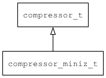

## compressor\_miniz\_t
### 概述


基于miniz实现的compressor接口。
----------------------------------
### 函数
<p id="compressor_miniz_t_methods">

| 函数名称 | 说明 | 
| -------- | ------------ | 
| <a href="#compressor_miniz_t_compressor_miniz_create">compressor\_miniz\_create</a> | 创建compressor对象。 |
#### compressor\_miniz\_create 函数
-----------------------

* 函数功能：

> <p id="compressor_miniz_t_compressor_miniz_create">创建compressor对象。

* 函数原型：

```
compressor_t* compressor_miniz_create (compressor_options_t options);
```

* 参数说明：

| 参数 | 类型 | 说明 |
| -------- | ----- | --------- |
| 返回值 | compressor\_t* | 返回compressor对象。 |
| options | compressor\_options\_t | 选项。 |
