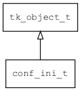

## conf\_ini\_t
### 概述


conf ini对象。
----------------------------------
### 函数
<p id="conf_ini_t_methods">

| 函数名称 | 说明 | 
| -------- | ------------ | 
| <a href="#conf_ini_t_conf_ini_create">conf\_ini\_create</a> | 创建一个空的conf对象。 |
| <a href="#conf_ini_t_conf_ini_load">conf\_ini\_load</a> | 从指定URL加载INI对象。 |
| <a href="#conf_ini_t_conf_ini_save_as">conf\_ini\_save\_as</a> | 将doc对象保存到指定URL。 |
#### conf\_ini\_create 函数
-----------------------

* 函数功能：

> <p id="conf_ini_t_conf_ini_create">创建一个空的conf对象。

* 函数原型：

```
object_t* conf_ini_create ();
```

* 参数说明：

| 参数 | 类型 | 说明 |
| -------- | ----- | --------- |
| 返回值 | object\_t* | 返回配置对象。 |
#### conf\_ini\_load 函数
-----------------------

* 函数功能：

> <p id="conf_ini_t_conf_ini_load">从指定URL加载INI对象。

* 函数原型：

```
object_t* conf_ini_load (const char* url, bool_t create_if_not_exist);
```

* 参数说明：

| 参数 | 类型 | 说明 |
| -------- | ----- | --------- |
| 返回值 | object\_t* | 返回配置对象。 |
| url | const char* | 路径(通常是文件路径)。 |
| create\_if\_not\_exist | bool\_t | 如果不存在是否创建。 |
#### conf\_ini\_save\_as 函数
-----------------------

* 函数功能：

> <p id="conf_ini_t_conf_ini_save_as">将doc对象保存到指定URL。

* 函数原型：

```
ret_t conf_ini_save_as (object_t* obj, const char* url);
```

* 参数说明：

| 参数 | 类型 | 说明 |
| -------- | ----- | --------- |
| 返回值 | ret\_t | 返回RET\_OK表示成功，否则表示失败 |
| obj | object\_t* | doc对象。 |
| url | const char* | 保存的位置。 |
