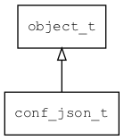

## conf\_json\_t
### 概述


conf json对象。
----------------------------------
### 函数
<p id="conf_json_t_methods">

| 函数名称 | 说明 | 
| -------- | ------------ | 
| <a href="#conf_json_t_conf_doc_save_json_ex">conf\_doc\_save\_json\_ex</a> | 功能描述 |
| <a href="#conf_json_t_conf_json_create">conf\_json\_create</a> | 创建一个空的conf对象。 |
| <a href="#conf_json_t_conf_json_load">conf\_json\_load</a> | 从指定URL加载JSON对象。 |
| <a href="#conf_json_t_conf_json_load_ex">conf\_json\_load\_ex</a> | 从指定URL加载JSON对象。 |
| <a href="#conf_json_t_conf_json_load_from_buff">conf\_json\_load\_from\_buff</a> | 从内存加载JSON对象。 |
| <a href="#conf_json_t_conf_json_save_as">conf\_json\_save\_as</a> | 将doc对象保存到指定URL。 |
| <a href="#conf_json_t_conf_json_save_to_buff">conf\_json\_save\_to\_buff</a> | 将obj保存为JSON格式到内存。 |
#### conf\_doc\_save\_json\_ex 函数
-----------------------

* 函数功能：

> <p id="conf_json_t_conf_doc_save_json_ex">功能描述

* 函数原型：

```
ret_t conf_doc_save_json_ex (conf_doc_t* doc, str_t* str, uint32_t indent);
```

* 参数说明：

| 参数 | 类型 | 说明 |
| -------- | ----- | --------- |
| 返回值 | ret\_t | 返回 ret\_t值 |
| doc | conf\_doc\_t* | doc对象 |
| str | str\_t* | 保存结果 |
| indent | uint32\_t | 缩进 |
#### conf\_json\_create 函数
-----------------------

* 函数功能：

> <p id="conf_json_t_conf_json_create">创建一个空的conf对象。

* 函数原型：

```
tk_object_t* conf_json_create ();
```

* 参数说明：

| 参数 | 类型 | 说明 |
| -------- | ----- | --------- |
| 返回值 | tk\_object\_t* | 返回配置对象。 |
#### conf\_json\_load 函数
-----------------------

* 函数功能：

> <p id="conf_json_t_conf_json_load">从指定URL加载JSON对象。

* 函数原型：

```
tk_object_t* conf_json_load (const char* url, bool_t create_if_not_exist);
```

* 参数说明：

| 参数 | 类型 | 说明 |
| -------- | ----- | --------- |
| 返回值 | tk\_object\_t* | 返回配置对象。 |
| url | const char* | 路径(通常是文件路径)。 |
| create\_if\_not\_exist | bool\_t | 如果不存在是否创建。 |
#### conf\_json\_load\_ex 函数
-----------------------

* 函数功能：

> <p id="conf_json_t_conf_json_load_ex">从指定URL加载JSON对象。

* 函数原型：

```
tk_object_t* conf_json_load_ex (const char* url, bool_t create_if_not_exist, bool_t use_extend_type);
```

* 参数说明：

| 参数 | 类型 | 说明 |
| -------- | ----- | --------- |
| 返回值 | tk\_object\_t* | 返回配置对象。 |
| url | const char* | 路径(通常是文件路径)。 |
| create\_if\_not\_exist | bool\_t | 如果不存在是否创建。 |
| use\_extend\_type | bool\_t | 是否使用拓展类型。 |
#### conf\_json\_load\_from\_buff 函数
-----------------------

* 函数功能：

> <p id="conf_json_t_conf_json_load_from_buff">从内存加载JSON对象。

* 函数原型：

```
tk_object_t* conf_json_load_from_buff (const void* buff, uint32_t size, bool_t create_if_not_exist);
```

* 参数说明：

| 参数 | 类型 | 说明 |
| -------- | ----- | --------- |
| 返回值 | tk\_object\_t* | 返回配置对象。 |
| buff | const void* | 数据。 |
| size | uint32\_t | 数据长度。 |
| create\_if\_not\_exist | bool\_t | 如果不存在是否创建。 |
#### conf\_json\_save\_as 函数
-----------------------

* 函数功能：

> <p id="conf_json_t_conf_json_save_as">将doc对象保存到指定URL。

* 函数原型：

```
ret_t conf_json_save_as (tk_object_t* obj, const char* url);
```

* 参数说明：

| 参数 | 类型 | 说明 |
| -------- | ----- | --------- |
| 返回值 | ret\_t | 返回RET\_OK表示成功，否则表示失败 |
| obj | tk\_object\_t* | doc对象。 |
| url | const char* | 保存的位置。 |
#### conf\_json\_save\_to\_buff 函数
-----------------------

* 函数功能：

> <p id="conf_json_t_conf_json_save_to_buff">将obj保存为JSON格式到内存。

* 函数原型：

```
ret_t conf_json_save_to_buff (tk_object_t* obj, wbuffer_t* wb);
```

* 参数说明：

| 参数 | 类型 | 说明 |
| -------- | ----- | --------- |
| 返回值 | ret\_t | 返回RET\_OK表示成功，否则表示失败 |
| obj | tk\_object\_t* | doc对象。 |
| wb | wbuffer\_t* | 返回结果(不要初始化，使用完成后要调用wbuffer\_deinit)。 |
