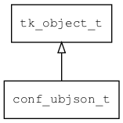

## conf\_ubjson\_t
### 概述


conf json对象。
----------------------------------
### 函数
<p id="conf_ubjson_t_methods">

| 函数名称 | 说明 | 
| -------- | ------------ | 
| <a href="#conf_ubjson_t_conf_ubjson_load">conf\_ubjson\_load</a> |  |
#### conf\_ubjson\_load 函数
-----------------------

* 函数功能：

> <p id="conf_ubjson_t_conf_ubjson_load">

* 函数原型：

```
object_t* conf_ubjson_load (const char* url, bool_t create_if_not_exist);
```

* 参数说明：

| 参数 | 类型 | 说明 |
| -------- | ----- | --------- |
| 返回值 | object\_t* | 返回配置对象。 |
| url | const char* | 路径(通常是文件路径)。 |
| create\_if\_not\_exist | bool\_t | 如果不存在是否创建。 |
