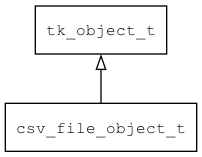

## csv\_file\_object\_t
### 概述


将cvs file包装成object对象。
----------------------------------
### 函数
<p id="csv_file_object_t_methods">

| 函数名称 | 说明 | 
| -------- | ------------ | 
| <a href="#csv_file_object_t_csv_file_object_create">csv\_file\_object\_create</a> | 将csv_file对象包装成object。 |
| <a href="#csv_file_object_t_csv_file_object_get_csv">csv\_file\_object\_get\_csv</a> | 获取csv对象。 |
#### csv\_file\_object\_create 函数
-----------------------

* 函数功能：

> <p id="csv_file_object_t_csv_file_object_create">将csv_file对象包装成object。

* 函数原型：

```
object_t* csv_file_object_create (csv_file_t* csv);
```

* 参数说明：

| 参数 | 类型 | 说明 |
| -------- | ----- | --------- |
| 返回值 | object\_t* | 返回对象。 |
| csv | csv\_file\_t* | csv对象(由object释放)。 |
#### csv\_file\_object\_get\_csv 函数
-----------------------

* 函数功能：

> <p id="csv_file_object_t_csv_file_object_get_csv">获取csv对象。

* 函数原型：

```
csv_file_t* csv_file_object_get_csv (object_t* obj);
```

* 参数说明：

| 参数 | 类型 | 说明 |
| -------- | ----- | --------- |
| 返回值 | csv\_file\_t* | 返回csv对象。 |
| obj | object\_t* | obj对象。 |
