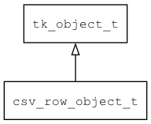

## csv\_row\_object\_t
### 概述


将cvs row包装成object对象。
----------------------------------
### 函数
<p id="csv_row_object_t_methods">

| 函数名称 | 说明 | 
| -------- | ------------ | 
| <a href="#csv_row_object_t_csv_row_object_create">csv\_row\_object\_create</a> | 将csv_row对象包装成object。 |
#### csv\_row\_object\_create 函数
-----------------------

* 函数功能：

> <p id="csv_row_object_t_csv_row_object_create">将csv_row对象包装成object。

* 函数原型：

```
tk_object_t* csv_row_object_create (tk_object_t* csv, const char* init);
```

* 参数说明：

| 参数 | 类型 | 说明 |
| -------- | ----- | --------- |
| 返回值 | tk\_object\_t* | 返回对象。 |
| csv | tk\_object\_t* | csv对象。 |
| init | const char* | 初始化数据。 |
