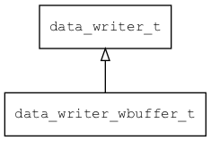

## data\_writer\_wbuffer\_t
### 概述


基于内存实现的 data_writer。通过 data_writer_factory 创建 writer 时，URL的格式如下(请用函数data_writer_wbuffer_build_url生成)：

```
wbuffer://addr
```
----------------------------------
### 函数
<p id="data_writer_wbuffer_t_methods">

| 函数名称 | 说明 | 
| -------- | ------------ | 
| <a href="#data_writer_wbuffer_t_data_writer_wbuffer_build_url">data\_writer\_wbuffer\_build\_url</a> | 构造wbuffer的URL。 |
| <a href="#data_writer_wbuffer_t_data_writer_wbuffer_create">data\_writer\_wbuffer\_create</a> | 创建基于wbuffer的data writer。 |
#### data\_writer\_wbuffer\_build\_url 函数
-----------------------

* 函数功能：

> <p id="data_writer_wbuffer_t_data_writer_wbuffer_build_url">构造wbuffer的URL。

* 函数原型：

```
const char* data_writer_wbuffer_build_url (wbuffer_t* wbuffer, char* url);
```

* 参数说明：

| 参数 | 类型 | 说明 |
| -------- | ----- | --------- |
| 返回值 | const char* | 返回URL。 |
| wbuffer | wbuffer\_t* | wbuffer对象。 |
| url | char* | 生成的URL。 |
#### data\_writer\_wbuffer\_create 函数
-----------------------

* 函数功能：

> <p id="data_writer_wbuffer_t_data_writer_wbuffer_create">创建基于wbuffer的data writer。

> 不要直接调用，而是注册到 data\_writer\_factory后，通过data\_writer\_factory调用

* 函数原型：

```
data_writer_t* data_writer_wbuffer_create (const char* wbuffer_name);
```

* 参数说明：

| 参数 | 类型 | 说明 |
| -------- | ----- | --------- |
| 返回值 | data\_writer\_t* | 返回data writer对象。 |
| wbuffer\_name | const char* | wbuffer地址的字符串格式表示 。 |
