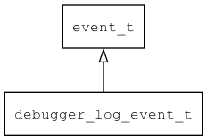

## debugger\_log\_event\_t
### 概述


调试器打印日志的事件。
----------------------------------
### 函数
<p id="debugger_log_event_t_methods">

| 函数名称 | 说明 | 
| -------- | ------------ | 
| <a href="#debugger_log_event_t_debugger_log_event_cast">debugger\_log\_event\_cast</a> | 把event对象转debugger_log_event_t对象。 |
| <a href="#debugger_log_event_t_debugger_log_event_init">debugger\_log\_event\_init</a> | 初始调试器打印日志的事件。 |
### 属性
<p id="debugger_log_event_t_properties">

| 属性名称 | 类型 | 说明 | 
| -------- | ----- | ------------ | 
| <a href="#debugger_log_event_t_line">line</a> | int32\_t | 打印日志的行号(<0表示原生代码打印的日志)。 |
| <a href="#debugger_log_event_t_message">message</a> | const char* | 日志消息。 |
#### debugger\_log\_event\_cast 函数
-----------------------

* 函数功能：

> <p id="debugger_log_event_t_debugger_log_event_cast">把event对象转debugger_log_event_t对象。

* 函数原型：

```
debugger_log_event_t* debugger_log_event_cast (event_t* event);
```

* 参数说明：

| 参数 | 类型 | 说明 |
| -------- | ----- | --------- |
| 返回值 | debugger\_log\_event\_t* | 返回event对象。 |
| event | event\_t* | event对象。 |
#### debugger\_log\_event\_init 函数
-----------------------

* 函数功能：

> <p id="debugger_log_event_t_debugger_log_event_init">初始调试器打印日志的事件。

* 函数原型：

```
event_t* debugger_log_event_init (debugger_log_event_t* event, uint32_t line, const char* message);
```

* 参数说明：

| 参数 | 类型 | 说明 |
| -------- | ----- | --------- |
| 返回值 | event\_t* | 返回event对象。 |
| event | debugger\_log\_event\_t* | event对象。 |
| line | uint32\_t | 打印日志的行号。 |
| message | const char* | 日志。 |
#### line 属性
-----------------------
> <p id="debugger_log_event_t_line">打印日志的行号(<0表示原生代码打印的日志)。

* 类型：int32\_t

| 特性 | 是否支持 |
| -------- | ----- |
| 可直接读取 | 是 |
| 可直接修改 | 否 |
#### message 属性
-----------------------
> <p id="debugger_log_event_t_message">日志消息。

* 类型：const char*

| 特性 | 是否支持 |
| -------- | ----- |
| 可直接读取 | 是 |
| 可直接修改 | 否 |
