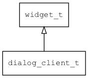

## dialog\_client\_t
### 概述


 对话框客户区控件。
### 函数
<p id="dialog_client_t_methods">

| 函数名称 | 说明 | 
| -------- | ------------ | 
| <a href="#dialog_client_t_dialog_client_cast">dialog\_client\_cast</a> | 转换为dialog_client对象(供脚本语言使用)。 |
| <a href="#dialog_client_t_dialog_client_create">dialog\_client\_create</a> | 创建dialog对象。 |
### 属性
<p id="dialog_client_t_properties">

| 名属性称 | 类型 | 说明 | 
| -------- | ----- | ------------ | 
### 事件
<p id="dialog_client_t_events">

| 事件名称 | 类型  | 说明 | 
| -------- | ----- | ------- | 
#### dialog\_client\_cast 函数
* 函数原型：

```
widget_t* dialog_client_cast (widget_t* widget);
```

* 参数说明：

-----------------------

| 参数 | 类型 | 说明 |
| -------- | ----- | --------- |
| 返回值 | widget\_t* | dialog\_client对象。 |
| widget | widget\_t* | dialog\_client对象。 |
* 函数功能：

> <p id="dialog_client_t_dialog_client_cast"> 转换为dialog_client对象(供脚本语言使用)。


#### dialog\_client\_create 函数
* 函数原型：

```
widget_t* dialog_client_create (widget_t* parent, xy_t x, xy_t y, wh_t w, wh_t h);
```

* 参数说明：

-----------------------

| 参数 | 类型 | 说明 |
| -------- | ----- | --------- |
| 返回值 | widget\_t* | dialog对象。 |
| parent | widget\_t* | 父控件 |
| x | xy\_t | x坐标 |
| y | xy\_t | y坐标 |
| w | wh\_t | 宽度 |
| h | wh\_t | 高度 |
* 函数功能：

> <p id="dialog_client_t_dialog_client_create"> 创建dialog对象。


