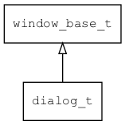
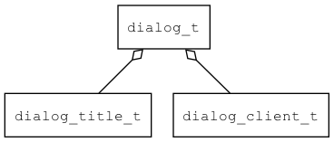

## dialog\_t
### 概述


 对话框。

 对话框是一种特殊的窗口，大小和位置可以自由设置。
 AWTK中的对话框是模态的，也就是说用户不能操作对话框后面的窗口。

 对话框通常由对话框标题和对话框客户区两部分组成：

 


 dialog\_t是[window\_base\_t](window_base_t.md)的子类控件，window\_base\_t的函数均适用于dialog\_t控件。

 在xml中使用"dialog"标签创建对话框。如：

 ```xml
 <dialog anim_hint="center_scale(duration=300)" x="c" y="m" w="80%" h="160" text="Dialog">
 <dialog_title x="0" y="0" w="100%" h="30" text="Hello AWTK" />
 <dialog_client x="0" y="bottom" w="100%" h="-30">
   <label name="" x="center" y="middle:-20" w="200" h="30" text="Are you ready?"/>
   <button name="quit" x="10" y="bottom:10" w="40%" h="30" text="确定"/>
   <button name="quit" x="right:10" y="bottom:10" w="40%" h="30" text="取消"/>
 </dialog_client>
 </dialog>
 ```

 如果你不需要对话框的标题，可以这样写：

 ```xml
 <dialog anim_hint="center_scale(duration=300)" x="c" y="m" w="80%" h="160" text="Dialog">
   <label name="" x="center" y="middle:-20" w="200" h="30" text="Are you ready?"/>
   <button name="quit" x="10" y="bottom:10" w="40%" h="30" text="确定"/>
   <button name="quit" x="right:10" y="bottom:10" w="40%" h="30" text="取消"/>
 </dialog>
 ```

 与窗口不同的是，打开对话框之后，还需要调用dialog\_modal。

 ```c
  widget_t* dlg = dialog_open(name);

  ret = dialog_modal(dlg);
 ```

 >
 更多用法请参考：[dialog.xml](https://github.com/zlgopen/awtk/blob/master/demos/assets/raw/ui/)

 在c代码中使用函数dialog\_create创建对话框。如：

 ```c
   widget_t* ok = NULL;
   widget_t* cancel = NULL;
   widget_t* label = NULL;

   widget_t* dlg = dialog_create_simple(NULL, 0, 0, 240, 160);

   dialog_set_title(dlg, "Dialog");

   ok = button_create(dialog_get_client(dlg), 20, 80, 80, 30);
   widget_set_text(ok, L"Go");

   cancel = button_create(dialog_get_client(dlg), 140, 80, 80, 30);
   widget_set_text(cancel, L"Cancel");

   label = label_create(dialog_get_client(dlg), 10, 30, 200, 30);
   widget_set_text(label, L"AWTK is cool!");

   widget_on(ok, EVT_CLICK, on_dialog_btn_click, (char*)NULL + 1);
   widget_on(cancel, EVT_CLICK, on_dialog_btn_click, (char*)NULL + 2);

   code = dialog_modal(dlg);

   log_debug("code=%d\n", code);
 ```

 > 创建之后，再创建子控件，最后调用dialog\_modal显示对话框。对话框关闭之后dialog\_modal才会返回。

 > 完整示例请参考：[dialog
 demo](https://github.com/zlgopen/awtk-c-demos/blob/master/demos/dialog.c)

 可用通过style来设置控件的显示风格，如字体的大小和颜色等等。如：

 ```xml
 <style name="default">
   <normal border_color="#606060" />
 </style>
 ```

 > 更多用法请参考：[theme
 default](https://github.com/zlgopen/awtk/blob/master/demos/assets/raw/styles/default.xml#L324)


----------------------------------
### 函数
<p id="dialog_t_methods">

| 函数名称 | 说明 | 
| -------- | ------------ | 
| <a href="#dialog_t_dialog_cast">dialog\_cast</a> | 转换dialog对象(供脚本语言使用)。 |
| <a href="#dialog_t_dialog_create">dialog\_create</a> | 创建dialog对象。 |
| <a href="#dialog_t_dialog_create_simple">dialog\_create\_simple</a> | 创建dialog对象，同时创建title/client。 |
| <a href="#dialog_t_dialog_get_client">dialog\_get\_client</a> | 获取client控件。 |
| <a href="#dialog_t_dialog_get_title">dialog\_get\_title</a> | 获取title控件。 |
| <a href="#dialog_t_dialog_modal">dialog\_modal</a> | 模态显示对话框。 |
| <a href="#dialog_t_dialog_open">dialog\_open</a> | 从资源文件中加载并创建Dialog对象。 |
| <a href="#dialog_t_dialog_quit">dialog\_quit</a> | 退出模态显示，关闭对话框。 |
| <a href="#dialog_t_dialog_set_title">dialog\_set\_title</a> | 设置对话框的标题文本。 |
#### dialog\_cast 函数
-----------------------

* 函数功能：

> <p id="dialog_t_dialog_cast"> 转换dialog对象(供脚本语言使用)。


* 函数原型：

```
widget_t* dialog_cast (widget_t* widget);
```

* 参数说明：

| 参数 | 类型 | 说明 |
| -------- | ----- | --------- |
| 返回值 | widget\_t* | dialog对象。 |
| widget | widget\_t* | dialog对象。 |
#### dialog\_create 函数
-----------------------

* 函数功能：

> <p id="dialog_t_dialog_create"> 创建dialog对象。


* 函数原型：

```
widget_t* dialog_create (widget_t* parent, xy_t x, xy_t y, wh_t w, wh_t h);
```

* 参数说明：

| 参数 | 类型 | 说明 |
| -------- | ----- | --------- |
| 返回值 | widget\_t* | dialog对象。 |
| parent | widget\_t* | 父控件 |
| x | xy\_t | x坐标 |
| y | xy\_t | y坐标 |
| w | wh\_t | 宽度 |
| h | wh\_t | 高度 |
#### dialog\_create\_simple 函数
-----------------------

* 函数功能：

> <p id="dialog_t_dialog_create_simple"> 创建dialog对象，同时创建title/client。


* 函数原型：

```
widget_t* dialog_create_simple (widget_t* parent, xy_t x, xy_t y, wh_t w, wh_t h);
```

* 参数说明：

| 参数 | 类型 | 说明 |
| -------- | ----- | --------- |
| 返回值 | widget\_t* | dialog对象。 |
| parent | widget\_t* | 父控件 |
| x | xy\_t | x坐标 |
| y | xy\_t | y坐标 |
| w | wh\_t | 宽度 |
| h | wh\_t | 高度 |
#### dialog\_get\_client 函数
-----------------------

* 函数功能：

> <p id="dialog_t_dialog_get_client"> 获取client控件。


* 函数原型：

```
widget_t* dialog_get_client (widget_t* widget);
```

* 参数说明：

| 参数 | 类型 | 说明 |
| -------- | ----- | --------- |
| 返回值 | widget\_t* | client对象。 |
| widget | widget\_t* | dialog对象。 |
#### dialog\_get\_title 函数
-----------------------

* 函数功能：

> <p id="dialog_t_dialog_get_title"> 获取title控件。


* 函数原型：

```
widget_t* dialog_get_title (widget_t* widget);
```

* 参数说明：

| 参数 | 类型 | 说明 |
| -------- | ----- | --------- |
| 返回值 | widget\_t* | title对象。 |
| widget | widget\_t* | dialog对象。 |
#### dialog\_modal 函数
-----------------------

* 函数功能：

> <p id="dialog_t_dialog_modal"> 模态显示对话框。
 dialog_modal返回后，dialog对象将在下一个idle函数中回收。
 也就是在dialog_modal调用完成后仍然可以访问dialog中控件，直到本次事件结束。


* 函数原型：

```
ret_t dialog_modal (widget_t* widget);
```

* 参数说明：

| 参数 | 类型 | 说明 |
| -------- | ----- | --------- |
| 返回值 | ret\_t | 返回RET\_OK表示成功，否则表示失败。 |
| widget | widget\_t* | dialog对象。 |
#### dialog\_open 函数
-----------------------

* 函数功能：

> <p id="dialog_t_dialog_open"> 从资源文件中加载并创建Dialog对象。

 本函数在ui\_loader/ui\_builder_default里实现。


* 函数原型：

```
widget_t* dialog_open (const char* name);
```

* 参数说明：

| 参数 | 类型 | 说明 |
| -------- | ----- | --------- |
| 返回值 | widget\_t* | 对象。 |
| name | const char* | dialog的名称。 |
#### dialog\_quit 函数
-----------------------

* 函数功能：

> <p id="dialog_t_dialog_quit"> 退出模态显示，关闭对话框。

> 比如，在对话框中关闭按钮的事件处理函数中，调用本函数关闭对话框。


* 函数原型：

```
ret_t dialog_quit (widget_t* widget, uint32_t code);
```

* 参数说明：

| 参数 | 类型 | 说明 |
| -------- | ----- | --------- |
| 返回值 | ret\_t | 返回RET\_OK表示成功，否则表示失败。 |
| widget | widget\_t* | dialog对象。 |
| code | uint32\_t | 退出码，作为dialog\_modal的返回值。 |
#### dialog\_set\_title 函数
-----------------------

* 函数功能：

> <p id="dialog_t_dialog_set_title"> 设置对话框的标题文本。


* 函数原型：

```
ret_t dialog_set_title (widget_t* widget, char* title);
```

* 参数说明：

| 参数 | 类型 | 说明 |
| -------- | ----- | --------- |
| 返回值 | ret\_t | 返回RET\_OK表示成功，否则表示失败。 |
| widget | widget\_t* | dialog对象。 |
| title | char* | 标题。 |
