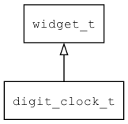

## digit\_clock\_t
### 概述


数字时钟控件。

digit\_clock\_t是[widget\_t](widget_t.md)的子类控件，widget\_t的函数均适用于digit\_clock\_t控件。

在xml中使用"digit\_clock"标签创建数字时钟控件。如：

```xml
<digit_clock format="YY/MM/DD h:mm:ss"/>
```

> 更多用法请参考：[digit\_clock.xml](
https://github.com/zlgopen/awtk/blob/master/design/default/ui/digit_clock.xml)

在c代码中使用函数digit\_clock\_create创建数字时钟控件。如：

```c
widget_t* tc = digit_clock_create(win, 10, 10, 240, 30);
digit_clock_set_format(tc, "YY/MM/DD h:mm:ss");
```

> 完整示例请参考：[digit\_clock demo](
https://github.com/zlgopen/awtk-c-demos/blob/master/demos/digit_clock.c)

可用通过style来设置控件的显示风格，如字体的大小和颜色等等。如：

```xml
<style name="default">
<normal text_color="black" />
</style>
```

> 更多用法请参考：[theme default](
https://github.com/zlgopen/awtk/blob/master/design/default/styles/default.xml#L138)
----------------------------------
### 函数
<p id="digit_clock_t_methods">

| 函数名称 | 说明 | 
| -------- | ------------ | 
| <a href="#digit_clock_t_digit_clock_cast">digit\_clock\_cast</a> | 转换为digit_clock对象(供脚本语言使用)。 |
| <a href="#digit_clock_t_digit_clock_create">digit\_clock\_create</a> | 创建digit_clock对象 |
| <a href="#digit_clock_t_digit_clock_set_format">digit\_clock\_set\_format</a> | 设置显示格式。 |
### 属性
<p id="digit_clock_t_properties">

| 属性名称 | 类型 | 说明 | 
| -------- | ----- | ------------ | 
| <a href="#digit_clock_t_format">format</a> | char* | 显示格式。 |
#### digit\_clock\_cast 函数
-----------------------

* 函数功能：

> <p id="digit_clock_t_digit_clock_cast">转换为digit_clock对象(供脚本语言使用)。

* 函数原型：

```
widget_t* digit_clock_cast (widget_t* widget);
```

* 参数说明：

| 参数 | 类型 | 说明 |
| -------- | ----- | --------- |
| 返回值 | widget\_t* | digit\_clock对象。 |
| widget | widget\_t* | digit\_clock对象。 |
#### digit\_clock\_create 函数
-----------------------

* 函数功能：

> <p id="digit_clock_t_digit_clock_create">创建digit_clock对象

* 函数原型：

```
widget_t* digit_clock_create (widget_t* parent, xy_t x, xy_t y, wh_t w, wh_t h);
```

* 参数说明：

| 参数 | 类型 | 说明 |
| -------- | ----- | --------- |
| 返回值 | widget\_t* | 对象。 |
| parent | widget\_t* | 父控件 |
| x | xy\_t | x坐标 |
| y | xy\_t | y坐标 |
| w | wh\_t | 宽度 |
| h | wh\_t | 高度 |
#### digit\_clock\_set\_format 函数
-----------------------

* 函数功能：

> <p id="digit_clock_t_digit_clock_set_format">设置显示格式。

* 函数原型：

```
ret_t digit_clock_set_format (widget_t* widget, const char* format);
```

* 参数说明：

| 参数 | 类型 | 说明 |
| -------- | ----- | --------- |
| 返回值 | ret\_t | 返回RET\_OK表示成功，否则表示失败。 |
| widget | widget\_t* | 控件对象。 |
| format | const char* | 格式。 |
#### format 属性
-----------------------
> <p id="digit_clock_t_format">显示格式。

* Y 代表年(完整显示)
* M 代表月(1-12)
* D 代表日(1-31)
* h 代表时(0-23)
* m 代表分(0-59)
* s 代表秒(0-59)
* w 代表星期(0-6)
* W 代表星期的英文缩写(支持翻译)
* YY 代表年(只显示末两位)
* MM 代表月(01-12)
* DD 代表日(01-31)
* hh 代表时(00-23)
* mm 代表分(00-59)
* ss 代表秒(00-59)
* MMM 代表月的英文缩写(支持翻译)

如 日期时间为：2018/11/12 9:10:20
* "Y/M/D"显示为"2018/11/12"
* "Y-M-D"显示为"2018-11-12"
* "Y-M-D h:m:s"显示为"2018-11-12 9:10:20"
* "Y-M-D hh:mm:ss"显示为"2018-11-12 09:10:20"

* 类型：char*

| 特性 | 是否支持 |
| -------- | ----- |
| 可直接读取 | 是 |
| 可直接修改 | 否 |
| 可持久化   | 是 |
| 可脚本化   | 是 |
| 可在IDE中设置 | 是 |
| 可在XML中设置 | 是 |
| 可通过widget\_get\_prop读取 | 是 |
| 可通过widget\_set\_prop修改 | 是 |
