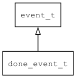

## done\_event\_t
### 概述


执行完成事件。
----------------------------------
### 函数
<p id="done_event_t_methods">

| 函数名称 | 说明 | 
| -------- | ------------ | 
| <a href="#done_event_t_done_event_cast">done\_event\_cast</a> | 把event对象转done_event_t对象，主要给脚本语言使用。 |
| <a href="#done_event_t_done_event_init">done\_event\_init</a> | 初始done event。 |
### 属性
<p id="done_event_t_properties">

| 属性名称 | 类型 | 说明 | 
| -------- | ----- | ------------ | 
| <a href="#done_event_t_result">result</a> | ret\_t | 执行结果。 |
#### done\_event\_cast 函数
-----------------------

* 函数功能：

> <p id="done_event_t_done_event_cast">把event对象转done_event_t对象，主要给脚本语言使用。

* 函数原型：

```
done_event_t* done_event_cast (event_t* event);
```

* 参数说明：

| 参数 | 类型 | 说明 |
| -------- | ----- | --------- |
| 返回值 | done\_event\_t* | 返回event对象。 |
| event | event\_t* | event对象。 |
#### done\_event\_init 函数
-----------------------

* 函数功能：

> <p id="done_event_t_done_event_init">初始done event。

* 函数原型：

```
event_t* done_event_init (done_event_t* event, ret_t result);
```

* 参数说明：

| 参数 | 类型 | 说明 |
| -------- | ----- | --------- |
| 返回值 | event\_t* | 返回event对象。 |
| event | done\_event\_t* | event对象。 |
| result | ret\_t | 结果。 |
#### result 属性
-----------------------
> <p id="done_event_t_result">执行结果。

* 类型：ret\_t

| 特性 | 是否支持 |
| -------- | ----- |
| 可直接读取 | 是 |
| 可直接修改 | 否 |
| 可脚本化   | 是 |
