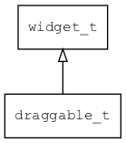

## draggable\_t
### 概述


将draggable放入目标控件，即可让目标控件或当前窗口可以被拖动。

draggable\_t是[widget\_t](widget_t.md)的子类控件，widget\_t的函数均适用于draggable\_t控件。

在xml中使用"draggable"标签创建draggable控件。如：

```xml
<button text="Drag Me" w="80" h="40" x="10" y="10">
<draggable />
</button>
```

拖动对话框标题时移动对话框：

```xml
<dialog_title x="0" y="0" w="100%" h="30" text="Hello AWTK" >
<draggable drag_window="true"/>
</dialog_title>
```

> 更多用法请参考：
[draggable.xml](https://github.com/zlgopen/awtk/blob/master/design/default/ui/draggable.xml)

在c代码中使用函数draggable\_create创建按钮控件。如：

```c
widget_t* draggable = draggable_create(target, 0, 0, 0, 0);
```

> draggable本身不可见，故无需style。
----------------------------------
### 函数
<p id="draggable_t_methods">

| 函数名称 | 说明 | 
| -------- | ------------ | 
| <a href="#draggable_t_draggable_cast">draggable\_cast</a> | 转换为draggable对象(供脚本语言使用)。 |
| <a href="#draggable_t_draggable_create">draggable\_create</a> | 创建draggable对象 |
| <a href="#draggable_t_draggable_set_bottom">draggable\_set\_bottom</a> | 设置bottom。 |
| <a href="#draggable_t_draggable_set_drag_window">draggable\_set\_drag\_window</a> | 设置drag_window。 |
| <a href="#draggable_t_draggable_set_horizontal_only">draggable\_set\_horizontal\_only</a> | 设置horizontal_only。 |
| <a href="#draggable_t_draggable_set_left">draggable\_set\_left</a> | 设置left。 |
| <a href="#draggable_t_draggable_set_right">draggable\_set\_right</a> | 设置right。 |
| <a href="#draggable_t_draggable_set_top">draggable\_set\_top</a> | 设置top。 |
| <a href="#draggable_t_draggable_set_vertical_only">draggable\_set\_vertical\_only</a> | 设置vertical_only。 |
### 属性
<p id="draggable_t_properties">

| 属性名称 | 类型 | 说明 | 
| -------- | ----- | ------------ | 
| <a href="#draggable_t_bottom">bottom</a> | int32\_t | 拖动范围的底部限制。缺省为父控件的底部。 |
| <a href="#draggable_t_drag_window">drag\_window</a> | bool\_t | 拖动窗口而不是父控件。比如放在对话框的titlebar上，拖动titlebar其实是希望拖动对话框。 |
| <a href="#draggable_t_horizontal_only">horizontal\_only</a> | bool\_t | 只允许水平拖动。 |
| <a href="#draggable_t_left">left</a> | int32\_t | 拖动范围的左边限制。缺省为父控件的左边。 |
| <a href="#draggable_t_right">right</a> | int32\_t | 拖动范围的右边限制。缺省为父控件的右边边。 |
| <a href="#draggable_t_top">top</a> | int32\_t | 拖动范围的顶部限制。缺省为父控件的顶部。 |
| <a href="#draggable_t_vertical_only">vertical\_only</a> | bool\_t | 只允许垂直拖动。 |
#### draggable\_cast 函数
-----------------------

* 函数功能：

> <p id="draggable_t_draggable_cast">转换为draggable对象(供脚本语言使用)。

* 函数原型：

```
widget_t* draggable_cast (widget_t* widget);
```

* 参数说明：

| 参数 | 类型 | 说明 |
| -------- | ----- | --------- |
| 返回值 | widget\_t* | draggable对象。 |
| widget | widget\_t* | draggable对象。 |
#### draggable\_create 函数
-----------------------

* 函数功能：

> <p id="draggable_t_draggable_create">创建draggable对象

* 函数原型：

```
widget_t* draggable_create (widget_t* parent, xy_t x, xy_t y, wh_t w, wh_t h);
```

* 参数说明：

| 参数 | 类型 | 说明 |
| -------- | ----- | --------- |
| 返回值 | widget\_t* | 对象。 |
| parent | widget\_t* | 父控件 |
| x | xy\_t | x坐标 |
| y | xy\_t | y坐标 |
| w | wh\_t | 宽度 |
| h | wh\_t | 高度 |
#### draggable\_set\_bottom 函数
-----------------------

* 函数功能：

> <p id="draggable_t_draggable_set_bottom">设置bottom。

* 函数原型：

```
ret_t draggable_set_bottom (widget_t* widget, int32_t bottom);
```

* 参数说明：

| 参数 | 类型 | 说明 |
| -------- | ----- | --------- |
| 返回值 | ret\_t | 返回RET\_OK表示成功，否则表示失败。 |
| widget | widget\_t* | widget对象。 |
| bottom | int32\_t | 拖动范围的底部限制。缺省为父控件的底部。 |
#### draggable\_set\_drag\_window 函数
-----------------------

* 函数功能：

> <p id="draggable_t_draggable_set_drag_window">设置drag_window。
拖动窗口而不是父控件。比如放在对话框的titlebar上，拖动titlebar其实是希望拖动对话框。

* 函数原型：

```
ret_t draggable_set_drag_window (widget_t* widget, bool_t drag_window);
```

* 参数说明：

| 参数 | 类型 | 说明 |
| -------- | ----- | --------- |
| 返回值 | ret\_t | 返回RET\_OK表示成功，否则表示失败。 |
| widget | widget\_t* | widget对象。 |
| drag\_window | bool\_t | drag\_window |
#### draggable\_set\_horizontal\_only 函数
-----------------------

* 函数功能：

> <p id="draggable_t_draggable_set_horizontal_only">设置horizontal_only。

* 函数原型：

```
ret_t draggable_set_horizontal_only (widget_t* widget, bool_t horizontal_only);
```

* 参数说明：

| 参数 | 类型 | 说明 |
| -------- | ----- | --------- |
| 返回值 | ret\_t | 返回RET\_OK表示成功，否则表示失败。 |
| widget | widget\_t* | widget对象。 |
| horizontal\_only | bool\_t | 只允许水平拖动。 |
#### draggable\_set\_left 函数
-----------------------

* 函数功能：

> <p id="draggable_t_draggable_set_left">设置left。

* 函数原型：

```
ret_t draggable_set_left (widget_t* widget, int32_t left);
```

* 参数说明：

| 参数 | 类型 | 说明 |
| -------- | ----- | --------- |
| 返回值 | ret\_t | 返回RET\_OK表示成功，否则表示失败。 |
| widget | widget\_t* | widget对象。 |
| left | int32\_t | 拖动范围的左边限制。缺省为父控件的左边。 |
#### draggable\_set\_right 函数
-----------------------

* 函数功能：

> <p id="draggable_t_draggable_set_right">设置right。

* 函数原型：

```
ret_t draggable_set_right (widget_t* widget, int32_t right);
```

* 参数说明：

| 参数 | 类型 | 说明 |
| -------- | ----- | --------- |
| 返回值 | ret\_t | 返回RET\_OK表示成功，否则表示失败。 |
| widget | widget\_t* | widget对象。 |
| right | int32\_t | 拖动范围的右边限制。缺省为父控件的右边边。 |
#### draggable\_set\_top 函数
-----------------------

* 函数功能：

> <p id="draggable_t_draggable_set_top">设置top。

* 函数原型：

```
ret_t draggable_set_top (widget_t* widget, int32_t top);
```

* 参数说明：

| 参数 | 类型 | 说明 |
| -------- | ----- | --------- |
| 返回值 | ret\_t | 返回RET\_OK表示成功，否则表示失败。 |
| widget | widget\_t* | widget对象。 |
| top | int32\_t | 拖动范围的顶部限制。缺省为父控件的顶部。 |
#### draggable\_set\_vertical\_only 函数
-----------------------

* 函数功能：

> <p id="draggable_t_draggable_set_vertical_only">设置vertical_only。

* 函数原型：

```
ret_t draggable_set_vertical_only (widget_t* widget, bool_t vertical_only);
```

* 参数说明：

| 参数 | 类型 | 说明 |
| -------- | ----- | --------- |
| 返回值 | ret\_t | 返回RET\_OK表示成功，否则表示失败。 |
| widget | widget\_t* | widget对象。 |
| vertical\_only | bool\_t | 只允许垂直拖动。 |
#### bottom 属性
-----------------------
> <p id="draggable_t_bottom">拖动范围的底部限制。缺省为父控件的底部。

* 类型：int32\_t

| 特性 | 是否支持 |
| -------- | ----- |
| 可直接读取 | 是 |
| 可直接修改 | 否 |
| 可持久化   | 是 |
| 可脚本化   | 是 |
| 可在IDE中设置 | 是 |
| 可在XML中设置 | 是 |
| 可通过widget\_get\_prop读取 | 是 |
| 可通过widget\_set\_prop修改 | 是 |
#### drag\_window 属性
-----------------------
> <p id="draggable_t_drag_window">拖动窗口而不是父控件。比如放在对话框的titlebar上，拖动titlebar其实是希望拖动对话框。

* 类型：bool\_t

| 特性 | 是否支持 |
| -------- | ----- |
| 可直接读取 | 是 |
| 可直接修改 | 否 |
| 可持久化   | 是 |
| 可脚本化   | 是 |
| 可在IDE中设置 | 是 |
| 可在XML中设置 | 是 |
| 可通过widget\_get\_prop读取 | 是 |
| 可通过widget\_set\_prop修改 | 是 |
#### horizontal\_only 属性
-----------------------
> <p id="draggable_t_horizontal_only">只允许水平拖动。

* 类型：bool\_t

| 特性 | 是否支持 |
| -------- | ----- |
| 可直接读取 | 是 |
| 可直接修改 | 否 |
| 可持久化   | 是 |
| 可脚本化   | 是 |
| 可在IDE中设置 | 是 |
| 可在XML中设置 | 是 |
| 可通过widget\_get\_prop读取 | 是 |
| 可通过widget\_set\_prop修改 | 是 |
#### left 属性
-----------------------
> <p id="draggable_t_left">拖动范围的左边限制。缺省为父控件的左边。

* 类型：int32\_t

| 特性 | 是否支持 |
| -------- | ----- |
| 可直接读取 | 是 |
| 可直接修改 | 否 |
| 可持久化   | 是 |
| 可脚本化   | 是 |
| 可在IDE中设置 | 是 |
| 可在XML中设置 | 是 |
| 可通过widget\_get\_prop读取 | 是 |
| 可通过widget\_set\_prop修改 | 是 |
#### right 属性
-----------------------
> <p id="draggable_t_right">拖动范围的右边限制。缺省为父控件的右边边。

* 类型：int32\_t

| 特性 | 是否支持 |
| -------- | ----- |
| 可直接读取 | 是 |
| 可直接修改 | 否 |
| 可持久化   | 是 |
| 可脚本化   | 是 |
| 可在IDE中设置 | 是 |
| 可在XML中设置 | 是 |
| 可通过widget\_get\_prop读取 | 是 |
| 可通过widget\_set\_prop修改 | 是 |
#### top 属性
-----------------------
> <p id="draggable_t_top">拖动范围的顶部限制。缺省为父控件的顶部。

* 类型：int32\_t

| 特性 | 是否支持 |
| -------- | ----- |
| 可直接读取 | 是 |
| 可直接修改 | 否 |
| 可持久化   | 是 |
| 可脚本化   | 是 |
| 可在IDE中设置 | 是 |
| 可在XML中设置 | 是 |
| 可通过widget\_get\_prop读取 | 是 |
| 可通过widget\_set\_prop修改 | 是 |
#### vertical\_only 属性
-----------------------
> <p id="draggable_t_vertical_only">只允许垂直拖动。

* 类型：bool\_t

| 特性 | 是否支持 |
| -------- | ----- |
| 可直接读取 | 是 |
| 可直接修改 | 否 |
| 可持久化   | 是 |
| 可脚本化   | 是 |
| 可在IDE中设置 | 是 |
| 可在XML中设置 | 是 |
| 可通过widget\_get\_prop读取 | 是 |
| 可通过widget\_set\_prop修改 | 是 |
