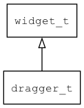

## dragger\_t
### 概述


dragger控件。

目前主要用于scrollbar里的滑块。
----------------------------------
### 函数
<p id="dragger_t_methods">

| 函数名称 | 说明 | 
| -------- | ------------ | 
| <a href="#dragger_t_dragger_cast">dragger\_cast</a> | 转换为dragger对象(供脚本语言使用)。 |
| <a href="#dragger_t_dragger_create">dragger\_create</a> | 创建dragger对象。 |
| <a href="#dragger_t_dragger_set_range">dragger\_set\_range</a> | 设置拖动的范围。 |
### 属性
<p id="dragger_t_properties">

| 属性名称 | 类型 | 说明 | 
| -------- | ----- | ------------ | 
| <a href="#dragger_t_x_max">x\_max</a> | xy\_t | x坐标的最大值。 |
| <a href="#dragger_t_x_min">x\_min</a> | xy\_t | x坐标的最小值。 |
| <a href="#dragger_t_y_max">y\_max</a> | xy\_t | y坐标的最大值。 |
| <a href="#dragger_t_y_min">y\_min</a> | xy\_t | y坐标的最小值。 |
#### dragger\_cast 函数
-----------------------

* 函数功能：

> <p id="dragger_t_dragger_cast">转换为dragger对象(供脚本语言使用)。

* 函数原型：

```
widget_t* dragger_cast (widget_t* widget);
```

* 参数说明：

| 参数 | 类型 | 说明 |
| -------- | ----- | --------- |
| 返回值 | widget\_t* | dragger对象。 |
| widget | widget\_t* | dragger对象。 |
#### dragger\_create 函数
-----------------------

* 函数功能：

> <p id="dragger_t_dragger_create">创建dragger对象。

* 函数原型：

```
widget_t* dragger_create (widget_t* parent, xy_t x, xy_t y, wh_t w, wh_t h);
```

* 参数说明：

| 参数 | 类型 | 说明 |
| -------- | ----- | --------- |
| 返回值 | widget\_t* | 对象。 |
| parent | widget\_t* | 父控件 |
| x | xy\_t | x坐标 |
| y | xy\_t | y坐标 |
| w | wh\_t | 宽度 |
| h | wh\_t | 高度 |
#### dragger\_set\_range 函数
-----------------------

* 函数功能：

> <p id="dragger_t_dragger_set_range">设置拖动的范围。

* 函数原型：

```
ret_t dragger_set_range (widget_t* widget, xy_t x_min, xy_t y_min, xy_t x_max, xy_t y_max);
```

* 参数说明：

| 参数 | 类型 | 说明 |
| -------- | ----- | --------- |
| 返回值 | ret\_t | 返回RET\_OK表示成功，否则表示失败。 |
| widget | widget\_t* | dragger控件。 |
| x\_min | xy\_t | x坐标最小值。 |
| y\_min | xy\_t | y坐标最小值。 |
| x\_max | xy\_t | x坐标最大值。 |
| y\_max | xy\_t | y坐标最大值。 |
#### x\_max 属性
-----------------------
> <p id="dragger_t_x_max">x坐标的最大值。

* 类型：xy\_t

| 特性 | 是否支持 |
| -------- | ----- |
| 可直接读取 | 是 |
| 可直接修改 | 否 |
| 可持久化   | 是 |
| 可脚本化   | 是 |
| 可在IDE中设置 | 是 |
| 可在XML中设置 | 是 |
| 可通过widget\_get\_prop读取 | 是 |
| 可通过widget\_set\_prop修改 | 是 |
#### x\_min 属性
-----------------------
> <p id="dragger_t_x_min">x坐标的最小值。

* 类型：xy\_t

| 特性 | 是否支持 |
| -------- | ----- |
| 可直接读取 | 是 |
| 可直接修改 | 否 |
| 可持久化   | 是 |
| 可脚本化   | 是 |
| 可在IDE中设置 | 是 |
| 可在XML中设置 | 是 |
| 可通过widget\_get\_prop读取 | 是 |
| 可通过widget\_set\_prop修改 | 是 |
#### y\_max 属性
-----------------------
> <p id="dragger_t_y_max">y坐标的最大值。

* 类型：xy\_t

| 特性 | 是否支持 |
| -------- | ----- |
| 可直接读取 | 是 |
| 可直接修改 | 否 |
| 可持久化   | 是 |
| 可脚本化   | 是 |
| 可在IDE中设置 | 是 |
| 可在XML中设置 | 是 |
| 可通过widget\_get\_prop读取 | 是 |
| 可通过widget\_set\_prop修改 | 是 |
#### y\_min 属性
-----------------------
> <p id="dragger_t_y_min">y坐标的最小值。

* 类型：xy\_t

| 特性 | 是否支持 |
| -------- | ----- |
| 可直接读取 | 是 |
| 可直接修改 | 否 |
| 可持久化   | 是 |
| 可脚本化   | 是 |
| 可在IDE中设置 | 是 |
| 可在XML中设置 | 是 |
| 可通过widget\_get\_prop读取 | 是 |
| 可通过widget\_set\_prop修改 | 是 |
