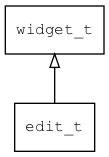

## edit\_t
### 概述


单行编辑器控件。

在基于SDL的平台，单行编辑器控件使用平台原生的输入法，对于嵌入式平台使用内置的输入法。

在使用内置的输入法时，软键盘由输入类型决定，开发者可以自定义软键盘的界面。

edit\_t是[widget\_t](widget_t.md)的子类控件，widget\_t的函数均适用于edit\_t控件。

edit\_t本身可以做为容器，放入按钮等控件。有几个特殊的子控件：

* 名为"clear"的按钮。点击时清除编辑器中的内容。
* 名为"inc"的按钮。点击时增加编辑器的值，用于实现类似于spinbox的功能。
* 名为"dec"的按钮。点击时减少编辑器的值，用于实现类似于spinbox的功能。
* 名为"visible"的复选框。勾选时显示密码，反之不显示密码。

在xml中使用"edit"标签创建编辑器控件。如：

```xml
<edit x="c" y="m" w="80" h="30"
tips="age" input_type="uint" min="0" max="150" step="1" auto_fix="true" style="number" />
```

> XXX：需要在min/max/step之前设置input\_type。

>更多用法请参考：
[edit.xml](https://github.com/zlgopen/awtk/blob/master/design/default/ui/edit.xml)

在c代码中使用函数edit\_create创建编辑器控件。如：

```c
widget_t* edit = edit_create(win, 10, 10, 128, 30);
widget_set_text(edit, L"OK");
```

> 创建之后，可以用widget\_set\_text或widget\_set\_text\_utf8设置文本内容。

> 完整示例请参考：
[edit demo](https://github.com/zlgopen/awtk-c-demos/blob/master/demos/edit.c)

可用通过style来设置控件的显示风格，如字体的大小和颜色等等。如：

```xml
<style name="default" border_color="#a0a0a0"  text_color="black" text_align_h="left">
<normal     bg_color="#f0f0f0" />
<focused    bg_color="#f0f0f0" border_color="black"/>
<disable    bg_color="gray" text_color="#d0d0d0" />
<error      bg_color="#f0f0f0" text_color="red" />
<empty      bg_color="#f0f0f0" text_color="#a0a0a0" />
</style>
```

> 更多用法请参考：
[theme
default](https://github.com/zlgopen/awtk/blob/master/design/default/styles/default.xml#L104)
----------------------------------
### 函数
<p id="edit_t_methods">

| 函数名称 | 说明 | 
| -------- | ------------ | 
| <a href="#edit_t_edit_cast">edit\_cast</a> | 转换为edit对象(供脚本语言使用)。 |
| <a href="#edit_t_edit_create">edit\_create</a> | 创建edit对象 |
| <a href="#edit_t_edit_get_double">edit\_get\_double</a> | 获取double类型的值。 |
| <a href="#edit_t_edit_get_int">edit\_get\_int</a> | 获取int类型的值。 |
| <a href="#edit_t_edit_set_action_text">edit\_set\_action\_text</a> | 设置软键盘上action按钮的文本。 |
| <a href="#edit_t_edit_set_auto_fix">edit\_set\_auto\_fix</a> | 设置编辑器是否为自动改正。 |
| <a href="#edit_t_edit_set_cursor">edit\_set\_cursor</a> | 设置输入框的光标坐标。 |
| <a href="#edit_t_edit_set_dec_value">edit\_set\_dec\_value</a> | 设置减少值的回调函数。 |
| <a href="#edit_t_edit_set_double">edit\_set\_double</a> | 设置double类型的值。 |
| <a href="#edit_t_edit_set_fix_value">edit\_set\_fix\_value</a> | 设置修正输入内容的回调函数。 |
| <a href="#edit_t_edit_set_float_limit">edit\_set\_float\_limit</a> | 设置为浮点数输入及取值范围。 |
| <a href="#edit_t_edit_set_focus">edit\_set\_focus</a> | 设置为焦点。 |
| <a href="#edit_t_edit_set_inc_value">edit\_set\_inc\_value</a> | 设置增加值的回调函数。 |
| <a href="#edit_t_edit_set_input_type">edit\_set\_input\_type</a> | 设置编辑器的输入类型。 |
| <a href="#edit_t_edit_set_int">edit\_set\_int</a> | 设置int类型的值。 |
| <a href="#edit_t_edit_set_int_limit">edit\_set\_int\_limit</a> | 设置为整数输入及取值范围。 |
| <a href="#edit_t_edit_set_is_valid_char">edit\_set\_is\_valid\_char</a> | 设置输入字符检查函数。 |
| <a href="#edit_t_edit_set_is_valid_value">edit\_set\_is\_valid\_value</a> | 设置输入内容检查函数。 |
| <a href="#edit_t_edit_set_keyboard">edit\_set\_keyboard</a> | 设置自定义软键盘名称。 |
| <a href="#edit_t_edit_set_open_im_when_focused">edit\_set\_open\_im\_when\_focused</a> | 设置编辑器是否在获得焦点时打开输入法。 |
| <a href="#edit_t_edit_set_password_visible">edit\_set\_password\_visible</a> | 当编辑器输入类型为密码时，设置密码是否可见。 |
| <a href="#edit_t_edit_set_pre_input">edit\_set\_pre\_input</a> | 设置预输入处的回调函数。 |
| <a href="#edit_t_edit_set_readonly">edit\_set\_readonly</a> | 设置编辑器是否为只读。 |
| <a href="#edit_t_edit_set_select_none_when_focused">edit\_set\_select\_none\_when\_focused</a> | 设置编辑器是否在获得焦点时不选中文本。 |
| <a href="#edit_t_edit_set_text_limit">edit\_set\_text\_limit</a> | 设置为文本输入及其长度限制，不允许输入超过max个字符，少于min个字符时进入error状态。 |
| <a href="#edit_t_edit_set_tips">edit\_set\_tips</a> | 设置编辑器的输入提示。 |
| <a href="#edit_t_edit_set_tr_tips">edit\_set\_tr\_tips</a> | 获取翻译之后的文本，然后调用edit_set_tips。 |
### 属性
<p id="edit_t_properties">

| 属性名称 | 类型 | 说明 | 
| -------- | ----- | ------------ | 
| <a href="#edit_t_action_text">action\_text</a> | char* | 软键盘上action按钮的文本。内置取值有： |
| <a href="#edit_t_auto_fix">auto\_fix</a> | bool\_t | 输入无效时，是否自动改正。 |
| <a href="#edit_t_bottom_margin">bottom\_margin</a> | uint8\_t | 下边距。 |
| <a href="#edit_t_input_type">input\_type</a> | input\_type\_t | 输入类型。 |
| <a href="#edit_t_keyboard">keyboard</a> | char* | 自定义软键盘名称。AWTK优先查找keyboard属性设置的键盘文件名（该键盘的XML文件需要在default\raw\ui目录下存在），如果keyboard为空就找input_type设置的键盘类型 |
| <a href="#edit_t_left_margin">left\_margin</a> | uint8\_t | 左边距。 |
| <a href="#edit_t_max">max</a> | double | 最大值或最大长度。 |
| <a href="#edit_t_min">min</a> | double | 最小值或最小长度。 |
| <a href="#edit_t_open_im_when_focused">open\_im\_when\_focused</a> | bool\_t | 获得焦点时打开输入法。 |
| <a href="#edit_t_password_visible">password\_visible</a> | bool\_t | 密码是否可见。 |
| <a href="#edit_t_readonly">readonly</a> | bool\_t | 编辑器是否为只读。 |
| <a href="#edit_t_right_margin">right\_margin</a> | uint8\_t | 右边距。 |
| <a href="#edit_t_select_none_when_focused">select\_none\_when\_focused</a> | bool\_t | 获得焦点时不选中文本。 |
| <a href="#edit_t_step">step</a> | double | 步长。 |
| <a href="#edit_t_tips">tips</a> | char* | 输入提示。 |
| <a href="#edit_t_top_margin">top\_margin</a> | uint8\_t | 上边距。 |
| <a href="#edit_t_tr_tips">tr\_tips</a> | char* | 保存用于翻译的提示信息。 |
### 事件
<p id="edit_t_events">

| 事件名称 | 类型  | 说明 | 
| -------- | ----- | ------- | 
| EVT\_VALUE\_CHANGING | event\_t | 文本正在改变事件(编辑中)。 |
| EVT\_VALUE\_CHANGED | event\_t | 文本改变事件。 |
#### edit\_cast 函数
-----------------------

* 函数功能：

> <p id="edit_t_edit_cast">转换为edit对象(供脚本语言使用)。

* 函数原型：

```
widget_t* edit_cast (widget_t* widget);
```

* 参数说明：

| 参数 | 类型 | 说明 |
| -------- | ----- | --------- |
| 返回值 | widget\_t* | edit对象。 |
| widget | widget\_t* | edit对象。 |
#### edit\_create 函数
-----------------------

* 函数功能：

> <p id="edit_t_edit_create">创建edit对象

* 函数原型：

```
widget_t* edit_create (widget_t* parent, xy_t x, xy_t y, wh_t w, wh_t h);
```

* 参数说明：

| 参数 | 类型 | 说明 |
| -------- | ----- | --------- |
| 返回值 | widget\_t* | 对象。 |
| parent | widget\_t* | 父控件 |
| x | xy\_t | x坐标 |
| y | xy\_t | y坐标 |
| w | wh\_t | 宽度 |
| h | wh\_t | 高度 |
#### edit\_get\_double 函数
-----------------------

* 函数功能：

> <p id="edit_t_edit_get_double">获取double类型的值。

* 函数原型：

```
double edit_get_double (widget_t* widget);
```

* 参数说明：

| 参数 | 类型 | 说明 |
| -------- | ----- | --------- |
| 返回值 | double | 返回double的值。 |
| widget | widget\_t* | widget对象。 |
#### edit\_get\_int 函数
-----------------------

* 函数功能：

> <p id="edit_t_edit_get_int">获取int类型的值。

* 函数原型：

```
int32_t edit_get_int (widget_t* widget);
```

* 参数说明：

| 参数 | 类型 | 说明 |
| -------- | ----- | --------- |
| 返回值 | int32\_t | 返回int的值。 |
| widget | widget\_t* | widget对象。 |
#### edit\_set\_action\_text 函数
-----------------------

* 函数功能：

> <p id="edit_t_edit_set_action_text">设置软键盘上action按钮的文本。

* 函数原型：

```
ret_t edit_set_action_text (widget_t* widget, char* action_text);
```

* 参数说明：

| 参数 | 类型 | 说明 |
| -------- | ----- | --------- |
| 返回值 | ret\_t | 返回RET\_OK表示成功，否则表示失败。 |
| widget | widget\_t* | widget对象。 |
| action\_text | char* | 软键盘上action按钮的文本。 |
#### edit\_set\_auto\_fix 函数
-----------------------

* 函数功能：

> <p id="edit_t_edit_set_auto_fix">设置编辑器是否为自动改正。

* 函数原型：

```
ret_t edit_set_auto_fix (widget_t* widget, bool_t auto_fix);
```

* 参数说明：

| 参数 | 类型 | 说明 |
| -------- | ----- | --------- |
| 返回值 | ret\_t | 返回RET\_OK表示成功，否则表示失败。 |
| widget | widget\_t* | widget对象。 |
| auto\_fix | bool\_t | 自动改正。 |
#### edit\_set\_cursor 函数
-----------------------

* 函数功能：

> <p id="edit_t_edit_set_cursor">设置输入框的光标坐标。

* 函数原型：

```
ret_t edit_set_cursor (widget_t* widget, uint32_t cursor);
```

* 参数说明：

| 参数 | 类型 | 说明 |
| -------- | ----- | --------- |
| 返回值 | ret\_t | 返回RET\_OK表示成功，否则表示失败。 |
| widget | widget\_t* | widget对象。 |
| cursor | uint32\_t | 是否为焦点。 |
#### edit\_set\_dec\_value 函数
-----------------------

* 函数功能：

> <p id="edit_t_edit_set_dec_value">设置减少值的回调函数。
> 如果内置函数不能满足需求时，可以设置自定义的检查函数。

* 函数原型：

```
ret_t edit_set_dec_value (widget_t* widget, edit_dec_value_t dec_value);
```

* 参数说明：

| 参数 | 类型 | 说明 |
| -------- | ----- | --------- |
| 返回值 | ret\_t | 返回RET\_OK表示成功，否则表示失败。 |
| widget | widget\_t* | widget对象。 |
| dec\_value | edit\_dec\_value\_t | 减少值的回调函数。 |
#### edit\_set\_double 函数
-----------------------

* 函数功能：

> <p id="edit_t_edit_set_double">设置double类型的值。

* 函数原型：

```
ret_t edit_set_double (widget_t* widget, double value);
```

* 参数说明：

| 参数 | 类型 | 说明 |
| -------- | ----- | --------- |
| 返回值 | ret\_t | 返回RET\_OK表示成功，否则表示失败。 |
| widget | widget\_t* | widget对象。 |
| value | double | 值。 |
#### edit\_set\_fix\_value 函数
-----------------------

* 函数功能：

> <p id="edit_t_edit_set_fix_value">设置修正输入内容的回调函数。
> 如果内置函数不能满足需求时，可以设置自定义的检查函数。

* 函数原型：

```
ret_t edit_set_fix_value (widget_t* widget, edit_fix_value_t fix_value);
```

* 参数说明：

| 参数 | 类型 | 说明 |
| -------- | ----- | --------- |
| 返回值 | ret\_t | 返回RET\_OK表示成功，否则表示失败。 |
| widget | widget\_t* | widget对象。 |
| fix\_value | edit\_fix\_value\_t | 修正输入内容的回调函数。 |
#### edit\_set\_float\_limit 函数
-----------------------

* 函数功能：

> <p id="edit_t_edit_set_float_limit">设置为浮点数输入及取值范围。

* 函数原型：

```
ret_t edit_set_float_limit (widget_t* widget, double min, double max, double step);
```

* 参数说明：

| 参数 | 类型 | 说明 |
| -------- | ----- | --------- |
| 返回值 | ret\_t | 返回RET\_OK表示成功，否则表示失败。 |
| widget | widget\_t* | widget对象。 |
| min | double | 最小值。 |
| max | double | 最大值。 |
| step | double | 步长。 |
#### edit\_set\_focus 函数
-----------------------

* 函数功能：

> <p id="edit_t_edit_set_focus">设置为焦点。

* 函数原型：

```
ret_t edit_set_focus (widget_t* widget, bool_t focus);
```

* 参数说明：

| 参数 | 类型 | 说明 |
| -------- | ----- | --------- |
| 返回值 | ret\_t | 返回RET\_OK表示成功，否则表示失败。 |
| widget | widget\_t* | widget对象。 |
| focus | bool\_t | 是否为焦点。 |
#### edit\_set\_inc\_value 函数
-----------------------

* 函数功能：

> <p id="edit_t_edit_set_inc_value">设置增加值的回调函数。
> 如果内置函数不能满足需求时，可以设置自定义的检查函数。

* 函数原型：

```
ret_t edit_set_inc_value (widget_t* widget, edit_inc_value_t inc_value);
```

* 参数说明：

| 参数 | 类型 | 说明 |
| -------- | ----- | --------- |
| 返回值 | ret\_t | 返回RET\_OK表示成功，否则表示失败。 |
| widget | widget\_t* | widget对象。 |
| inc\_value | edit\_inc\_value\_t | 增加值的回调函数。 |
#### edit\_set\_input\_type 函数
-----------------------

* 函数功能：

> <p id="edit_t_edit_set_input_type">设置编辑器的输入类型。

* 函数原型：

```
ret_t edit_set_input_type (widget_t* widget, input_type_t type);
```

* 参数说明：

| 参数 | 类型 | 说明 |
| -------- | ----- | --------- |
| 返回值 | ret\_t | 返回RET\_OK表示成功，否则表示失败。 |
| widget | widget\_t* | widget对象。 |
| type | input\_type\_t | 输入类型。 |
#### edit\_set\_int 函数
-----------------------

* 函数功能：

> <p id="edit_t_edit_set_int">设置int类型的值。

* 函数原型：

```
ret_t edit_set_int (widget_t* widget, int32_t value);
```

* 参数说明：

| 参数 | 类型 | 说明 |
| -------- | ----- | --------- |
| 返回值 | ret\_t | 返回RET\_OK表示成功，否则表示失败。 |
| widget | widget\_t* | widget对象。 |
| value | int32\_t | 值。 |
#### edit\_set\_int\_limit 函数
-----------------------

* 函数功能：

> <p id="edit_t_edit_set_int_limit">设置为整数输入及取值范围。

* 函数原型：

```
ret_t edit_set_int_limit (widget_t* widget, int32_t min, int32_t max, uint32_t step);
```

* 参数说明：

| 参数 | 类型 | 说明 |
| -------- | ----- | --------- |
| 返回值 | ret\_t | 返回RET\_OK表示成功，否则表示失败。 |
| widget | widget\_t* | widget对象。 |
| min | int32\_t | 最小值。 |
| max | int32\_t | 最大值。 |
| step | uint32\_t | 步长。 |
#### edit\_set\_is\_valid\_char 函数
-----------------------

* 函数功能：

> <p id="edit_t_edit_set_is_valid_char">设置输入字符检查函数。
> 如果内置函数不能满足需求时，可以设置自定义的检查函数。

* 函数原型：

```
ret_t edit_set_is_valid_char (widget_t* widget, edit_is_valid_char_t is_valid_char);
```

* 参数说明：

| 参数 | 类型 | 说明 |
| -------- | ----- | --------- |
| 返回值 | ret\_t | 返回RET\_OK表示成功，否则表示失败。 |
| widget | widget\_t* | widget对象。 |
| is\_valid\_char | edit\_is\_valid\_char\_t | 检查输入字符是否有效的回调函数。 |
#### edit\_set\_is\_valid\_value 函数
-----------------------

* 函数功能：

> <p id="edit_t_edit_set_is_valid_value">设置输入内容检查函数。
> 如果内置函数不能满足需求时，可以设置自定义的检查函数。

* 函数原型：

```
ret_t edit_set_is_valid_value (widget_t* widget, edit_is_valid_value_t is_valid_value);
```

* 参数说明：

| 参数 | 类型 | 说明 |
| -------- | ----- | --------- |
| 返回值 | ret\_t | 返回RET\_OK表示成功，否则表示失败。 |
| widget | widget\_t* | widget对象。 |
| is\_valid\_value | edit\_is\_valid\_value\_t | 检查输入内容是否有效的回调函数。 |
#### edit\_set\_keyboard 函数
-----------------------

* 函数功能：

> <p id="edit_t_edit_set_keyboard">设置自定义软键盘名称。

* 函数原型：

```
ret_t edit_set_keyboard (widget_t* widget, char* keyboard);
```

* 参数说明：

| 参数 | 类型 | 说明 |
| -------- | ----- | --------- |
| 返回值 | ret\_t | 返回RET\_OK表示成功，否则表示失败。 |
| widget | widget\_t* | widget对象。 |
| keyboard | char* | 键盘名称(相应UI资源必须存在)。 |
#### edit\_set\_open\_im\_when\_focused 函数
-----------------------

* 函数功能：

> <p id="edit_t_edit_set_open_im_when_focused">设置编辑器是否在获得焦点时打开输入法。

* 函数原型：

```
ret_t edit_set_open_im_when_focused (widget_t* widget, bool_t open_im_when_focused);
```

* 参数说明：

| 参数 | 类型 | 说明 |
| -------- | ----- | --------- |
| 返回值 | ret\_t | 返回RET\_OK表示成功，否则表示失败。 |
| widget | widget\_t* | widget对象。 |
| open\_im\_when\_focused | bool\_t | 是否在获得焦点时打开输入法。 |
#### edit\_set\_password\_visible 函数
-----------------------

* 函数功能：

> <p id="edit_t_edit_set_password_visible">当编辑器输入类型为密码时，设置密码是否可见。

* 函数原型：

```
ret_t edit_set_password_visible (widget_t* widget, bool_t password_visible);
```

* 参数说明：

| 参数 | 类型 | 说明 |
| -------- | ----- | --------- |
| 返回值 | ret\_t | 返回RET\_OK表示成功，否则表示失败。 |
| widget | widget\_t* | widget对象。 |
| password\_visible | bool\_t | 密码是否可见。 |
#### edit\_set\_pre\_input 函数
-----------------------

* 函数功能：

> <p id="edit_t_edit_set_pre_input">设置预输入处的回调函数。
> 如果内置函数不能满足需求时，可以设置自定义的检查函数。

* 函数原型：

```
ret_t edit_set_pre_input (widget_t* widget, edit_pre_input_t pre_input);
```

* 参数说明：

| 参数 | 类型 | 说明 |
| -------- | ----- | --------- |
| 返回值 | ret\_t | 返回RET\_OK表示成功，否则表示失败。 |
| widget | widget\_t* | widget对象。 |
| pre\_input | edit\_pre\_input\_t | 预输入处理的回调函数(处理一些特殊的键)。 |
#### edit\_set\_readonly 函数
-----------------------

* 函数功能：

> <p id="edit_t_edit_set_readonly">设置编辑器是否为只读。

* 函数原型：

```
ret_t edit_set_readonly (widget_t* widget, bool_t readonly);
```

* 参数说明：

| 参数 | 类型 | 说明 |
| -------- | ----- | --------- |
| 返回值 | ret\_t | 返回RET\_OK表示成功，否则表示失败。 |
| widget | widget\_t* | widget对象。 |
| readonly | bool\_t | 只读。 |
#### edit\_set\_select\_none\_when\_focused 函数
-----------------------

* 函数功能：

> <p id="edit_t_edit_set_select_none_when_focused">设置编辑器是否在获得焦点时不选中文本。

* 函数原型：

```
ret_t edit_set_select_none_when_focused (widget_t* widget, bool_t select_none_when_focused);
```

* 参数说明：

| 参数 | 类型 | 说明 |
| -------- | ----- | --------- |
| 返回值 | ret\_t | 返回RET\_OK表示成功，否则表示失败。 |
| widget | widget\_t* | widget对象。 |
| select\_none\_when\_focused | bool\_t | 是否在获得焦点时不选中文本。 |
#### edit\_set\_text\_limit 函数
-----------------------

* 函数功能：

> <p id="edit_t_edit_set_text_limit">设置为文本输入及其长度限制，不允许输入超过max个字符，少于min个字符时进入error状态。

* 函数原型：

```
ret_t edit_set_text_limit (widget_t* widget, uint32_t min, uint32_t max);
```

* 参数说明：

| 参数 | 类型 | 说明 |
| -------- | ----- | --------- |
| 返回值 | ret\_t | 返回RET\_OK表示成功，否则表示失败。 |
| widget | widget\_t* | widget对象。 |
| min | uint32\_t | 最小长度。 |
| max | uint32\_t | 最大长度。 |
#### edit\_set\_tips 函数
-----------------------

* 函数功能：

> <p id="edit_t_edit_set_tips">设置编辑器的输入提示。

* 函数原型：

```
ret_t edit_set_tips (widget_t* widget, char* tips);
```

* 参数说明：

| 参数 | 类型 | 说明 |
| -------- | ----- | --------- |
| 返回值 | ret\_t | 返回RET\_OK表示成功，否则表示失败。 |
| widget | widget\_t* | widget对象。 |
| tips | char* | 输入提示。 |
#### edit\_set\_tr\_tips 函数
-----------------------

* 函数功能：

> <p id="edit_t_edit_set_tr_tips">获取翻译之后的文本，然后调用edit_set_tips。

* 函数原型：

```
ret_t edit_set_tr_tips (widget_t* widget, const char* tr_tips);
```

* 参数说明：

| 参数 | 类型 | 说明 |
| -------- | ----- | --------- |
| 返回值 | ret\_t | 返回RET\_OK表示成功，否则表示失败。 |
| widget | widget\_t* | 控件对象。 |
| tr\_tips | const char* | 提示信息。 |
#### action\_text 属性
-----------------------
> <p id="edit_t_action_text">软键盘上action按钮的文本。内置取值有：

* next 将焦点切换到下一个控件。
* done 完成，关闭软键盘。

也可以使用其它文本，比如send表示发送。这个需要自己实现相应的功能，处理EVT\_IM\_ACTION事件即可。

* 类型：char*

| 特性 | 是否支持 |
| -------- | ----- |
| 可直接读取 | 是 |
| 可直接修改 | 否 |
| 可持久化   | 是 |
| 可脚本化   | 是 |
| 可在IDE中设置 | 是 |
| 可在XML中设置 | 是 |
| 可通过widget\_get\_prop读取 | 是 |
| 可通过widget\_set\_prop修改 | 是 |
#### auto\_fix 属性
-----------------------
> <p id="edit_t_auto_fix">输入无效时，是否自动改正。

* 类型：bool\_t

| 特性 | 是否支持 |
| -------- | ----- |
| 可直接读取 | 是 |
| 可直接修改 | 否 |
| 可持久化   | 是 |
| 可脚本化   | 是 |
| 可在IDE中设置 | 是 |
| 可在XML中设置 | 是 |
| 可通过widget\_get\_prop读取 | 是 |
| 可通过widget\_set\_prop修改 | 是 |
#### bottom\_margin 属性
-----------------------
> <p id="edit_t_bottom_margin">下边距。

* 类型：uint8\_t

| 特性 | 是否支持 |
| -------- | ----- |
| 可直接读取 | 是 |
| 可直接修改 | 否 |
| 可持久化   | 是 |
| 可脚本化   | 是 |
| 可在IDE中设置 | 是 |
| 可在XML中设置 | 是 |
| 可通过widget\_get\_prop读取 | 是 |
| 可通过widget\_set\_prop修改 | 是 |
#### input\_type 属性
-----------------------
> <p id="edit_t_input_type">输入类型。

* 类型：input\_type\_t

| 特性 | 是否支持 |
| -------- | ----- |
| 可直接读取 | 是 |
| 可直接修改 | 否 |
| 可持久化   | 是 |
| 可脚本化   | 是 |
| 可在IDE中设置 | 是 |
| 可在XML中设置 | 是 |
| 可通过widget\_get\_prop读取 | 是 |
| 可通过widget\_set\_prop修改 | 是 |
#### keyboard 属性
-----------------------
> <p id="edit_t_keyboard">自定义软键盘名称。AWTK优先查找keyboard属性设置的键盘文件名（该键盘的XML文件需要在default\raw\ui目录下存在），如果keyboard为空就找input_type设置的键盘类型

* 类型：char*

| 特性 | 是否支持 |
| -------- | ----- |
| 可直接读取 | 是 |
| 可直接修改 | 否 |
| 可持久化   | 是 |
| 可脚本化   | 是 |
| 可在IDE中设置 | 是 |
| 可在XML中设置 | 是 |
| 可通过widget\_get\_prop读取 | 是 |
| 可通过widget\_set\_prop修改 | 是 |
#### left\_margin 属性
-----------------------
> <p id="edit_t_left_margin">左边距。

* 类型：uint8\_t

| 特性 | 是否支持 |
| -------- | ----- |
| 可直接读取 | 是 |
| 可直接修改 | 否 |
| 可持久化   | 是 |
| 可脚本化   | 是 |
| 可在IDE中设置 | 是 |
| 可在XML中设置 | 是 |
| 可通过widget\_get\_prop读取 | 是 |
| 可通过widget\_set\_prop修改 | 是 |
#### max 属性
-----------------------
> <p id="edit_t_max">最大值或最大长度。

* 类型：double

| 特性 | 是否支持 |
| -------- | ----- |
| 可直接读取 | 是 |
| 可直接修改 | 否 |
| 可持久化   | 是 |
| 可脚本化   | 是 |
| 可在IDE中设置 | 是 |
| 可在XML中设置 | 是 |
| 可通过widget\_get\_prop读取 | 是 |
| 可通过widget\_set\_prop修改 | 是 |
#### min 属性
-----------------------
> <p id="edit_t_min">最小值或最小长度。

* 类型：double

| 特性 | 是否支持 |
| -------- | ----- |
| 可直接读取 | 是 |
| 可直接修改 | 否 |
| 可持久化   | 是 |
| 可脚本化   | 是 |
| 可在IDE中设置 | 是 |
| 可在XML中设置 | 是 |
| 可通过widget\_get\_prop读取 | 是 |
| 可通过widget\_set\_prop修改 | 是 |
#### open\_im\_when\_focused 属性
-----------------------
> <p id="edit_t_open_im_when_focused">获得焦点时打开输入法。

> 主要用于没有指针设备的情况，否则每次切换焦点时都打开输入法。

* 类型：bool\_t

| 特性 | 是否支持 |
| -------- | ----- |
| 可直接读取 | 是 |
| 可直接修改 | 否 |
| 可持久化   | 是 |
| 可脚本化   | 是 |
| 可在IDE中设置 | 是 |
| 可在XML中设置 | 是 |
| 可通过widget\_get\_prop读取 | 是 |
| 可通过widget\_set\_prop修改 | 是 |
#### password\_visible 属性
-----------------------
> <p id="edit_t_password_visible">密码是否可见。

* 类型：bool\_t

| 特性 | 是否支持 |
| -------- | ----- |
| 可直接读取 | 是 |
| 可直接修改 | 否 |
| 可持久化   | 是 |
| 可脚本化   | 是 |
| 可在IDE中设置 | 是 |
| 可在XML中设置 | 是 |
| 可通过widget\_get\_prop读取 | 是 |
| 可通过widget\_set\_prop修改 | 是 |
#### readonly 属性
-----------------------
> <p id="edit_t_readonly">编辑器是否为只读。

* 类型：bool\_t

| 特性 | 是否支持 |
| -------- | ----- |
| 可直接读取 | 是 |
| 可直接修改 | 否 |
| 可持久化   | 是 |
| 可脚本化   | 是 |
| 可在IDE中设置 | 是 |
| 可在XML中设置 | 是 |
| 可通过widget\_get\_prop读取 | 是 |
| 可通过widget\_set\_prop修改 | 是 |
#### right\_margin 属性
-----------------------
> <p id="edit_t_right_margin">右边距。

* 类型：uint8\_t

| 特性 | 是否支持 |
| -------- | ----- |
| 可直接读取 | 是 |
| 可直接修改 | 否 |
| 可持久化   | 是 |
| 可脚本化   | 是 |
| 可在IDE中设置 | 是 |
| 可在XML中设置 | 是 |
| 可通过widget\_get\_prop读取 | 是 |
| 可通过widget\_set\_prop修改 | 是 |
#### select\_none\_when\_focused 属性
-----------------------
> <p id="edit_t_select_none_when_focused">获得焦点时不选中文本。

> 主要用于没有指针设备的情况，否则软键盘无法取消选中文本。

* 类型：bool\_t

| 特性 | 是否支持 |
| -------- | ----- |
| 可直接读取 | 是 |
| 可直接修改 | 否 |
| 可持久化   | 是 |
| 可脚本化   | 是 |
| 可在IDE中设置 | 是 |
| 可在XML中设置 | 是 |
| 可通过widget\_get\_prop读取 | 是 |
| 可通过widget\_set\_prop修改 | 是 |
#### step 属性
-----------------------
> <p id="edit_t_step">步长。
作为数值型编辑器时，一次增加和减少时的数值。

* 类型：double

| 特性 | 是否支持 |
| -------- | ----- |
| 可直接读取 | 是 |
| 可直接修改 | 否 |
| 可持久化   | 是 |
| 可脚本化   | 是 |
| 可在IDE中设置 | 是 |
| 可在XML中设置 | 是 |
| 可通过widget\_get\_prop读取 | 是 |
| 可通过widget\_set\_prop修改 | 是 |
#### tips 属性
-----------------------
> <p id="edit_t_tips">输入提示。

* 类型：char*

| 特性 | 是否支持 |
| -------- | ----- |
| 可直接读取 | 是 |
| 可直接修改 | 否 |
| 可持久化   | 是 |
| 可脚本化   | 是 |
| 可在IDE中设置 | 是 |
| 可在XML中设置 | 是 |
| 可通过widget\_get\_prop读取 | 是 |
| 可通过widget\_set\_prop修改 | 是 |
#### top\_margin 属性
-----------------------
> <p id="edit_t_top_margin">上边距。

* 类型：uint8\_t

| 特性 | 是否支持 |
| -------- | ----- |
| 可直接读取 | 是 |
| 可直接修改 | 否 |
| 可持久化   | 是 |
| 可脚本化   | 是 |
| 可在IDE中设置 | 是 |
| 可在XML中设置 | 是 |
| 可通过widget\_get\_prop读取 | 是 |
| 可通过widget\_set\_prop修改 | 是 |
#### tr\_tips 属性
-----------------------
> <p id="edit_t_tr_tips">保存用于翻译的提示信息。

* 类型：char*

| 特性 | 是否支持 |
| -------- | ----- |
| 可直接读取 | 是 |
| 可直接修改 | 否 |
| 可持久化   | 是 |
| 可脚本化   | 是 |
| 可在IDE中设置 | 是 |
| 可在XML中设置 | 是 |
| 可通过widget\_get\_prop读取 | 是 |
| 可通过widget\_set\_prop修改 | 是 |
