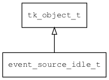

## event\_source\_idle\_t
### 概述



 idle事件源。


----------------------------------
### 函数
<p id="event_source_idle_t_methods">

| 函数名称 | 说明 | 
| -------- | ------------ | 
| <a href="#event_source_idle_t_event_source_idle_create">event\_source\_idle\_create</a> |  |
| <a href="#event_source_idle_t_event_source_manager_default_create">event\_source\_manager\_default\_create</a> |  |
#### event\_source\_idle\_create 函数
-----------------------

* 函数功能：

> <p id="event_source_idle_t_event_source_idle_create">
 创建idle事件源。


* 函数原型：

```
event_source_t* event_source_idle_create (idle_manager_t* idle_manager);
```

* 参数说明：

| 参数 | 类型 | 说明 |
| -------- | ----- | --------- |
| 返回值 | event\_source\_t* | 返回事件源对象。 |
| idle\_manager | idle\_manager\_t* | 定时器管理器对象。 |
#### event\_source\_manager\_default\_create 函数
-----------------------

* 函数功能：

> <p id="event_source_idle_t_event_source_manager_default_create">
 创建事件源管理器。


* 函数原型：

```
ret_t event_source_manager_default_create (event_source_manager_t* manager);
```

* 参数说明：

| 参数 | 类型 | 说明 |
| -------- | ----- | --------- |
| 返回值 | ret\_t | 返回RET\_OK表示成功，否则表示失败。 |
| manager | event\_source\_manager\_t* | event\_source\_manager对象。 |
