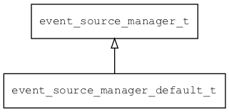

## event\_source\_manager\_default\_t
### 概述


缺省的事件源管理器。
----------------------------------
### 函数
<p id="event_source_manager_default_t_methods">

| 函数名称 | 说明 | 
| -------- | ------------ | 
| <a href="#event_source_manager_default_t_event_source_manager_default_create">event\_source\_manager\_default\_create</a> | 创建事件源管理器。 |
#### event\_source\_manager\_default\_create 函数
-----------------------

* 函数功能：

> <p id="event_source_manager_default_t_event_source_manager_default_create">创建事件源管理器。

* 函数原型：

```
event_source_manager_t* event_source_manager_default_create ();
```

* 参数说明：

| 参数 | 类型 | 说明 |
| -------- | ----- | --------- |
| 返回值 | event\_source\_manager\_t* | 返回事件源管理器对象。 |
