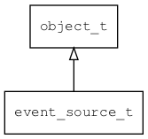

## event\_source\_t
### 概述


表示一个事件源。

事件源有下列两种方式：

* 对于有文件描述符的事件源(如socket)，get_fd返回一个有效的文件描述符。
* 对于定时器，则get_wakeup_time返回下次唤醒的时间。
----------------------------------
### 函数
<p id="event_source_t_methods">

| 函数名称 | 说明 | 
| -------- | ------------ | 
| <a href="#event_source_t_event_source_check">event\_source\_check</a> | 对于没有文件描述符的事件源，需要自己检查是否准备就绪。 |
| <a href="#event_source_t_event_source_dispatch">event\_source\_dispatch</a> | 分发事件。 |
| <a href="#event_source_t_event_source_get_fd">event\_source\_get\_fd</a> | 获取文件描述符。 |
| <a href="#event_source_t_event_source_get_wakeup_time">event\_source\_get\_wakeup\_time</a> | 获取唤醒时间(ms)。 |
| <a href="#event_source_t_event_source_set_tag">event\_source\_set\_tag</a> | 设置tag，方便通过tag一次移除多个事件源。 |
#### event\_source\_check 函数
-----------------------

* 函数功能：

> <p id="event_source_t_event_source_check">对于没有文件描述符的事件源，需要自己检查是否准备就绪。

* 函数原型：

```
ret_t event_source_check (event_source_t* source);
```

* 参数说明：

| 参数 | 类型 | 说明 |
| -------- | ----- | --------- |
| 返回值 | ret\_t | 返回RET\_OK表示成功，否则表示失败。 |
| source | event\_source\_t* | event\_source对象。 |
#### event\_source\_dispatch 函数
-----------------------

* 函数功能：

> <p id="event_source_t_event_source_dispatch">分发事件。

* 函数原型：

```
ret_t event_source_dispatch (event_source_t* source);
```

* 参数说明：

| 参数 | 类型 | 说明 |
| -------- | ----- | --------- |
| 返回值 | ret\_t | 返回RET\_OK表示成功，否则表示失败。 |
| source | event\_source\_t* | event\_source对象。 |
#### event\_source\_get\_fd 函数
-----------------------

* 函数功能：

> <p id="event_source_t_event_source_get_fd">获取文件描述符。

* 函数原型：

```
int32_t event_source_get_fd (event_source_t* source);
```

* 参数说明：

| 参数 | 类型 | 说明 |
| -------- | ----- | --------- |
| 返回值 | int32\_t | 返回文件描述符。 |
| source | event\_source\_t* | event\_source对象。 |
#### event\_source\_get\_wakeup\_time 函数
-----------------------

* 函数功能：

> <p id="event_source_t_event_source_get_wakeup_time">获取唤醒时间(ms)。

* 函数原型：

```
uint32_t event_source_get_wakeup_time (event_source_t* source);
```

* 参数说明：

| 参数 | 类型 | 说明 |
| -------- | ----- | --------- |
| 返回值 | uint32\_t | 返回唤醒时间(ms)。 |
| source | event\_source\_t* | event\_source对象。 |
#### event\_source\_set\_tag 函数
-----------------------

* 函数功能：

> <p id="event_source_t_event_source_set_tag">设置tag，方便通过tag一次移除多个事件源。

* 函数原型：

```
ret_t event_source_set_tag (event_source_t* source, void* tag);
```

* 参数说明：

| 参数 | 类型 | 说明 |
| -------- | ----- | --------- |
| 返回值 | ret\_t | 返回RET\_OK表示成功，否则表示失败。 |
| source | event\_source\_t* | event\_source对象。 |
| tag | void* | tag。 |
