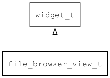

## file\_browser\_view\_t
### 概述


文件管理/浏览/选择控件。

file\_browser\_view\_t是[widget\_t](widget_t.md)的子类控件，widget\_t的函数均适用于file\_browser\_view\_t控件。

考虑到文件浏览器界面呈现的多样性，界面呈现工作完全有子控件来完成。

file\_browser\_view\_t负责关联文件/文件夹数据到子控件上，子控件需要特定的规范命名。

* 名为 "cwd" 的子控件用于显示当前路径。

* 名为 "selected_file" 的子控件用于显示当前选择的文件。

* 名为 "file" 的子控件用于显示文件项的模板控件。

* 名为 "folder" 的子控件用于显示文件夹项的模板控件。

* 名为 "return_up" 的子控件用于返回上一级文件夹的模板控件。

* 名为 "container" 的子控件为容器控件，通常是scrollview。

* 名为 "name" 的子控件用于显示文件和文件夹的名称(放在列表项目内)。

* 名为 "size" 的子控件用于显示文件和文件夹的大小(放在列表项目内)。

* 名为 "mtime" 的子控件用于显示文件和文件夹的修改时间(放在列表项目内)。

* 名为 "ctime" 的子控件用于显示文件和文件夹的创建时间(放在列表项目内)。

* 名为 "icon" 的子控件用于显示文件和文件夹的图标(放在列表项目内)。

* 类型为 "check_button" 的子控件用于选择(放在列表项目内)。

完整示例请参考：

https://github.com/zlgopen/awtk/blob/master/design/default/ui/file_chooser_for_open.xml
----------------------------------
### 函数
<p id="file_browser_view_t_methods">

| 函数名称 | 说明 | 
| -------- | ------------ | 
| <a href="#file_browser_view_t_file_browser_view_cast">file\_browser\_view\_cast</a> | 转换为file_browser_view对象(供脚本语言使用)。 |
| <a href="#file_browser_view_t_file_browser_view_create">file\_browser\_view\_create</a> | 创建file_browser_view对象 |
| <a href="#file_browser_view_t_file_browser_view_create_dir">file\_browser\_view\_create\_dir</a> | 在当前文件夹创建子文件夹。 |
| <a href="#file_browser_view_t_file_browser_view_create_file">file\_browser\_view\_create\_file</a> | 在当前文件夹创建文件。 |
| <a href="#file_browser_view_t_file_browser_view_get_cwd">file\_browser\_view\_get\_cwd</a> | 获取当前路径。 |
| <a href="#file_browser_view_t_file_browser_view_get_selected_items">file\_browser\_view\_get\_selected\_items</a> | 返回当前选中的项目。 |
| <a href="#file_browser_view_t_file_browser_view_reload">file\_browser\_view\_reload</a> | 重新加载。 |
| <a href="#file_browser_view_t_file_browser_view_set_filter">file\_browser\_view\_set\_filter</a> | 设置 过滤规则。 |
| <a href="#file_browser_view_t_file_browser_view_set_ignore_hidden_files">file\_browser\_view\_set\_ignore\_hidden\_files</a> | 设置 忽略隐藏文件。 |
| <a href="#file_browser_view_t_file_browser_view_set_init_dir">file\_browser\_view\_set\_init\_dir</a> | 设置 初始文件夹。 |
| <a href="#file_browser_view_t_file_browser_view_set_show_check_button">file\_browser\_view\_set\_show\_check\_button</a> | 设置 是否显示checkbutton。 |
| <a href="#file_browser_view_t_file_browser_view_set_sort_ascending">file\_browser\_view\_set\_sort\_ascending</a> | 设置 是否为升序排序。 |
| <a href="#file_browser_view_t_file_browser_view_set_sort_by">file\_browser\_view\_set\_sort\_by</a> | 设置 排序方式。可选值(name, size, mtime, type)。 |
### 属性
<p id="file_browser_view_t_properties">

| 属性名称 | 类型 | 说明 | 
| -------- | ----- | ------------ | 
| <a href="#file_browser_view_t_filter">filter</a> | char* | 过滤规则。 |
| <a href="#file_browser_view_t_ignore_hidden_files">ignore\_hidden\_files</a> | bool\_t | 是否忽略隐藏文件。 |
| <a href="#file_browser_view_t_init_dir">init\_dir</a> | char* | 初始文件夹。 |
| <a href="#file_browser_view_t_show_check_button">show\_check\_button</a> | bool\_t | 是否显示checkbutton。 |
| <a href="#file_browser_view_t_sort_ascending">sort\_ascending</a> | bool\_t | 是否为升序排序。 |
| <a href="#file_browser_view_t_sort_by">sort\_by</a> | char* | 排序方式。可选值(name, size, mtime, type)。 |
#### file\_browser\_view\_cast 函数
-----------------------

* 函数功能：

> <p id="file_browser_view_t_file_browser_view_cast">转换为file_browser_view对象(供脚本语言使用)。

* 函数原型：

```
widget_t* file_browser_view_cast (widget_t* widget);
```

* 参数说明：

| 参数 | 类型 | 说明 |
| -------- | ----- | --------- |
| 返回值 | widget\_t* | file\_browser\_view对象。 |
| widget | widget\_t* | file\_browser\_view对象。 |
#### file\_browser\_view\_create 函数
-----------------------

* 函数功能：

> <p id="file_browser_view_t_file_browser_view_create">创建file_browser_view对象

* 函数原型：

```
widget_t* file_browser_view_create (widget_t* parent, xy_t x, xy_t y, wh_t w, wh_t h);
```

* 参数说明：

| 参数 | 类型 | 说明 |
| -------- | ----- | --------- |
| 返回值 | widget\_t* | 对象。 |
| parent | widget\_t* | 父控件 |
| x | xy\_t | x坐标 |
| y | xy\_t | y坐标 |
| w | wh\_t | 宽度 |
| h | wh\_t | 高度 |
#### file\_browser\_view\_create\_dir 函数
-----------------------

* 函数功能：

> <p id="file_browser_view_t_file_browser_view_create_dir">在当前文件夹创建子文件夹。

* 函数原型：

```
ret_t file_browser_view_create_dir (widget_t* widget, const char* name);
```

* 参数说明：

| 参数 | 类型 | 说明 |
| -------- | ----- | --------- |
| 返回值 | ret\_t | 返回RET\_OK表示成功，否则表示失败。 |
| widget | widget\_t* | widget对象。 |
| name | const char* | 子文件夹名。 |
#### file\_browser\_view\_create\_file 函数
-----------------------

* 函数功能：

> <p id="file_browser_view_t_file_browser_view_create_file">在当前文件夹创建文件。

* 函数原型：

```
ret_t file_browser_view_create_file (widget_t* widget, const char* name, const char* data, uint32_t size);
```

* 参数说明：

| 参数 | 类型 | 说明 |
| -------- | ----- | --------- |
| 返回值 | ret\_t | 返回RET\_OK表示成功，否则表示失败。 |
| widget | widget\_t* | widget对象。 |
| name | const char* | 文件名。 |
| data | const char* | 数据。 |
| size | uint32\_t | 数据长度。 |
#### file\_browser\_view\_get\_cwd 函数
-----------------------

* 函数功能：

> <p id="file_browser_view_t_file_browser_view_get_cwd">获取当前路径。

* 函数原型：

```
const char* file_browser_view_get_cwd (widget_t* widget);
```

* 参数说明：

| 参数 | 类型 | 说明 |
| -------- | ----- | --------- |
| 返回值 | const char* | 返回当前路径。 |
| widget | widget\_t* | widget对象。 |
#### file\_browser\_view\_get\_selected\_items 函数
-----------------------

* 函数功能：

> <p id="file_browser_view_t_file_browser_view_get_selected_items">返回当前选中的项目。

> 在返回数组中，每个元素是一个fb\_item\_t对象。
> 调用者无需释放返回值，返回值只在当次调用有效。

* 函数原型：

```
darray_t* file_browser_view_get_selected_items (widget_t* widget);
```

* 参数说明：

| 参数 | 类型 | 说明 |
| -------- | ----- | --------- |
| 返回值 | darray\_t* | 返回当前选中的项目。 |
| widget | widget\_t* | widget对象。 |
#### file\_browser\_view\_reload 函数
-----------------------

* 函数功能：

> <p id="file_browser_view_t_file_browser_view_reload">重新加载。

* 函数原型：

```
ret_t file_browser_view_reload (widget_t* widget);
```

* 参数说明：

| 参数 | 类型 | 说明 |
| -------- | ----- | --------- |
| 返回值 | ret\_t | 返回RET\_OK表示成功，否则表示失败。 |
| widget | widget\_t* | widget对象。 |
#### file\_browser\_view\_set\_filter 函数
-----------------------

* 函数功能：

> <p id="file_browser_view_t_file_browser_view_set_filter">设置 过滤规则。
> files_only 表示只列出文件，dir_only 表示只列出目录，其它表示只列出满足扩展名文件集合(如：.jpg.png.gif)。

* 函数原型：

```
ret_t file_browser_view_set_filter (widget_t* widget, const char* filter);
```

* 参数说明：

| 参数 | 类型 | 说明 |
| -------- | ----- | --------- |
| 返回值 | ret\_t | 返回RET\_OK表示成功，否则表示失败。 |
| widget | widget\_t* | widget对象。 |
| filter | const char* | 过滤规则。 |
#### file\_browser\_view\_set\_ignore\_hidden\_files 函数
-----------------------

* 函数功能：

> <p id="file_browser_view_t_file_browser_view_set_ignore_hidden_files">设置 忽略隐藏文件。

* 函数原型：

```
ret_t file_browser_view_set_ignore_hidden_files (widget_t* widget, bool_t ignore_hidden_files);
```

* 参数说明：

| 参数 | 类型 | 说明 |
| -------- | ----- | --------- |
| 返回值 | ret\_t | 返回RET\_OK表示成功，否则表示失败。 |
| widget | widget\_t* | widget对象。 |
| ignore\_hidden\_files | bool\_t | 忽略隐藏文件。 |
#### file\_browser\_view\_set\_init\_dir 函数
-----------------------

* 函数功能：

> <p id="file_browser_view_t_file_browser_view_set_init_dir">设置 初始文件夹。

* 函数原型：

```
ret_t file_browser_view_set_init_dir (widget_t* widget, const char* init_dir);
```

* 参数说明：

| 参数 | 类型 | 说明 |
| -------- | ----- | --------- |
| 返回值 | ret\_t | 返回RET\_OK表示成功，否则表示失败。 |
| widget | widget\_t* | widget对象。 |
| init\_dir | const char* | 初始文件夹。 |
#### file\_browser\_view\_set\_show\_check\_button 函数
-----------------------

* 函数功能：

> <p id="file_browser_view_t_file_browser_view_set_show_check_button">设置 是否显示checkbutton。

* 函数原型：

```
ret_t file_browser_view_set_show_check_button (widget_t* widget, bool_t show_check_button);
```

* 参数说明：

| 参数 | 类型 | 说明 |
| -------- | ----- | --------- |
| 返回值 | ret\_t | 返回RET\_OK表示成功，否则表示失败。 |
| widget | widget\_t* | widget对象。 |
| show\_check\_button | bool\_t | 是否显示checkbutton。 |
#### file\_browser\_view\_set\_sort\_ascending 函数
-----------------------

* 函数功能：

> <p id="file_browser_view_t_file_browser_view_set_sort_ascending">设置 是否为升序排序。

* 函数原型：

```
ret_t file_browser_view_set_sort_ascending (widget_t* widget, bool_t sort_ascending);
```

* 参数说明：

| 参数 | 类型 | 说明 |
| -------- | ----- | --------- |
| 返回值 | ret\_t | 返回RET\_OK表示成功，否则表示失败。 |
| widget | widget\_t* | widget对象。 |
| sort\_ascending | bool\_t | 是否为升序排序。 |
#### file\_browser\_view\_set\_sort\_by 函数
-----------------------

* 函数功能：

> <p id="file_browser_view_t_file_browser_view_set_sort_by">设置 排序方式。可选值(name, size, mtime, type)。

* 函数原型：

```
ret_t file_browser_view_set_sort_by (widget_t* widget, const char* sort_by);
```

* 参数说明：

| 参数 | 类型 | 说明 |
| -------- | ----- | --------- |
| 返回值 | ret\_t | 返回RET\_OK表示成功，否则表示失败。 |
| widget | widget\_t* | widget对象。 |
| sort\_by | const char* | 排序方式。可选值(name, size, mtime, type)。 |
#### filter 属性
-----------------------
> <p id="file_browser_view_t_filter">过滤规则。

* 类型：char*

| 特性 | 是否支持 |
| -------- | ----- |
| 可直接读取 | 是 |
| 可直接修改 | 否 |
| 可持久化   | 是 |
| 可脚本化   | 是 |
| 可在IDE中设置 | 是 |
| 可在XML中设置 | 是 |
| 可通过widget\_get\_prop读取 | 是 |
| 可通过widget\_set\_prop修改 | 是 |
#### ignore\_hidden\_files 属性
-----------------------
> <p id="file_browser_view_t_ignore_hidden_files">是否忽略隐藏文件。

* 类型：bool\_t

| 特性 | 是否支持 |
| -------- | ----- |
| 可直接读取 | 是 |
| 可直接修改 | 否 |
| 可持久化   | 是 |
| 可脚本化   | 是 |
| 可在IDE中设置 | 是 |
| 可在XML中设置 | 是 |
| 可通过widget\_get\_prop读取 | 是 |
| 可通过widget\_set\_prop修改 | 是 |
#### init\_dir 属性
-----------------------
> <p id="file_browser_view_t_init_dir">初始文件夹。

* 类型：char*

| 特性 | 是否支持 |
| -------- | ----- |
| 可直接读取 | 是 |
| 可直接修改 | 否 |
| 可持久化   | 是 |
| 可脚本化   | 是 |
| 可在IDE中设置 | 是 |
| 可在XML中设置 | 是 |
| 可通过widget\_get\_prop读取 | 是 |
| 可通过widget\_set\_prop修改 | 是 |
#### show\_check\_button 属性
-----------------------
> <p id="file_browser_view_t_show_check_button">是否显示checkbutton。

* 类型：bool\_t

| 特性 | 是否支持 |
| -------- | ----- |
| 可直接读取 | 是 |
| 可直接修改 | 否 |
| 可持久化   | 是 |
| 可脚本化   | 是 |
| 可在IDE中设置 | 是 |
| 可在XML中设置 | 是 |
| 可通过widget\_get\_prop读取 | 是 |
| 可通过widget\_set\_prop修改 | 是 |
#### sort\_ascending 属性
-----------------------
> <p id="file_browser_view_t_sort_ascending">是否为升序排序。

* 类型：bool\_t

| 特性 | 是否支持 |
| -------- | ----- |
| 可直接读取 | 是 |
| 可直接修改 | 否 |
| 可持久化   | 是 |
| 可脚本化   | 是 |
| 可在IDE中设置 | 是 |
| 可在XML中设置 | 是 |
| 可通过widget\_get\_prop读取 | 是 |
| 可通过widget\_set\_prop修改 | 是 |
#### sort\_by 属性
-----------------------
> <p id="file_browser_view_t_sort_by">排序方式。可选值(name, size, mtime, type)。

* 类型：char*

| 特性 | 是否支持 |
| -------- | ----- |
| 可直接读取 | 是 |
| 可直接修改 | 否 |
| 可持久化   | 是 |
| 可脚本化   | 是 |
| 可在IDE中设置 | 是 |
| 可在XML中设置 | 是 |
| 可通过widget\_get\_prop读取 | 是 |
| 可通过widget\_set\_prop修改 | 是 |
