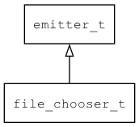

## file\_chooser\_t
### 概述


文件/目录选择器
----------------------------------
### 函数
<p id="file_chooser_t_methods">

| 函数名称 | 说明 | 
| -------- | ------------ | 
| <a href="#file_chooser_t_file_chooser_cast">file\_chooser\_cast</a> | 转换为file_chooser对象(供脚本语言使用)。 |
| <a href="#file_chooser_t_file_chooser_choose_file_for_open">file\_chooser\_choose\_file\_for\_open</a> | 为了打开而选择文件。 |
| <a href="#file_chooser_t_file_chooser_choose_file_for_save">file\_chooser\_choose\_file\_for\_save</a> | 为了保存而选择文件。 |
| <a href="#file_chooser_t_file_chooser_choose_folder">file\_chooser\_choose\_folder</a> | 选择目录。 |
| <a href="#file_chooser_t_file_chooser_create">file\_chooser\_create</a> | 创建file_chooser对象 |
| <a href="#file_chooser_t_file_chooser_destroy">file\_chooser\_destroy</a> | 销毁file_chooser对象(选择完成后自动调用)。 |
| <a href="#file_chooser_t_file_chooser_get_dir">file\_chooser\_get\_dir</a> | 获取目录。 |
| <a href="#file_chooser_t_file_chooser_get_filename">file\_chooser\_get\_filename</a> | 获取文件名。 |
| <a href="#file_chooser_t_file_chooser_is_aborted">file\_chooser\_is\_aborted</a> | 用户是否取消了选择。 |
| <a href="#file_chooser_t_file_chooser_set_filter">file\_chooser\_set\_filter</a> | 设置过滤规则。 |
| <a href="#file_chooser_t_file_chooser_set_init_dir">file\_chooser\_set\_init\_dir</a> | 设置初始目录。 |
### 属性
<p id="file_chooser_t_properties">

| 属性名称 | 类型 | 说明 | 
| -------- | ----- | ------------ | 
| <a href="#file_chooser_t_aborted">aborted</a> | bool\_t | 是否取消了选择。 |
| <a href="#file_chooser_t_cwd">cwd</a> | str\_t | 当前路径。 |
| <a href="#file_chooser_t_filename;">filename;</a> | str\_t | 当前选择的文件。 |
| <a href="#file_chooser_t_filter">filter</a> | char* | 过滤规则。 |
| <a href="#file_chooser_t_init_dir">init\_dir</a> | char* | 初始目录。 |
| <a href="#file_chooser_t_on_done">on\_done</a> | tk\_on\_done\_t | 接受结果的回调函数。 |
| <a href="#file_chooser_t_on_done_ctx">on\_done\_ctx</a> | void* | 用户数据。 |
#### file\_chooser\_cast 函数
-----------------------

* 函数功能：

> <p id="file_chooser_t_file_chooser_cast">转换为file_chooser对象(供脚本语言使用)。

* 函数原型：

```
file_chooser_t* file_chooser_cast (file_chooser_t* chooser);
```

* 参数说明：

| 参数 | 类型 | 说明 |
| -------- | ----- | --------- |
| 返回值 | file\_chooser\_t* | 对象。 |
| chooser | file\_chooser\_t* | file\_chooser对象。 |
#### file\_chooser\_choose\_file\_for\_open 函数
-----------------------

* 函数功能：

> <p id="file_chooser_t_file_chooser_choose_file_for_open">为了打开而选择文件。

* 函数原型：

```
ret_t file_chooser_choose_file_for_open (file_chooser_t* chooser);
```

* 参数说明：

| 参数 | 类型 | 说明 |
| -------- | ----- | --------- |
| 返回值 | ret\_t | 返回RET\_OK表示成功，否则表示失败。 |
| chooser | file\_chooser\_t* | file\_chooser对象。 |
#### file\_chooser\_choose\_file\_for\_save 函数
-----------------------

* 函数功能：

> <p id="file_chooser_t_file_chooser_choose_file_for_save">为了保存而选择文件。

* 函数原型：

```
ret_t file_chooser_choose_file_for_save (file_chooser_t* chooser);
```

* 参数说明：

| 参数 | 类型 | 说明 |
| -------- | ----- | --------- |
| 返回值 | ret\_t | 返回RET\_OK表示成功，否则表示失败。 |
| chooser | file\_chooser\_t* | file\_chooser对象。 |
#### file\_chooser\_choose\_folder 函数
-----------------------

* 函数功能：

> <p id="file_chooser_t_file_chooser_choose_folder">选择目录。

* 函数原型：

```
ret_t file_chooser_choose_folder (file_chooser_t* chooser);
```

* 参数说明：

| 参数 | 类型 | 说明 |
| -------- | ----- | --------- |
| 返回值 | ret\_t | 返回RET\_OK表示成功，否则表示失败。 |
| chooser | file\_chooser\_t* | file\_chooser对象。 |
#### file\_chooser\_create 函数
-----------------------

* 函数功能：

> <p id="file_chooser_t_file_chooser_create">创建file_chooser对象

* 函数原型：

```
file_chooser_t* file_chooser_create ();
```

* 参数说明：

| 参数 | 类型 | 说明 |
| -------- | ----- | --------- |
| 返回值 | file\_chooser\_t* | 对象。 |
#### file\_chooser\_destroy 函数
-----------------------

* 函数功能：

> <p id="file_chooser_t_file_chooser_destroy">销毁file_chooser对象(选择完成后自动调用)。

* 函数原型：

```
ret_t file_chooser_destroy (file_chooser_t* chooser);
```

* 参数说明：

| 参数 | 类型 | 说明 |
| -------- | ----- | --------- |
| 返回值 | ret\_t | 返回RET\_OK表示成功，否则表示失败。 |
| chooser | file\_chooser\_t* | file\_chooser对象。 |
#### file\_chooser\_get\_dir 函数
-----------------------

* 函数功能：

> <p id="file_chooser_t_file_chooser_get_dir">获取目录。

* 函数原型：

```
const char* file_chooser_get_dir (file_chooser_t* chooser);
```

* 参数说明：

| 参数 | 类型 | 说明 |
| -------- | ----- | --------- |
| 返回值 | const char* | 返回选择的目录。 |
| chooser | file\_chooser\_t* | file\_chooser对象。 |
#### file\_chooser\_get\_filename 函数
-----------------------

* 函数功能：

> <p id="file_chooser_t_file_chooser_get_filename">获取文件名。

* 函数原型：

```
const char* file_chooser_get_filename (file_chooser_t* chooser);
```

* 参数说明：

| 参数 | 类型 | 说明 |
| -------- | ----- | --------- |
| 返回值 | const char* | 返回选择的文件名。 |
| chooser | file\_chooser\_t* | file\_chooser对象。 |
#### file\_chooser\_is\_aborted 函数
-----------------------

* 函数功能：

> <p id="file_chooser_t_file_chooser_is_aborted">用户是否取消了选择。

* 函数原型：

```
bool_t file_chooser_is_aborted (file_chooser_t* chooser);
```

* 参数说明：

| 参数 | 类型 | 说明 |
| -------- | ----- | --------- |
| 返回值 | bool\_t | 返回用户是否取消了选择。 |
| chooser | file\_chooser\_t* | file\_chooser对象。 |
#### file\_chooser\_set\_filter 函数
-----------------------

* 函数功能：

> <p id="file_chooser_t_file_chooser_set_filter">设置过滤规则。
> files_only 表示只列出文件，dir_only 表示只列出目录，其它表示只列出满足扩展名文件集合(如：.jpg.png.gif)。

* 函数原型：

```
ret_t file_chooser_set_filter (file_chooser_t* chooser, const char* filter);
```

* 参数说明：

| 参数 | 类型 | 说明 |
| -------- | ----- | --------- |
| 返回值 | ret\_t | 返回RET\_OK表示成功，否则表示失败。 |
| chooser | file\_chooser\_t* | file\_chooser对象。 |
| filter | const char* | 过滤规则。 |
#### file\_chooser\_set\_init\_dir 函数
-----------------------

* 函数功能：

> <p id="file_chooser_t_file_chooser_set_init_dir">设置初始目录。

* 函数原型：

```
ret_t file_chooser_set_init_dir (file_chooser_t* chooser, const char* init_dir);
```

* 参数说明：

| 参数 | 类型 | 说明 |
| -------- | ----- | --------- |
| 返回值 | ret\_t | 返回RET\_OK表示成功，否则表示失败。 |
| chooser | file\_chooser\_t* | file\_chooser对象。 |
| init\_dir | const char* | 初始目录 |
#### aborted 属性
-----------------------
> <p id="file_chooser_t_aborted">是否取消了选择。

* 类型：bool\_t

#### cwd 属性
-----------------------
> <p id="file_chooser_t_cwd">当前路径。

* 类型：str\_t

#### filename; 属性
-----------------------
> <p id="file_chooser_t_filename;">当前选择的文件。

* 类型：str\_t

#### filter 属性
-----------------------
> <p id="file_chooser_t_filter">过滤规则。

* 类型：char*

#### init\_dir 属性
-----------------------
> <p id="file_chooser_t_init_dir">初始目录。

* 类型：char*

#### on\_done 属性
-----------------------
> <p id="file_chooser_t_on_done">接受结果的回调函数。

* 类型：tk\_on\_done\_t

#### on\_done\_ctx 属性
-----------------------
> <p id="file_chooser_t_on_done_ctx">用户数据。

* 类型：void*

